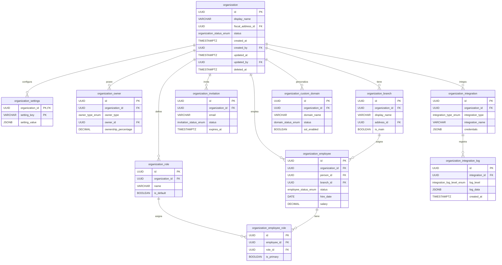
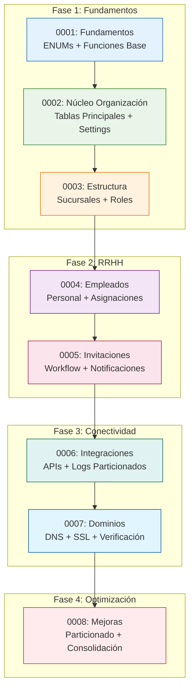

# Sistema de Migraciones - Organization Service

## 📋 Descripción General

Este documento presenta una **visión integral** del sistema de migraciones del servicio `organization-svc`, que implementa la gestión completa de organizaciones inmobiliarias. El sistema está diseñado como una **arquitectura evolutiva** que se construye en 8 migraciones progresivas, desde los fundamentos básicos hasta características avanzadas de escalabilidad y mantenimiento.

### 🎯 Objetivos del Sistema

- **Gestión Completa de Organizaciones**: Desde la creación básica hasta estructuras complejas
- **Escalabilidad Empresarial**: Soporte para múltiples sucursales, empleados y roles
- **Integraciones Externas**: Conectividad con servicios de terceros
- **Seguridad y Compliance**: Auditoría completa y soft-delete obligatorio
- **Performance Optimizada**: Índices inteligentes y particionado proactivo

---

## 📚 Índice de Migraciones

### 🏗️ Fase 1: Fundamentos (0001-0003)

| Migración | Descripción | Componentes Clave | Estado |
|-----------|-------------|-------------------|--------|
| **[0001](pg/README_0001.md)** | **Fundamentos del Sistema** | ENUMs, Funciones base, Tipos de datos | ✅ Completo |
| **[0002](pg/README_0002.md)** | **Núcleo de Organización** | Tablas principales, Settings, Propietarios | ✅ Completo |
| **[0003](pg/README_0003.md)** | **Estructura Organizacional** | Sucursales, Roles, Jerarquías | ✅ Completo |

### 🏢 Fase 2: Gestión de Recursos Humanos (0004-0005)

| Migración | Descripción | Componentes Clave | Estado |
|-----------|-------------|-------------------|--------|
| **[0004](pg/README_0004.md)** | **Empleados y Asignaciones** | Empleados, Roles asignados, Triggers | ✅ Completo |
| **[0005](pg/README_0005.md)** | **Sistema de Invitaciones** | Invitaciones, Workflow, Notificaciones | ✅ Completo |

### 🔌 Fase 3: Conectividad y Servicios (0006-0007)

| Migración | Descripción | Componentes Clave | Estado |
|-----------|-------------|-------------------|--------|
| **[0006](pg/README_0006.md)** | **Integraciones Externas** | APIs terceros, Logs particionados, Eventos | ✅ Completo |
| **[0007](pg/README_0007.md)** | **Dominios Personalizados** | DNS, SSL, Verificación automática | ✅ Completo |

### ⚡ Fase 4: Optimización y Escalabilidad (0008)

| Migración | Descripción | Componentes Clave | Estado |
|-----------|-------------|-------------------|--------|
| **[0008](pg/README_0008.md)** | **Mejoras y Optimización** | Particionado, Mantenimiento, Consolidación | ✅ Completo |

---

## 🏛️ Arquitectura Global del Sistema

### 📊 Diagrama de Relaciones General



### 🔄 Diagrama de Flujo de Migraciones



### 🏗️ Diagrama de Dependencias Técnicas

```mermaid
graph TB
    subgraph "Servicios Externos"
        AUTH[auth-identity-svc<br/>👤 Usuarios]
        ADDRESS[address-svc<br/>📍 Direcciones]
        PERSON[person-svc<br/>👥 Personas]
    end
    
    subgraph "Funciones Base (0001)"
        UUID_GEN[generate_uuid()]
        UTC_TIME[current_timestamp_utc()]
        VALIDATORS[Validadores Email/Phone]
        BASE_ENUMS[ENUMs Base]
    end
    
    subgraph "Núcleo (0002)"
        ORG_TABLE[organization]
        SETTINGS[organization_settings]
        OWNERS[organization_owner]
        TRIGGERS_CORE[Triggers Auditoría]
    end
    
    subgraph "Estructura (0003)"
        BRANCHES[organization_branch]
        ROLES[organization_role]
        PROTECTIONS[Protecciones Principales]
    end
    
    subgraph "RRHH (0004-0005)"
        EMPLOYEES[organization_employee]
        INVITATIONS[organization_invitation]
        WORKFLOWS[Workflows Automáticos]
    end
    
    subgraph "Integraciones (0006-0007)"
        INTEGRATIONS[organization_integration]
        DOMAINS[organization_custom_domain]
        PARTITIONS[Logs Particionados]
    end
    
    subgraph "Optimización (0008)"
        MAINTENANCE[Mantenimiento Automático]
        PERFORMANCE[Índices Consolidados]
        MONITORING[Vistas Materializadas]
    end
    
    AUTH --> ORG_TABLE
    ADDRESS --> BRANCHES
    PERSON --> EMPLOYEES
    
    BASE_ENUMS --> ORG_TABLE
    UUID_GEN --> ORG_TABLE
    UTC_TIME --> TRIGGERS_CORE
    VALIDATORS --> BRANCHES
    
    ORG_TABLE --> SETTINGS
    ORG_TABLE --> OWNERS
    ORG_TABLE --> BRANCHES
    ORG_TABLE --> ROLES
    
    BRANCHES --> EMPLOYEES
    ROLES --> EMPLOYEES
    ORG_TABLE --> INVITATIONS
    
    ORG_TABLE --> INTEGRATIONS
    ORG_TABLE --> DOMAINS
    INTEGRATIONS --> PARTITIONS
    
    EMPLOYEES --> MAINTENANCE
    PARTITIONS --> PERFORMANCE
    DOMAINS --> MONITORING
```

---

## 🔧 Componentes Técnicos por Migración

### 📊 Resumen de Componentes

| Migración | Tablas | Funciones | Triggers | Índices | ENUMs | Constraints |
|-----------|--------|-----------|----------|---------|-------|-------------|
| **0001** | 0 | 4 | 0 | 0 | 4 | 0 |
| **0002** | 3 | 8 | 12 | 15 | 0 | 5 |
| **0003** | 2 | 6 | 8 | 12 | 0 | 4 |
| **0004** | 2 | 8 | 10 | 18 | 1 | 6 |
| **0005** | 1 | 6 | 6 | 8 | 1 | 3 |
| **0006** | 2 | 10 | 12 | 14 | 2 | 4 |
| **0007** | 1 | 8 | 8 | 10 | 1 | 5 |
| **0008** | 1 | 12 | 8 | 20 | 0 | 8 |
| **TOTAL** | **12** | **62** | **64** | **97** | **9** | **35** |

### 🎯 Características Clave por Fase

#### 🏗️ Fase 1: Fundamentos (0001-0003)
- **Propósito**: Establecer la base sólida del sistema
- **Características**:
  - Tipos de datos y funciones reutilizables
  - Gestión de organizaciones con soft-delete obligatorio
  - Estructura jerárquica con sucursales y roles
  - Validaciones automáticas y protecciones críticas

#### 🏢 Fase 2: RRHH (0004-0005)
- **Propósito**: Gestión completa de recursos humanos
- **Características**:
  - Sistema de empleados con roles múltiples
  - Workflow de invitaciones con expiración automática
  - Triggers de notificación y automatización
  - Constraints de integridad para asignaciones

#### 🔌 Fase 3: Conectividad (0006-0007)
- **Propósito**: Integración externa y personalización
- **Características**:
  - Catálogo de integraciones con logs particionados
  - Dominios personalizados con verificación DNS/SSL
  - Sistema de eventos para sincronización
  - Mantenimiento automático de logs históricos

#### ⚡ Fase 4: Optimización (0008)
- **Propósito**: Escalabilidad y rendimiento a largo plazo
- **Características**:
  - Particionado proactivo de tablas grandes
  - Consolidación de índices para performance
  - Vistas materializadas para reportes
  - Mantenimiento automático programado

---

## 🛠️ Patrones y Arquitectura

### 🔒 Principios de Diseño

#### 1. **Soft Delete Obligatorio**
```sql
-- Patrón universal aplicado en todas las tablas principales
deleted_at TIMESTAMP WITH TIME ZONE

-- Con constraints que aseguran consistencia
CONSTRAINT chk_soft_delete_status CHECK (
    (deleted_at IS NULL AND status != 'deleted') OR 
    (deleted_at IS NOT NULL AND status = 'deleted')
)
```

#### 2. **Auditoría Completa**
```sql
-- Campos estándar en todas las tablas
created_at    TIMESTAMP WITH TIME ZONE NOT NULL DEFAULT current_timestamp_utc(),
created_by    UUID NOT NULL,
updated_at    TIMESTAMP WITH TIME ZONE NOT NULL DEFAULT current_timestamp_utc(),
updated_by    UUID
```

#### 3. **Foreign Keys Lógicas**
```sql
-- Evitar dependencias circulares entre microservicios
fiscal_address_id   UUID,        -- FK lógica → address-svc
created_by          UUID NOT NULL, -- FK lógica → auth-identity-svc
owner_id            UUID NOT NULL  -- FK lógica → person-svc
```

#### 4. **Validaciones Multi-Capa**
- **Base de Datos**: Constraints, triggers, funciones PL/pgSQL
- **Aplicación**: Validaciones en la capa de servicio
- **API Gateway**: Validaciones de entrada y autorización

### 🏗️ Arquitectura de Funciones

#### **Funciones Base (Migración 0001)**
```sql
generate_uuid()              -- UUIDs consistentes
current_timestamp_utc()      -- Timestamps normalizados
is_valid_email()            -- Validación RFC compliant
is_valid_phone()            -- Validación internacional
```

#### **Funciones de Auditoría (Migración 0002)**
```sql
update_timestamp_utc()       -- Trigger genérico para updated_at
create_organization_defaults() -- Configuraciones automáticas
validate_ownership_percentages() -- Business rules críticas
```

#### **Funciones de Protección (Migraciones 0003-0007)**
```sql
prevent_delete_only_main_branch()    -- Integridad estructural
prevent_delete_default_roles()       -- Roles críticos del sistema
validate_employee_constraints()      -- Reglas de RRHH
manage_invitation_lifecycle()        -- Workflow automático
```

#### **Funciones de Mantenimiento (Migración 0008)**
```sql
cleanup_expired_logs()              -- Limpieza automática
rebuild_materialized_views()        -- Performance optimization
partition_large_tables()            -- Escalabilidad proactiva
```

### 📊 Estrategia de Indexación

#### **Índices Condicionales**
```sql
-- Solo indexar registros activos (mejora performance)
CREATE INDEX ix_organization_status_active 
ON organization(status) WHERE deleted_at IS NULL;
```

#### **Índices Únicos Inteligentes**
```sql
-- Una sucursal principal por organización
CREATE UNIQUE INDEX uq_organization_branch_one_main_per_org 
ON organization_branch(organization_id) 
WHERE is_main = true AND deleted_at IS NULL;
```

#### **Índices de Performance**
```sql
-- Optimización para consultas frecuentes
CREATE INDEX ix_integration_log_organization_created 
ON organization_integration_log(organization_id, created_at) 
WHERE created_at > current_timestamp_utc() - INTERVAL '30 days';
```

---

## 🚀 Guía de Implementación

### 📋 Prerrequisitos

#### **Servicios Dependientes**
- `auth-identity-svc`: Gestión de usuarios y autenticación
- `address-svc`: Manejo de direcciones y geolocalización  
- `person-svc`: Datos de personas físicas y jurídicas

#### **Infraestructura**
- PostgreSQL 13+ con extensiones UUID y JSONB
- RabbitMQ para eventos async (usado en 0005, 0006)
- Redis para cache (usado en configuraciones de 0008)

### 🔄 Proceso de Migración

#### **1. Validación Pre-migración**
```sql
-- Verificar versión de PostgreSQL
SELECT version();

-- Verificar extensiones requeridas
SELECT * FROM pg_extension WHERE extname IN ('uuid-ossp', 'pg_cron');

-- Verificar espacio en disco
SELECT pg_size_pretty(pg_database_size(current_database()));
```

#### **2. Ejecutar Migraciones en Orden**
```bash
# Ejecutar cada migración secuencialmente
psql -d organization_db -f 0001_create_base.up.sql
psql -d organization_db -f 0002_create_organization_core.up.sql
psql -d organization_db -f 0003_create_structure.up.sql
psql -d organization_db -f 0004_create_employees.up.sql
psql -d organization_db -f 0005_create_invitations.up.sql
psql -d organization_db -f 0006_create_integrations.up.sql
psql -d organization_db -f 0007_create_custom_domains.up.sql
psql -d organization_db -f 0008_create_improvements.up.sql
```

#### **3. Validación Post-migración**
```sql
-- Verificar todas las tablas fueron creadas
SELECT schemaname, tablename 
FROM pg_tables 
WHERE tablename LIKE 'organization%'
ORDER BY tablename;

-- Verificar funciones críticas
SELECT proname, pronamespace::regnamespace 
FROM pg_proc 
WHERE proname LIKE '%organization%' 
OR proname IN ('generate_uuid', 'current_timestamp_utc');

-- Verificar triggers activos
SELECT tgname, tgrelid::regclass, tgenabled 
FROM pg_trigger 
WHERE tgrelid::regclass::text LIKE 'organization%';
```

### 🧪 Testing y Validación

#### **Smoke Tests por Migración**

**0001 - Fundamentos:**
```sql
SELECT generate_uuid() IS NOT NULL;
SELECT current_timestamp_utc() IS NOT NULL;
SELECT is_valid_email('test@example.com') = true;
```

**0002 - Núcleo:**
```sql
INSERT INTO organization (display_name, created_by) 
VALUES ('Test Org', generate_uuid()) RETURNING id;
```

**0003 - Estructura:**
```sql
SELECT create_default_organization_roles(
    (SELECT id FROM organization LIMIT 1), 
    generate_uuid()
);
```

**0004 - Empleados:**
```sql
INSERT INTO organization_employee (organization_id, person_id, hire_date, created_by)
VALUES (
    (SELECT id FROM organization LIMIT 1),
    generate_uuid(),
    current_date,
    generate_uuid()
) RETURNING id;
```

#### **Tests de Integridad**
```sql
-- Verificar constraints de soft delete
SELECT tablename, constraint_name 
FROM information_schema.table_constraints 
WHERE constraint_name LIKE '%soft_delete%';

-- Verificar índices únicos
SELECT indexname, tablename 
FROM pg_indexes 
WHERE indexname LIKE 'uq_%';

-- Verificar triggers de protección
SELECT tgname, tgrelid::regclass 
FROM pg_trigger 
WHERE tgname LIKE '%prevent%';
```

---

## 📊 Monitoreo y Mantenimiento

### 🔍 Queries de Diagnóstico

#### **Estado General del Sistema**
```sql
-- Resumen de organizaciones por estado
SELECT 
    status,
    COUNT(*) as count,
    COUNT(*) * 100.0 / SUM(COUNT(*)) OVER() as percentage
FROM organization 
WHERE deleted_at IS NULL
GROUP BY status;

-- Distribución de empleados por organización
SELECT 
    o.display_name,
    COUNT(oe.id) as total_employees,
    COUNT(CASE WHEN oe.status = 'active' THEN 1 END) as active_employees
FROM organization o
LEFT JOIN organization_employee oe ON o.id = oe.organization_id 
    AND oe.deleted_at IS NULL
WHERE o.deleted_at IS NULL
GROUP BY o.id, o.display_name
ORDER BY total_employees DESC;
```

#### **Performance y Utilización**
```sql
-- Tamaño de tablas principales
SELECT 
    schemaname,
    tablename,
    pg_size_pretty(pg_total_relation_size(schemaname||'.'||tablename)) as size,
    pg_total_relation_size(schemaname||'.'||tablename) as size_bytes
FROM pg_tables 
WHERE tablename LIKE 'organization%'
ORDER BY size_bytes DESC;

-- Efectividad de índices
SELECT 
    schemaname,
    tablename,
    indexname,
    pg_size_pretty(pg_relation_size(indexname::regclass)) as index_size,
    idx_scan as times_used,
    idx_tup_read as tuples_read,
    idx_tup_fetch as tuples_fetched
FROM pg_stat_user_indexes 
WHERE schemaname = 'public' 
AND tablename LIKE 'organization%'
ORDER BY times_used DESC;
```

### 🛠️ Mantenimiento Automático

#### **Limpieza de Logs (Programado en 0008)**
```sql
-- Ejecutar limpieza semanal de logs antiguos
SELECT cleanup_expired_integration_logs();

-- Mantenimiento de particiones automático
SELECT maintain_integration_log_partitions();
```

#### **Optimización de Performance**
```sql
-- Refrescar vistas materializadas
REFRESH MATERIALIZED VIEW mv_organization_subscriptions;

-- Reindex tablas grandes periódicamente
REINDEX INDEX CONCURRENTLY ix_integration_log_organization_created;
```

---

## 🔧 Extensibilidad y Evolución

### 🎯 Patrones para Nuevas Migraciones

#### **1. Agregar Nueva Tabla**
```sql
-- Seguir el patrón establecido
CREATE TABLE organization_new_feature (
    id              UUID PRIMARY KEY DEFAULT generate_uuid(),
    organization_id UUID NOT NULL,
    -- campos específicos de la funcionalidad
    
    -- Auditoría estándar
    created_at      TIMESTAMP WITH TIME ZONE NOT NULL DEFAULT current_timestamp_utc(),
    created_by      UUID NOT NULL,
    updated_at      TIMESTAMP WITH TIME ZONE NOT NULL DEFAULT current_timestamp_utc(),
    updated_by      UUID,
    deleted_at      TIMESTAMP WITH TIME ZONE
);

-- Trigger de auditoría automático
CREATE TRIGGER trg_organization_new_feature_updated_at
    BEFORE UPDATE ON organization_new_feature
    FOR EACH ROW EXECUTE FUNCTION update_timestamp_utc();
```

#### **2. Agregar Funcionalidad Compleja**
```sql
-- Crear ENUM si es necesario
CREATE TYPE new_feature_status_enum AS ENUM ('pending', 'active', 'suspended');

-- Función de business logic
CREATE OR REPLACE FUNCTION validate_new_feature_rules()
RETURNS TRIGGER AS $$
BEGIN
    -- Lógica de validación específica
    RETURN NEW;
END;
$$ LANGUAGE plpgsql;

-- Trigger de validación
CREATE TRIGGER trg_organization_new_feature_validate
    BEFORE INSERT OR UPDATE ON organization_new_feature
    FOR EACH ROW EXECUTE FUNCTION validate_new_feature_rules();
```

### 📈 Consideraciones de Escalabilidad

#### **Particionado Horizontal**
```sql
-- Para tablas que crecen rápidamente
CREATE TABLE organization_large_table (
    -- estructura normal
) PARTITION BY RANGE (created_at);

-- Crear particiones automáticamente
CREATE TABLE organization_large_table_2024_01 
PARTITION OF organization_large_table 
FOR VALUES FROM ('2024-01-01') TO ('2024-02-01');
```

#### **Índices Adaptativos**
```sql
-- Índices que se ajustan al crecimiento
CREATE INDEX CONCURRENTLY ix_large_table_adaptive 
ON organization_large_table (organization_id, created_at) 
WHERE created_at > current_timestamp_utc() - INTERVAL '90 days';
```

---

## 📚 Referencias Técnicas

### 🔗 Documentación Detallada

Para información técnica específica de cada migración, consultar:

- **[Migración 0001](pg/README_0001.md)**: Fundamentos del sistema, ENUMs y funciones base
- **[Migración 0002](pg/README_0002.md)**: Núcleo organizacional, settings y propietarios  
- **[Migración 0003](pg/README_0003.md)**: Estructura de sucursales y roles
- **[Migración 0004](pg/README_0004.md)**: Gestión de empleados y asignaciones de roles
- **[Migración 0005](pg/README_0005.md)**: Sistema de invitaciones y workflow automático
- **[Migración 0006](pg/README_0006.md)**: Integraciones externas y logs particionados
- **[Migración 0007](pg/README_0007.md)**: Dominios personalizados y verificación DNS/SSL
- **[Migración 0008](pg/README_0008.md)**: Mejoras finales y optimización de performance

### 🏛️ Arquitectura de Microservicios

#### **Servicios Relacionados**
- `auth-identity-svc`: Autenticación y autorización
- `address-svc`: Gestión de direcciones y geolocalización
- `person-svc`: Información de personas físicas y jurídicas
- `property-svc`: Gestión de propiedades inmobiliarias
- `notification-svc`: Envío de notificaciones multicanal

#### **Eventos de Integración**
- `OrganizationCreated`: Notifica creación de nueva organización
- `EmployeeInvited`: Activar workflow de invitación
- `IntegrationActivated`: Sincronizar con servicios externos
- `DomainVerified`: Configurar SSL y routing personalizado

### 🔧 Herramientas de Desarrollo

#### **Scripts de Utilidad**
```bash
# Backup antes de migraciones
pg_dump organization_db > backup_$(date +%Y%m%d_%H%M%S).sql

# Verificar estructura
psql -d organization_db -c "\d+ organization*"

# Monitorear performance
psql -d organization_db -c "SELECT * FROM pg_stat_user_tables WHERE relname LIKE 'organization%';"
```

#### **Testing Automatizado**
```sql
-- Suite de tests de regresión
\i tests/test_organization_core.sql
\i tests/test_employee_management.sql
\i tests/test_integration_workflows.sql
```

---

## ⚠️ Notas Importantes

### 🔒 Consideraciones de Seguridad

- **Datos Sensibles**: Las credenciales de integración se almacenan encriptadas en JSONB
- **Auditoría**: Todos los cambios quedan registrados con timestamp y usuario
- **Soft Delete**: Preserva integridad referencial y permite auditorías forenses
- **Validaciones**: Múltiples capas de validación previenen inconsistencias

### 🚀 Performance

- **Índices Condicionales**: Solo indexan registros activos para optimizar espacio y velocidad
- **Particionado**: Tablas de logs se particionan automáticamente por fecha
- **Vistas Materializadas**: Reportes complejos pre-calculados para mejor respuesta
- **Limpieza Automática**: Mantenimiento programado de datos históricos

### 🔄 Mantenimiento

- **Backward Compatibility**: Todas las migraciones mantienen compatibilidad hacia atrás
- **Rollback**: Scripts `.down.sql` disponibles para reversión controlada
- **Monitoring**: Métricas y alertas integradas para detectar problemas
- **Documentación**: Cada cambio está documentado exhaustivamente

---

**📧 Para soporte técnico o consultas sobre el sistema de migraciones, contactar al equipo de arquitectura de datos.**

**🔄 Última actualización**: Migración 0008 completada - Sistema totalmente funcional y optimizado para producción.
