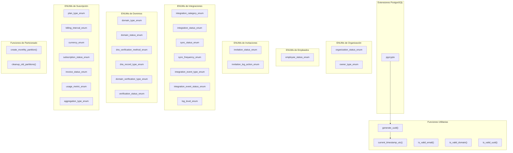
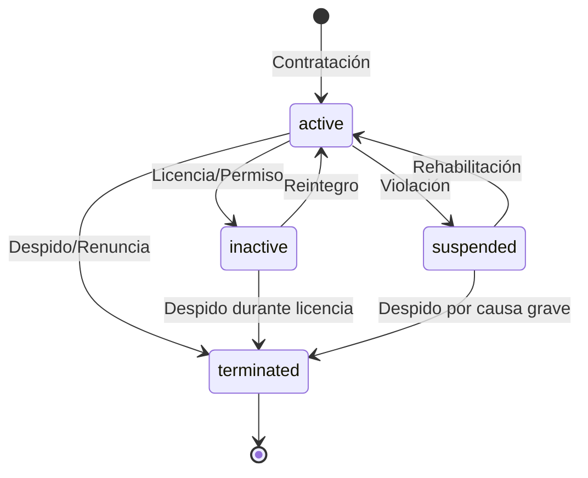

# Migration 0001: ENUMs y Tipos Fundamentales

## 📋 Descripción General

La migración `0001_create_enums_and_types.up.sql` establece los tipos de datos fundamentales y funciones utilitarias para todo el sistema de organization-svc. Esta migración es **crítica** porque define:

- **27 ENUMs** para garantizar integridad de datos
- **5 funciones utilitarias** para validaciones y generación de IDs
- **2 funciones de particionado** para manejo eficiente de logs
- **Extensiones PostgreSQL** necesarias para el funcionamiento

## 🏗️ Arquitectura de Tipos

### 📊 Diagrama de Dependencias



## 📋 Especificaciones Detalladas

### 🏢 ENUMs de Organización

#### `organization_status_enum`
Define los estados del ciclo de vida organizacional:

```sql
CREATE TYPE organization_status_enum AS ENUM (
    'active',           -- Organización operativa y funcional
    'suspended',        -- Temporalmente deshabilitada (por pago, violaciones, etc.)
    'deleted',          -- Marcada para eliminación (soft delete)
    'pending_activation' -- Recién creada, pendiente de activación
);
```

**Estados y Transiciones:**
- `pending_activation` → `active`: Tras completar onboarding
- `active` → `suspended`: Por problemas de pago o violaciones
- `suspended` → `active`: Tras resolver problemas
- `active|suspended` → `deleted`: Eliminación por usuario o admin

#### `owner_type_enum`
Categoriza el tipo de propietario legal:

```sql
CREATE TYPE owner_type_enum AS ENUM (
    'individual',  -- Persona física
    'company'      -- Persona jurídica/empresa
);
```

**Implicaciones:**
- Afecta validaciones fiscales
- Determina campos requeridos en facturación
- Influye en límites de API y features

### 👥 ENUMs de Empleados

#### `employee_status_enum`
Controla el estado laboral dentro de la organización:

```sql
CREATE TYPE employee_status_enum AS ENUM (
    'active',     -- Empleado activo con acceso completo
    'inactive',   -- Temporalmente inactivo (licencia, etc.)
    'suspended',  -- Acceso revocado por violaciones
    'terminated'  -- Relación laboral terminada
);
```

**Flujo de Estados:**


### 📧 ENUMs de Invitaciones

#### `invitation_status_enum`
Ciclo completo de invitaciones:

```sql
CREATE TYPE invitation_status_enum AS ENUM (
    'pending',    -- Invitación creada, no enviada
    'accepted',   -- Aceptada por el invitado
    'rejected',   -- Rechazada explícitamente
    'expired',    -- Expiró por tiempo
    'cancelled'   -- Cancelada por el invitante
);
```

#### `invitation_log_action_enum`
Auditoría detallada de acciones:

```sql
CREATE TYPE invitation_log_action_enum AS ENUM (
    'created',   -- Invitación creada
    'sent',      -- Email/notificación enviada
    'viewed',    -- Usuario vio la invitación
    'accepted',  -- Usuario aceptó
    'rejected',  -- Usuario rechazó
    'expired',   -- Sistema marcó como expirada
    'cancelled', -- Admin/invitante canceló
    'resent'     -- Reenviada por admin
);
```

### 🔗 ENUMs de Integraciones

#### Categorías y Estados

```sql
-- Categorías funcionales
CREATE TYPE integration_category_enum AS ENUM (
    'accounting',     -- QuickBooks, Xero, etc.
    'crm',           -- Salesforce, HubSpot, etc.
    'marketing',     -- Mailchimp, SendGrid, etc.
    'communication', -- Slack, Teams, etc.
    'analytics',     -- Google Analytics, Mixpanel, etc.
    'storage',       -- AWS S3, Google Drive, etc.
    'payment',       -- Stripe, PayPal, etc.
    'automation',    -- Zapier, IFTTT, etc.
    'other'          -- Integraciones personalizadas
);

-- Estados operacionales
CREATE TYPE integration_status_enum AS ENUM (
    'inactive',     -- Deshabilitada
    'active',       -- Funcionando correctamente
    'error',        -- Error en última sincronización
    'suspended',    -- Deshabilitada por errores recurrentes
    'configuring'   -- En proceso de configuración inicial
);
```

#### Sincronización y Eventos

```sql
-- Estados de sincronización
CREATE TYPE sync_status_enum AS ENUM (
    'success',      -- Sincronización exitosa
    'error',        -- Error en sincronización
    'partial',      -- Parcialmente exitosa
    'in_progress'   -- En proceso actualmente
);

-- Frecuencias de sincronización
CREATE TYPE sync_frequency_enum AS ENUM (
    'manual',   -- Solo manual
    'hourly',   -- Cada hora
    'daily',    -- Diaria
    'weekly',   -- Semanal
    'monthly'   -- Mensual
);
```

### 🌐 ENUMs de Dominios

#### Tipos y Estados de Dominio

```sql
CREATE TYPE domain_type_enum AS ENUM (
    'custom',    -- Dominio personalizado del cliente
    'subdomain', -- Subdominio de la plataforma
    'system'     -- Dominio del sistema
);

CREATE TYPE domain_status_enum AS ENUM (
    'pending',   -- Esperando verificación
    'active',    -- Verificado y activo
    'suspended', -- Suspendido por problemas
    'expired',   -- Expirado (certificado/dominio)
    'failed'     -- Falló la verificación
);
```

#### Configuración DNS

```sql
-- Métodos de verificación
CREATE TYPE dns_verification_method_enum AS ENUM (
    'txt',   -- Registro TXT
    'cname', -- Registro CNAME
    'file'   -- Archivo en servidor web
);

-- Tipos de registros DNS
CREATE TYPE dns_record_type_enum AS ENUM (
    'A',     -- IPv4
    'AAAA',  -- IPv6
    'CNAME', -- Alias canónico
    'TXT',   -- Texto
    'MX',    -- Mail exchange
    'NS'     -- Name server
);
```

### 💰 ENUMs de Suscripción y Facturación

#### Tipos de Plan y Facturación

```sql
-- Tipos de plan (snake_case uniformizado)
CREATE TYPE plan_type_enum AS ENUM (
    'free',       -- Plan gratuito
    'trial',      -- Período de prueba
    'recurring',  -- Suscripción recurrente
    'one_time',   -- Pago único
    'enterprise'  -- Plan empresarial personalizado
);

-- Intervalos de facturación
CREATE TYPE billing_interval_enum AS ENUM (
    'monthly',    -- Mensual
    'quarterly',  -- Trimestral
    'yearly',     -- Anual
    'one_time'    -- Pago único
);
```

**⚠️ Nota Importante:** Estos ENUMs están definidos en `organization-svc` para evitar dependencias circulares con `subscription-billing-svc`, ya que la tabla `organization` necesita referencias directas a estos tipos.

#### Monedas y Estados

```sql
-- Monedas soportadas
CREATE TYPE currency_enum AS ENUM (
    'USD', 'EUR', 'GBP', 'CAD', 'AUD', 'MXN'
);

-- Estados de suscripción
CREATE TYPE subscription_status_enum AS ENUM (
    'pending',    -- Pendiente de activación
    'active',     -- Activa y funcional
    'past_due',   -- Pago vencido
    'cancelled',  -- Cancelada por usuario
    'paused',     -- Pausada temporalmente
    'trialing'    -- En período de prueba
);
```

## 🛠️ Funciones Utilitarias

### 🆔 Generación de Identificadores

#### `generate_uuid()`
```sql
CREATE OR REPLACE FUNCTION generate_uuid()
RETURNS UUID AS $$
BEGIN
    RETURN gen_random_uuid();
END;
$$ LANGUAGE plpgsql IMMUTABLE SET search_path = public;
```

**Características:**
- Usa `gen_random_uuid()` de pgcrypto (más seguro que uuid_generate_v4)
- Marcada como `IMMUTABLE` para optimización de consultas
- `search_path = public` para seguridad

#### `current_timestamp_utc()`
```sql
CREATE OR REPLACE FUNCTION current_timestamp_utc()
RETURNS TIMESTAMP WITH TIME ZONE AS $$
BEGIN
    RETURN CURRENT_TIMESTAMP AT TIME ZONE 'UTC';
END;
$$ LANGUAGE plpgsql STABLE SET search_path = public;
```

**Uso:**
- Garantiza timestamps en UTC para consistencia global
- Marcada como `STABLE` (puede cambiar en transacción)
- Retorna `TIMESTAMPTZ` para compatibilidad de zonas horarias

### ✅ Funciones de Validación

#### `is_valid_email(email TEXT)`
```sql
CREATE OR REPLACE FUNCTION is_valid_email(email TEXT)
RETURNS BOOLEAN AS $$
BEGIN
    RETURN email ~* '^[A-Za-z0-9._%+-]+@[A-Za-z0-9.-]+\.[A-Za-z]{2,}$';
END;
$$ LANGUAGE plpgsql IMMUTABLE;
```

**Validaciones:**
- Formato RFC 5322 básico
- Permite caracteres especiales comunes: `._%+-`
- Requiere TLD de al menos 2 caracteres
- Case-insensitive (`~*`)

#### `is_valid_uuid(uuid_text TEXT)`
```sql
CREATE OR REPLACE FUNCTION is_valid_uuid(uuid_text TEXT)
RETURNS BOOLEAN AS $$
BEGIN
    RETURN (uuid_text::UUID) IS NOT NULL;
EXCEPTION
    WHEN invalid_text_representation THEN
        RETURN FALSE;
END;
$$ LANGUAGE plpgsql IMMUTABLE;
```

**Optimización:**
- Usa casting directo en lugar de regex (más eficiente)
- Manejo de excepciones para valores inválidos
- Marcada como `IMMUTABLE` para cache

#### `is_valid_domain(domain_name TEXT)`
```sql
CREATE OR REPLACE FUNCTION is_valid_domain(domain_name TEXT)
RETURNS BOOLEAN AS $$
BEGIN
    -- Verificaciones de seguridad
    IF domain_name IS NULL OR domain_name = '' THEN
        RETURN FALSE;
    END IF;
    
    -- Longitud máxima FQDN
    IF char_length(domain_name) > 253 THEN
        RETURN FALSE;
    END IF;
    
    -- Regex con anclas estrictas para prevenir bypass CRLF
    RETURN domain_name ~ E'^\\A([a-z0-9]([a-z0-9\\-]{0,61}[a-z0-9])?\\\.)+[a-z0-9]{2,}\\z$';
END;
$$ LANGUAGE plpgsql IMMUTABLE;
```

**Seguridad:**
- Anclas `\A` y `\z` previenen bypass CRLF
- Valida longitud RFC compliant (253 caracteres)
- Soporta TLD con dígitos
- Previene subdominios vacíos

## 🗂️ Sistema de Particionado

### 📅 Particiones Mensuales

#### `create_monthly_partition()`
```sql
CREATE OR REPLACE FUNCTION create_monthly_partition(
    table_name TEXT,
    partition_date DATE DEFAULT CURRENT_DATE,
    schema_name TEXT DEFAULT 'public'
)
RETURNS VOID AS $$
-- Implementación completa en el archivo
```

**Características:**
- Crea particiones por mes automáticamente
- Soporte para esquemas personalizados
- Crea partición `DEFAULT` para datos fuera de rango
- Indices automáticos en `created_at`
- **Idempotente**: No falla si la partición existe

**Ejemplo de Uso:**
```sql
-- Crear partición para el mes actual
SELECT create_monthly_partition('organization_integration_log');

-- Crear partición para fecha específica
SELECT create_monthly_partition('organization_integration_log', '2024-06-01');

-- Crear en esquema personalizado
SELECT create_monthly_partition('audit_logs', CURRENT_DATE, 'audit');
```

#### `cleanup_old_partitions()`
```sql
CREATE OR REPLACE FUNCTION cleanup_old_partitions(
    table_name TEXT,
    months_to_keep INTEGER DEFAULT 12
)
RETURNS INTEGER AS $$
-- Implementación de limpieza
```

**Gestión de Almacenamiento:**
- Elimina particiones anteriores a N meses
- Retorna cantidad de particiones eliminadas
- Default: mantiene 12 meses de historia
- Implementación segura con validación de nombres

### 🔄 Triggers de Particionado Automático

#### Ejemplo de Implementación
```sql
-- Trigger para organization_integration_log
CREATE OR REPLACE FUNCTION organization_integration_log_insert_trigger()
RETURNS TRIGGER AS $$
BEGIN
    -- Crear partición si no existe para el mes del registro
    PERFORM create_monthly_partition('organization_integration_log', NEW.created_at::DATE);
    RETURN NEW;
END;
$$ LANGUAGE plpgsql;

CREATE TRIGGER trigger_organization_integration_log_partition
    BEFORE INSERT ON organization_integration_log
    FOR EACH ROW EXECUTE FUNCTION organization_integration_log_insert_trigger();
```

**Ventajas:**
- **Automático**: No requiere intervención manual
- **Safety-net**: Crea particiones bajo demanda
- **Performance**: Solo se ejecuta en INSERT
- **Idempotente**: No duplica particiones existentes

### 📊 Estrategia de Particionado Recomendada

#### Para Tablas de Log:
```sql
-- 1. Crear tabla particionada
CREATE TABLE organization_integration_log (
    id UUID DEFAULT generate_uuid(),
    created_at TIMESTAMPTZ DEFAULT current_timestamp_utc(),
    -- otros campos...
) PARTITION BY RANGE (created_at);

-- 2. Crear trigger automático
SELECT create_monthly_partition('organization_integration_log');

-- 3. Job programado para limpieza (ejecutar mensualmente)
SELECT cleanup_old_partitions('organization_integration_log', 12);
```

#### Beneficios del Particionado:
- **Performance**: Consultas más rápidas en rangos de fechas
- **Mantenimiento**: Eliminación eficiente de datos antiguos
- **Espacio**: Liberación inmediata de storage
- **Backup**: Backup/restore granular por período

## 📝 Ejemplos Prácticos

### 🏢 Creación de Organización
```sql
-- Ejemplo de inserción con validaciones
INSERT INTO organization (
    id,
    name,
    owner_type,
    status,
    email,
    domain,
    created_at
) VALUES (
    generate_uuid(),
    'Acme Real Estate',
    'company'::owner_type_enum,
    'pending_activation'::organization_status_enum,
    'admin@acme-realestate.com',
    'acme-realestate.com',
    current_timestamp_utc()
) WHERE 
    is_valid_email('admin@acme-realestate.com') AND
    is_valid_domain('acme-realestate.com');
```

### 📧 Gestión de Invitaciones
```sql
-- Crear invitación con log automático
WITH new_invitation AS (
    INSERT INTO organization_invite (
        id,
        organization_id,
        email,
        status,
        created_at
    ) VALUES (
        generate_uuid(),
        '123e4567-e89b-12d3-a456-426614174000',
        'john.doe@example.com',
        'pending'::invitation_status_enum,
        current_timestamp_utc()
    ) RETURNING *
)
INSERT INTO organization_invite_log (
    invite_id,
    action,
    created_at
) SELECT 
    id,
    'created'::invitation_log_action_enum,
    created_at
FROM new_invitation;
```

### 🔗 Configuración de Integración
```sql
-- Crear integración con configuración inicial
INSERT INTO organization_integration (
    id,
    organization_id,
    name,
    category,
    status,
    sync_frequency,
    config,
    created_at
) VALUES (
    generate_uuid(),
    '123e4567-e89b-12d3-a456-426614174000',
    'QuickBooks Online',
    'accounting'::integration_category_enum,
    'configuring'::integration_status_enum,
    'daily'::sync_frequency_enum,
    '{"api_key": "encrypted_key", "company_id": "12345"}'::JSONB,
    current_timestamp_utc()
);
```

### 🌐 Verificación de Dominio
```sql
-- Proceso completo de verificación DNS
INSERT INTO organization_domain (
    id,
    organization_id,
    domain_name,
    domain_type,
    status,
    verification_method,
    verification_token,
    created_at
) VALUES (
    generate_uuid(),
    '123e4567-e89b-12d3-a456-426614174000',
    'custom.acme-realestate.com',
    'custom'::domain_type_enum,
    'pending'::domain_status_enum,
    'txt'::dns_verification_method_enum,
    'rem-verify-' || substr(replace(generate_uuid()::text, '-', ''), 1, 16),
    current_timestamp_utc()
) WHERE is_valid_domain('custom.acme-realestate.com');
```

## 🔍 Consultas de Diagnóstico

### 📊 Estado de ENUMs
```sql
-- Verificar todos los ENUMs creados
SELECT 
    n.nspname AS schema_name,
    t.typname AS enum_name,
    string_agg(e.enumlabel, ', ' ORDER BY e.enumsortorder) AS enum_values
FROM pg_type t
JOIN pg_enum e ON t.oid = e.enumtypid
JOIN pg_namespace n ON t.typnamespace = n.oid
WHERE n.nspname = 'public'
AND t.typname LIKE '%_enum'
GROUP BY n.nspname, t.typname
ORDER BY t.typname;
```

### 🛠️ Estado de Funciones
```sql
-- Verificar funciones utilitarias
SELECT 
    proname AS function_name,
    prorettype::regtype AS return_type,
    proargnames AS argument_names,
    prosrc AS source_code
FROM pg_proc 
WHERE proname IN (
    'generate_uuid',
    'current_timestamp_utc',
    'is_valid_email',
    'is_valid_uuid',
    'is_valid_domain',
    'create_monthly_partition',
    'cleanup_old_partitions'
)
ORDER BY proname;
```

### 🗂️ Estado de Particiones
```sql
-- Verificar particiones existentes
SELECT 
    schemaname,
    tablename,
    tableowner,
    pg_size_pretty(pg_total_relation_size(schemaname||'.'||tablename)) AS size
FROM pg_tables 
WHERE tablename ~ '_\d{4}_\d{2}$'
ORDER BY tablename;
```

## ⚠️ Consideraciones Importantes

### 🔒 Seguridad
- **Validaciones**: Todas las funciones incluyen validaciones de seguridad
- **SQL Injection**: Uso de `format()` y parámetros seguros
- **CRLF Bypass**: Prevención en validación de dominios
- **search_path**: Configurado explícitamente en funciones

### 🚀 Performance
- **Funciones IMMUTABLE**: Optimización de queries con cache
- **Particionado**: Mejora dramática en consultas de logs
- **Índices automáticos**: Creados en particiones nuevas
- **UUID optimizado**: Uso de `gen_random_uuid()` más eficiente

### 📈 Escalabilidad
- **Particionado horizontal**: Para tablas de alto volumen
- **Limpieza automática**: Gestión del crecimiento de datos
- **ENUMs extensibles**: Diseño que permite agregar valores
- **Esquemas flexibles**: Soporte para multi-tenancy

### 🔧 Mantenimiento
- **Idempotencia**: Todas las operaciones son safe para reejecutar
- **Logging**: Auditoría completa de cambios
- **Cleanup**: Herramientas automáticas de limpieza
- **Monitoreo**: Funciones de diagnóstico incluidas

## 📚 Referencias y Documentación

### 📖 PostgreSQL Features Utilizadas
- **ENUMs**: [Tipos enumerados](https://www.postgresql.org/docs/current/datatype-enum.html)
- **Partitioning**: [Particionado declarativo](https://www.postgresql.org/docs/current/ddl-partitioning.html)
- **pgcrypto**: [Extensión criptográfica](https://www.postgresql.org/docs/current/pgcrypto.html)
- **Functions**: [Funciones PL/pgSQL](https://www.postgresql.org/docs/current/plpgsql.html)

### 🔗 Standards y RFCs
- **Email**: RFC 5322 (Internet Message Format)
- **Domain**: RFC 1035 (Domain Names Implementation)
- **UUID**: RFC 4122 (UUID Specification)
- **DNS**: RFC 1034/1035 (Domain Name System)

### 📋 Próximos Pasos
1. **Migración 0002**: Creación de tabla `organization` usando estos ENUMs
2. **Migración 0003**: Estructura organizacional y empleados
3. **Migración 0004**: Sistema de invitaciones
4. **Migración 0005**: Integraciones y logs con particionado
5. **Migración 0006**: Gestión de dominios personalizados

---

**⚡ Nota**: Esta migración es la base fundamental del sistema. Cualquier modificación debe ser cuidadosamente evaluada por su impacto en todas las migraciones posteriores.
