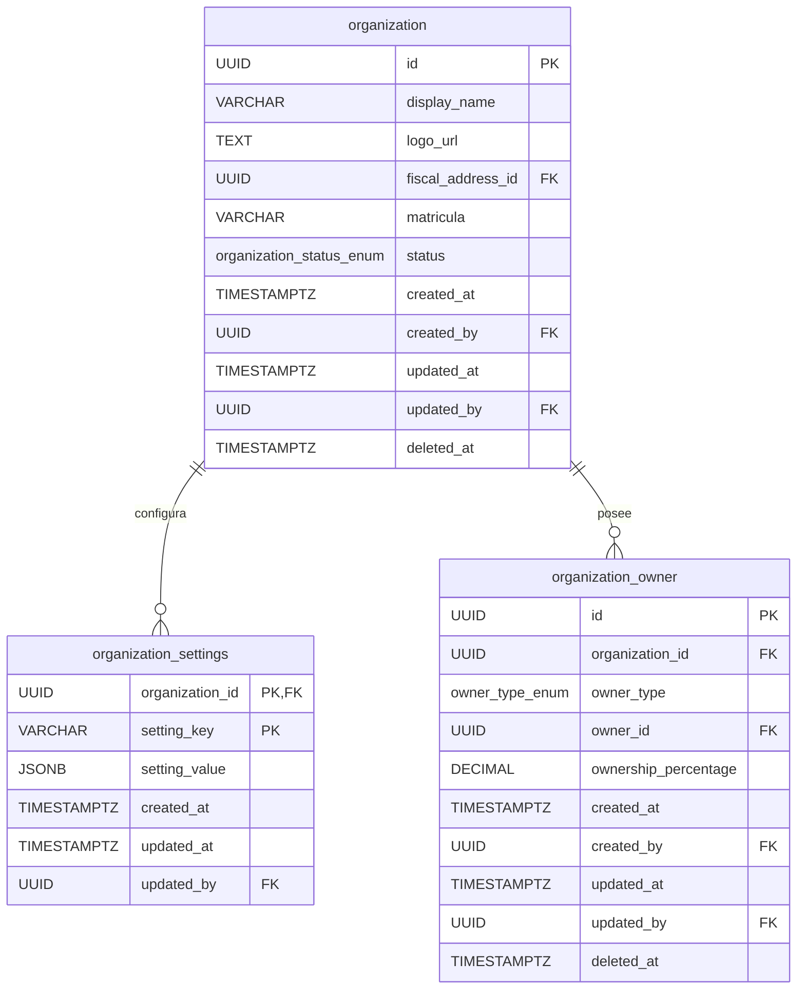
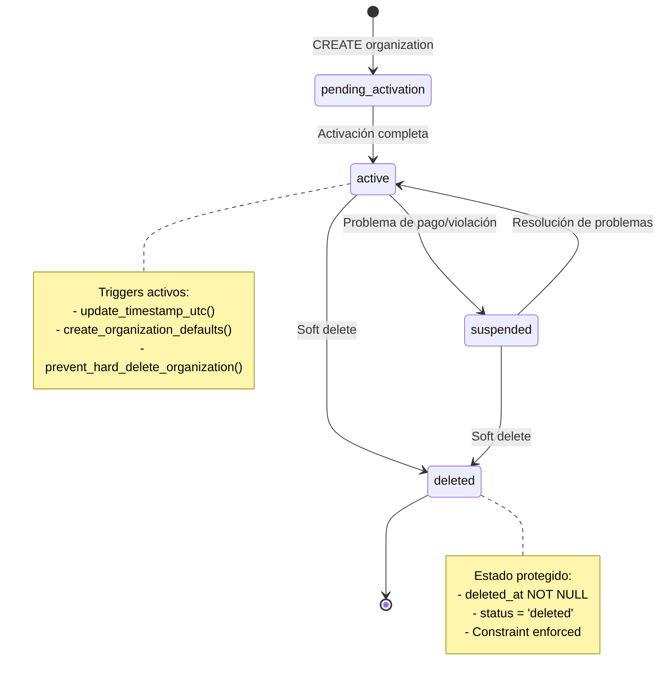
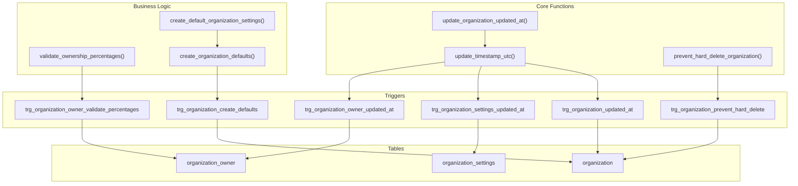
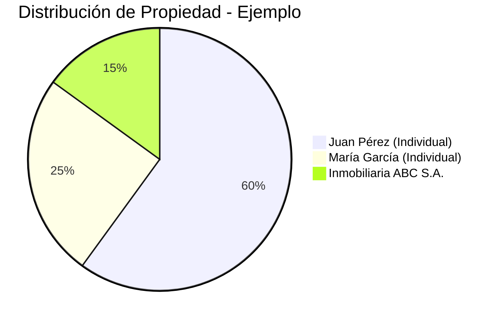

# Migration 0002: Núcleo de Organización

## 📋 Descripción General

La migración `0002_create_organization_core.up.sql` crea las **tablas fundamentales** del sistema de organizaciones inmobiliarias. Esta migración establece:

- **3 tablas principales** para el modelo organizacional
- **8 funciones especializadas** para business logic y validaciones
- **12 triggers** para automatización y auditoría
- **Soft delete** obligatorio con protección contra eliminación directa
- **Validaciones avanzadas** para integridad de datos

## 🏗️ Arquitectura del Modelo

### 📊 Diagrama Entidad-Relación



### 🔄 Diagrama de Estados y Triggers



### 🏛️ Diagrama de Arquitectura de Funciones



## 📋 Especificaciones de Tablas

### 🏢 Tabla: `organization`

#### Estructura y Campos

```sql
CREATE TABLE organization (
    id                  UUID         PRIMARY KEY DEFAULT generate_uuid(),
    display_name        VARCHAR(120) NOT NULL,
    logo_url            TEXT,
    fiscal_address_id   UUID,        -- FK externa → address-svc
    matricula           VARCHAR(32),
    status              organization_status_enum NOT NULL DEFAULT 'active',
    
    -- Auditoría completa
    created_at          TIMESTAMP WITH TIME ZONE NOT NULL DEFAULT current_timestamp_utc(),
    created_by          UUID NOT NULL,  -- FK externa → auth-identity-svc
    updated_at          TIMESTAMP WITH TIME ZONE NOT NULL DEFAULT current_timestamp_utc(),
    updated_by          UUID,        -- FK externa → auth-identity-svc
    deleted_at          TIMESTAMP WITH TIME ZONE -- Soft delete
);
```

#### 🔍 Descripción de Campos

| Campo | Tipo | Descripción | Constraints |
|-------|------|-------------|-------------|
| `id` | UUID | Identificador único primario | PK, auto-generado |
| `display_name` | VARCHAR(120) | Nombre comercial de la inmobiliaria | NOT NULL, mín. 2 caracteres |
| `logo_url` | TEXT | URL del logotipo corporativo | Opcional |
| `fiscal_address_id` | UUID | **FK lógica** a `address-svc.address.id` | No enforced por DB |
| `matricula` | VARCHAR(32) | Número de matrícula/registro oficial | Formato: `^[A-Z0-9\-]+$` |
| `status` | organization_status_enum | Estado operacional | Default: 'active' |
| `created_at` | TIMESTAMPTZ | Timestamp de creación en UTC | Auto-asignado |
| `created_by` | UUID | **FK lógica** a `auth-identity-svc.users.id` | NOT NULL, UUID válido |
| `updated_at` | TIMESTAMPTZ | Última modificación | Auto-actualizado |
| `updated_by` | UUID | Usuario que hizo última modificación | UUID válido |
| `deleted_at` | TIMESTAMPTZ | Timestamp de soft delete | NULL = activo |

#### ⚠️ Constraints Críticos

```sql
-- Soft delete obligatorio
CONSTRAINT chk_organization_soft_delete_status CHECK (
    (deleted_at IS NULL AND status != 'deleted') OR 
    (deleted_at IS NOT NULL AND status = 'deleted')
)
```

**⚡ Importante**: Este constraint **fuerza** que cuando `deleted_at` no es NULL, el `status` DEBE ser 'deleted' y viceversa. La capa de servicio debe actualizar ambos campos en la misma transacción.

#### 📊 Índices Optimizados

```sql
-- Consultas por estado (solo activos)
CREATE INDEX ix_organization_status_active ON organization(status) WHERE deleted_at IS NULL;

-- Búsquedas por nombre (solo activos)
CREATE INDEX ix_organization_display_name_search ON organization(display_name) WHERE deleted_at IS NULL;

-- Auditoría por usuario creador
CREATE INDEX ix_organization_created_by ON organization(created_by);

-- Consultas por dirección fiscal (solo cuando existe)
CREATE INDEX ix_organization_fiscal_address ON organization(fiscal_address_id) WHERE fiscal_address_id IS NOT NULL;

-- Administración de soft deletes
CREATE INDEX ix_organization_deleted_at ON organization(deleted_at) WHERE deleted_at IS NOT NULL;
```

### ⚙️ Tabla: `organization_settings`

#### Estructura KV (Key-Value Store)

```sql
CREATE TABLE organization_settings (
    organization_id     UUID         NOT NULL,  -- PK compuesta
    setting_key         VARCHAR(64)  NOT NULL,  -- PK compuesta
    setting_value       JSONB,
    
    -- Auditoría
    created_at          TIMESTAMP WITH TIME ZONE NOT NULL DEFAULT current_timestamp_utc(),
    updated_at          TIMESTAMP WITH TIME ZONE NOT NULL DEFAULT current_timestamp_utc(),
    updated_by          UUID,        -- FK lógica externa
    
    CONSTRAINT pk_organization_settings PRIMARY KEY (organization_id, setting_key)
);
```

#### 🎛️ Configuraciones por Defecto

Cuando se crea una organización, se insertan automáticamente estas configuraciones:

```sql
DEFAULT SETTINGS:
├── enable_notifications: true
├── timezone: "UTC"
├── language: "es"
├── currency: "USD"
├── date_format: "dd/mm/yyyy"
├── enable_public_listings: true
├── max_images_per_property: 10
├── enable_agent_commissions: true
└── default_commission_percentage: 3.0
```

#### 🔧 Validaciones de Settings

```sql
-- Formato de clave: snake_case obligatorio
CONSTRAINT chk_organization_settings_key_format 
    CHECK (setting_key ~ '^[a-z][a-z0-9_]*[a-z0-9]$')

-- Longitud mínima de clave
CONSTRAINT chk_organization_settings_key_length 
    CHECK (char_length(setting_key) >= 2)
```

#### 📝 Ejemplos de Uso

```sql
-- Configurar zona horaria
INSERT INTO organization_settings (organization_id, setting_key, setting_value)
VALUES ('123e4567-e89b-12d3-a456-426614174000', 'timezone', '"America/Mexico_City"'::jsonb);

-- Configurar límites de propiedades
INSERT INTO organization_settings (organization_id, setting_key, setting_value)
VALUES ('123e4567-e89b-12d3-a456-426614174000', 'max_properties_per_agent', 50::jsonb);

-- Configurar datos complejos
INSERT INTO organization_settings (organization_id, setting_key, setting_value)
VALUES ('123e4567-e89b-12d3-a456-426614174000', 'notification_preferences', 
        '{"email": true, "sms": false, "push": true, "frequency": "daily"}'::jsonb);
```

### 👤 Tabla: `organization_owner`

#### Estructura de Propietarios

```sql
CREATE TABLE organization_owner (
    id              UUID         PRIMARY KEY DEFAULT generate_uuid(),
    organization_id UUID         NOT NULL,
    owner_type      owner_type_enum NOT NULL,  -- 'individual' | 'company'
    owner_id        UUID         NOT NULL,     -- FK externa → person-svc
    ownership_percentage DECIMAL(5,2) NOT NULL, -- 0.00-100.00
    
    -- Auditoría completa
    created_at      TIMESTAMP WITH TIME ZONE NOT NULL DEFAULT current_timestamp_utc(),
    created_by      UUID NOT NULL,
    updated_at      TIMESTAMP WITH TIME ZONE NOT NULL DEFAULT current_timestamp_utc(),
    updated_by      UUID,
    deleted_at      TIMESTAMP WITH TIME ZONE  -- Soft delete
);
```

#### 💼 Gestión de Porcentajes de Propiedad

**Validación Automática:**
- El total de `ownership_percentage` **no puede exceder 100%**
- Se valida en tiempo real con trigger `validate_ownership_percentages()`
- Solo cuenta propietarios activos (deleted_at IS NULL)

#### 🔄 Escenarios de Propiedad



#### 🏛️ Unique Constraint Inteligente

```sql
CONSTRAINT uq_organization_owner_unique 
    UNIQUE (organization_id, owner_type, owner_id) DEFERRABLE INITIALLY DEFERRED
```

**Características:**
- **DEFERRABLE**: Permite violaciones temporales dentro de la transacción
- **INITIALLY DEFERRED**: La validación se ejecuta al final de la transacción
- Previene duplicados de la misma persona/empresa como propietario

## 🛠️ Funciones Especializadas

### ⏰ Gestión de Timestamps

#### `update_timestamp_utc()`
```sql
CREATE OR REPLACE FUNCTION update_timestamp_utc()
RETURNS TRIGGER AS $$
BEGIN
    NEW.updated_at = current_timestamp_utc();
    RETURN NEW;
END;
$$ LANGUAGE plpgsql;
```

**Características:**
- **Función genérica** reutilizable para todas las tablas
- Actualiza automáticamente `updated_at` en cualquier UPDATE
- Usa `current_timestamp_utc()` para consistencia global

#### `update_organization_updated_at()`
```sql
CREATE OR REPLACE FUNCTION update_organization_updated_at()
RETURNS TRIGGER AS $$
BEGIN 
    RETURN update_timestamp_utc(); 
END;
$$ LANGUAGE plpgsql;
```

**Propósito:**
- **Alias de compatibilidad** para triggers existentes
- Permite migración gradual sin romper triggers anteriores
- Delegación a función genérica para mantenimiento centralizado

### 🔒 Protección contra Eliminación Directa

#### `prevent_hard_delete_organization()`
```sql
CREATE OR REPLACE FUNCTION prevent_hard_delete_organization()
RETURNS TRIGGER AS $$
BEGIN
    IF TG_OP = 'DELETE' AND TG_TABLE_SCHEMA = 'public' THEN
        RAISE EXCEPTION 'Direct DELETE not allowed on %. Use soft delete by setting deleted_at timestamp.', TG_TABLE_NAME;
    END IF;
    RETURN NULL;
END;
$$ LANGUAGE plpgsql;
```

**Protección:**
- **Bloquea completamente** las operaciones DELETE directas
- Fuerza el uso de soft delete obligatorio
- Aplica solo al esquema 'public' (permite limpieza en esquemas de test)
- **Mensaje explicativo** guía al desarrollador

### 💰 Validación de Porcentajes de Propiedad

#### `validate_ownership_percentages()`
```sql
CREATE OR REPLACE FUNCTION validate_ownership_percentages()
RETURNS TRIGGER AS $$
DECLARE
    total_percentage DECIMAL(5,2);
BEGIN
    -- Calcular total excluyendo el registro actual
    SELECT COALESCE(SUM(ownership_percentage), 0)
    INTO total_percentage
    FROM organization_owner
    WHERE organization_id = NEW.organization_id
    AND deleted_at IS NULL
    AND id != COALESCE(NEW.id, '00000000-0000-0000-0000-000000000000'::UUID);
    
    -- Validar límite del 100%
    IF (total_percentage + NEW.ownership_percentage) > 100 THEN
        RAISE EXCEPTION 'Total ownership percentage cannot exceed 100%%. Current total: %%, trying to add: %%', 
            total_percentage, NEW.ownership_percentage;
    END IF;
    
    RETURN NEW;
END;
$$ LANGUAGE plpgsql;
```

**Lógica de Validación:**
1. **Excluye el registro actual** del cálculo (para UPDATEs)
2. **Solo cuenta propietarios activos** (deleted_at IS NULL)
3. **Valida antes de INSERT/UPDATE** para prevenir inconsistencias
4. **Mensaje detallado** muestra el total actual y el porcentaje que se intenta agregar

### 🎛️ Configuraciones por Defecto

#### `create_default_organization_settings(org_id UUID)`
```sql
CREATE OR REPLACE FUNCTION create_default_organization_settings(org_id UUID)
RETURNS VOID AS $$
BEGIN
    INSERT INTO organization_settings (organization_id, setting_key, setting_value) VALUES
    (org_id, 'enable_notifications', true::jsonb),
    (org_id, 'timezone', '"UTC"'::jsonb),
    (org_id, 'language', '"es"'::jsonb),
    (org_id, 'currency', '"USD"'::jsonb),
    (org_id, 'date_format', '"dd/mm/yyyy"'::jsonb),
    (org_id, 'enable_public_listings', true::jsonb),
    (org_id, 'max_images_per_property', 10::jsonb),
    (org_id, 'enable_agent_commissions', true::jsonb),
    (org_id, 'default_commission_percentage', 3.0::jsonb)
    ON CONFLICT (organization_id, setting_key) DO NOTHING;
END;
$$ LANGUAGE plpgsql;
```

**Configuraciones Iniciales:**

| Setting | Valor | Tipo | Descripción |
|---------|-------|------|-------------|
| `enable_notifications` | `true` | boolean | Habilitar notificaciones |
| `timezone` | `"UTC"` | string | Zona horaria por defecto |
| `language` | `"es"` | string | Idioma por defecto (español) |
| `currency` | `"USD"` | string | Moneda por defecto |
| `date_format` | `"dd/mm/yyyy"` | string | Formato de fecha |
| `enable_public_listings` | `true` | boolean | Permitir listados públicos |
| `max_images_per_property` | `10` | number | Máximo de imágenes por propiedad |
| `enable_agent_commissions` | `true` | boolean | Habilitar comisiones de agentes |
| `default_commission_percentage` | `3.0` | number | Porcentaje de comisión por defecto |

#### `create_organization_defaults()`
```sql
CREATE OR REPLACE FUNCTION create_organization_defaults()
RETURNS TRIGGER AS $$
BEGIN
    PERFORM create_default_organization_settings(NEW.id);
    RETURN NEW;
END;
$$ LANGUAGE plpgsql;
```

**Trigger Automático:**
- Se ejecuta **AFTER INSERT** en `organization`
- Crea automáticamente todas las configuraciones por defecto
- **Idempotente**: No falla si las configuraciones ya existen

## 🔄 Sistema de Triggers

### ⏰ Triggers de Timestamp

```sql
-- Actualización automática de updated_at en todas las tablas
CREATE TRIGGER trg_organization_updated_at
    BEFORE UPDATE ON organization
    FOR EACH ROW EXECUTE FUNCTION update_timestamp_utc();

CREATE TRIGGER trg_organization_settings_updated_at
    BEFORE UPDATE ON organization_settings
    FOR EACH ROW EXECUTE FUNCTION update_timestamp_utc();

CREATE TRIGGER trg_organization_owner_updated_at
    BEFORE UPDATE ON organization_owner
    FOR EACH ROW EXECUTE FUNCTION update_timestamp_utc();
```

### 🔒 Triggers de Protección

```sql
-- Prevención de DELETE directo
CREATE TRIGGER trg_organization_prevent_hard_delete
    BEFORE DELETE ON organization
    FOR EACH ROW EXECUTE FUNCTION prevent_hard_delete_organization();
```

### ✅ Triggers de Validación

```sql
-- Validación de porcentajes de propiedad
CREATE TRIGGER trg_organization_owner_validate_percentages
    BEFORE INSERT OR UPDATE ON organization_owner
    FOR EACH ROW EXECUTE FUNCTION validate_ownership_percentages();
```

### 🎛️ Triggers de Inicialización

```sql
-- Creación automática de configuraciones por defecto
CREATE TRIGGER trg_organization_create_defaults
    AFTER INSERT ON organization
    FOR EACH ROW EXECUTE FUNCTION create_organization_defaults();
```

## 📝 Ejemplos Prácticos

### 🏢 Creación Completa de Organización

```sql
-- 1. Crear organización (trigger crea configuraciones automáticamente)
INSERT INTO organization (
    display_name,
    logo_url,
    fiscal_address_id,
    matricula,
    status,
    created_by
) VALUES (
    'Inmobiliaria Sunset Premium',
    'https://cdn.example.com/logos/sunset-premium.png',
    '550e8400-e29b-41d4-a716-446655440000', -- ID del address-svc
    'INM-2024-001',
    'active'::organization_status_enum,
    '123e4567-e89b-12d3-a456-426614174000'  -- ID del usuario creador
) RETURNING id;

-- Resultado: Se crea la organización Y automáticamente sus configuraciones por defecto
```

### 👤 Gestión de Propietarios

```sql
-- 2. Agregar propietarios con validación automática de porcentajes
INSERT INTO organization_owner (
    organization_id,
    owner_type,
    owner_id,
    ownership_percentage,
    created_by
) VALUES 
-- Propietario principal (60%)
('550e8400-e29b-41d4-a716-446655440001', 'individual', 
 '661f9510-f39c-52e5-b827-557766551001', 60.00,
 '123e4567-e89b-12d3-a456-426614174000'),

-- Socio minoritario (25%)
('550e8400-e29b-41d4-a716-446655440001', 'individual',
 '661f9510-f39c-52e5-b827-557766551002', 25.00,
 '123e4567-e89b-12d3-a456-426614174000'),

-- Empresa inversora (15%)
('550e8400-e29b-41d4-a716-446655440001', 'company',
 '661f9510-f39c-52e5-b827-557766551003', 15.00,
 '123e4567-e89b-12d3-a456-426614174000');

-- Total: 100% exacto ✅
```

### ⚙️ Personalización de Configuraciones

```sql
-- 3. Personalizar configuraciones específicas
UPDATE organization_settings 
SET setting_value = '"America/Mexico_City"'::jsonb,
    updated_by = '123e4567-e89b-12d3-a456-426614174000'
WHERE organization_id = '550e8400-e29b-41d4-a716-446655440001' 
AND setting_key = 'timezone';

-- Agregar configuración personalizada
INSERT INTO organization_settings (
    organization_id, 
    setting_key, 
    setting_value,
    updated_by
) VALUES (
    '550e8400-e29b-41d4-a716-446655440001',
    'custom_branding_colors',
    '{"primary": "#1E40AF", "secondary": "#059669", "accent": "#DC2626"}'::jsonb,
    '123e4567-e89b-12d3-a456-426614174000'
);
```

### 🔄 Soft Delete Correcto

```sql
-- 4. Eliminar organización (soft delete)
UPDATE organization 
SET deleted_at = current_timestamp_utc(),
    status = 'deleted'::organization_status_enum,
    updated_by = '123e4567-e89b-12d3-a456-426614174000'
WHERE id = '550e8400-e29b-41d4-a716-446655440001';

-- ❌ Esto FALLARÁ por el trigger de protección:
-- DELETE FROM organization WHERE id = '550e8400-e29b-41d4-a716-446655440001';
-- ERROR: Direct DELETE not allowed on organization. Use soft delete by setting deleted_at timestamp.
```

### 📊 Consultas de Negocio

```sql
-- 5. Consultar organizaciones activas con sus propietarios
SELECT 
    o.display_name,
    o.matricula,
    o.status,
    o.created_at,
    COUNT(oo.id) as total_owners,
    SUM(oo.ownership_percentage) as total_ownership_percentage
FROM organization o
LEFT JOIN organization_owner oo ON o.id = oo.organization_id 
    AND oo.deleted_at IS NULL
WHERE o.deleted_at IS NULL
    AND o.status = 'active'
GROUP BY o.id, o.display_name, o.matricula, o.status, o.created_at;

-- 6. Verificar distribución de propiedad
SELECT 
    o.display_name,
    oo.owner_type,
    oo.ownership_percentage,
    CASE 
        WHEN SUM(oo.ownership_percentage) OVER (PARTITION BY o.id) = 100 
        THEN 'Completo' 
        ELSE 'Incompleto' 
    END as ownership_status
FROM organization o
JOIN organization_owner oo ON o.id = oo.organization_id
WHERE o.deleted_at IS NULL 
    AND oo.deleted_at IS NULL
ORDER BY o.display_name, oo.ownership_percentage DESC;
```

### 🎛️ Gestión de Configuraciones

```sql
-- 7. Obtener configuraciones con valores por defecto
SELECT 
    os.setting_key,
    os.setting_value,
    os.updated_at,
    CASE 
        WHEN os.created_at = os.updated_at THEN 'Default'
        ELSE 'Customized'
    END as config_status
FROM organization_settings os
WHERE os.organization_id = '550e8400-e29b-41d4-a716-446655440001'
ORDER BY os.setting_key;

-- 8. Configuración tipo-segura con validación JSON
UPDATE organization_settings 
SET setting_value = (
    CASE 
        WHEN setting_key = 'max_images_per_property' THEN 20::jsonb
        WHEN setting_key = 'enable_notifications' THEN false::jsonb
        WHEN setting_key = 'timezone' THEN '"America/Mexico_City"'::jsonb
        ELSE setting_value
    END
),
updated_by = '123e4567-e89b-12d3-a456-426614174000'
WHERE organization_id = '550e8400-e29b-41d4-a716-446655440001'
AND setting_key IN ('max_images_per_property', 'enable_notifications', 'timezone');
```

## 🔍 Consultas de Diagnóstico y Monitoreo

### 📊 Estado de Organizaciones

```sql
-- Resumen de estado de organizaciones
SELECT 
    status,
    COUNT(*) as count,
    COUNT(*) * 100.0 / SUM(COUNT(*)) OVER() as percentage
FROM organization 
WHERE deleted_at IS NULL
GROUP BY status
ORDER BY count DESC;

-- Organizaciones recientes
SELECT 
    display_name,
    status,
    created_at,
    extract(days from current_timestamp_utc() - created_at) as days_since_creation
FROM organization 
WHERE deleted_at IS NULL
    AND created_at > current_timestamp_utc() - INTERVAL '30 days'
ORDER BY created_at DESC;
```

### 👤 Análisis de Propietarios

```sql
-- Distribución de tipos de propietario
SELECT 
    owner_type,
    COUNT(*) as count,
    AVG(ownership_percentage) as avg_ownership,
    SUM(ownership_percentage) as total_ownership
FROM organization_owner 
WHERE deleted_at IS NULL
GROUP BY owner_type;

-- Propietarios con mayor participación
SELECT 
    o.display_name as organization,
    oo.owner_type,
    oo.ownership_percentage,
    RANK() OVER (ORDER BY oo.ownership_percentage DESC) as ownership_rank
FROM organization o
JOIN organization_owner oo ON o.id = oo.organization_id
WHERE o.deleted_at IS NULL 
    AND oo.deleted_at IS NULL
    AND oo.ownership_percentage >= 50
ORDER BY oo.ownership_percentage DESC;
```

### ⚙️ Análisis de Configuraciones

```sql
-- Configuraciones más personalizadas
SELECT 
    setting_key,
    COUNT(*) as organizations_using,
    COUNT(CASE WHEN created_at != updated_at THEN 1 END) as customized_count,
    COUNT(CASE WHEN created_at != updated_at THEN 1 END) * 100.0 / COUNT(*) as customization_rate
FROM organization_settings
GROUP BY setting_key
ORDER BY customization_rate DESC;

-- Configuraciones por tipo de valor JSON
SELECT 
    setting_key,
    jsonb_typeof(setting_value) as value_type,
    COUNT(*) as count,
    array_agg(DISTINCT setting_value) FILTER (WHERE jsonb_typeof(setting_value) = 'string') as string_values
FROM organization_settings
GROUP BY setting_key, jsonb_typeof(setting_value)
ORDER BY setting_key, value_type;
```

### 🔧 Verificación de Integridad

```sql
-- Verificar constraint de soft delete
SELECT 
    id,
    display_name,
    status,
    deleted_at IS NOT NULL as is_deleted,
    CASE 
        WHEN deleted_at IS NULL AND status != 'deleted' THEN 'OK'
        WHEN deleted_at IS NOT NULL AND status = 'deleted' THEN 'OK'
        ELSE 'VIOLATION'
    END as constraint_status
FROM organization
WHERE NOT (
    (deleted_at IS NULL AND status != 'deleted') OR 
    (deleted_at IS NOT NULL AND status = 'deleted')
);

-- Verificar porcentajes de propiedad
WITH ownership_totals AS (
    SELECT 
        organization_id,
        SUM(ownership_percentage) as total_percentage,
        COUNT(*) as owner_count
    FROM organization_owner 
    WHERE deleted_at IS NULL
    GROUP BY organization_id
)
SELECT 
    o.display_name,
    ot.total_percentage,
    ot.owner_count,
    CASE 
        WHEN ot.total_percentage = 100 THEN 'Perfect'
        WHEN ot.total_percentage < 100 THEN 'Under-owned'
        WHEN ot.total_percentage > 100 THEN 'Over-owned'
        ELSE 'No owners'
    END as ownership_status
FROM organization o
LEFT JOIN ownership_totals ot ON o.id = ot.organization_id
WHERE o.deleted_at IS NULL
ORDER BY ot.total_percentage DESC NULLS LAST;
```

## ⚠️ Consideraciones Importantes

### 🔒 Seguridad y Constraints

#### Soft Delete Obligatorio
- **Constraint crítico**: `chk_organization_soft_delete_status`
- **Implicación**: `deleted_at` y `status` deben ser consistentes
- **Capa de servicio**: Debe actualizar ambos campos en la misma transacción

```sql
-- ✅ Correcto - actualizar ambos campos
UPDATE organization 
SET deleted_at = current_timestamp_utc(),
    status = 'deleted'::organization_status_enum
WHERE id = $1;

-- ❌ Incorrecto - violará constraint
UPDATE organization 
SET deleted_at = current_timestamp_utc()  -- status queda != 'deleted'
WHERE id = $1;
```

#### Validación de Porcentajes
- **Automática**: Trigger valida en INSERT/UPDATE
- **Limitación**: Total no puede exceder 100%
- **Consideración**: Solo cuenta propietarios activos (no soft-deleted)

### 🚀 Performance y Escalabilidad

#### Índices Condicionales
- Optimización para consultas frecuentes (solo registros activos)
- Menor tamaño de índice al excluir soft-deleted
- Mejor performance en consultas con `WHERE deleted_at IS NULL`

#### JSONB para Configuraciones
- **Ventajas**: Flexibilidad, validación de tipos, consultas eficientes
- **Índices**: Se pueden crear índices GIN en campos JSONB específicos
- **Tipos**: Usar casting explícito (`::jsonb`) para garantizar tipo correcto

### 🔧 Mantenimiento y Monitoreo

#### Triggers de Auditoría
- **updated_at**: Automático en todos los UPDATEs
- **Consistencia**: Función genérica evita duplicación
- **Extensibilidad**: Fácil agregar a nuevas tablas

#### Configuraciones por Defecto
- **Automático**: Se crean al insertar organización
- **Idempotente**: No falla si ya existen
- **Personalizable**: Se pueden modificar después de la creación

### 📈 Patterns y Mejores Prácticas

#### Foreign Keys Lógicas
- **Decisión**: No enforce en DB para evitar dependencias circulares
- **Validación**: En capa de aplicación y API Gateway
- **Flexibilidad**: Permite deployment independiente de servicios

#### Unique Constraints Deferidos
- **DEFERRABLE**: Permite violaciones temporales en transacciones complejas
- **INITIALLY DEFERRED**: Validación al final de la transacción
- **Uso**: Reorganización de propietarios sin conflictos temporales

## 📚 Referencias Técnicas

### 🔗 Dependencias Externas

| Campo | Servicio | Tabla | Descripción |
|-------|----------|-------|-------------|
| `fiscal_address_id` | address-svc | address | Dirección fiscal de la organización |
| `created_by` | auth-identity-svc | users | Usuario que creó la organización |
| `updated_by` | auth-identity-svc | users | Usuario que modificó la organización |
| `owner_id` | person-svc | person | Datos de la persona/empresa propietaria |

### 📊 ENUMs Utilizados

| ENUM | Valores | Migración Origen |
|------|---------|------------------|
| `organization_status_enum` | active, suspended, deleted, pending_activation | 0001 |
| `owner_type_enum` | individual, company | 0001 |

### 🛠️ Funciones Reutilizadas

| Función | Migración Origen | Uso |
|---------|------------------|-----|
| `generate_uuid()` | 0001 | Generación de PKs |
| `current_timestamp_utc()` | 0001 | Timestamps consistentes |
| `is_valid_uuid()` | 0001 | Validación de UUIDs |

## 📋 Próximos Pasos

### 🔄 Migraciones Siguientes
1. **0003**: Estructura organizacional (sucursales, departamentos)
2. **0004**: Empleados y roles
3. **0005**: Sistema de invitaciones
4. **0006**: Integraciones externas
5. **0007**: Dominios personalizados
6. **0008**: Mejoras y optimizaciones

### 🧪 Testing y Validación

```sql
-- Smoke test incluido en migración
SELECT 1 FROM organization_status_enum LIMIT 1;
SELECT 1 FROM owner_type_enum LIMIT 1;
SELECT generate_uuid() IS NOT NULL;
SELECT current_timestamp_utc() IS NOT NULL;

-- Test de inserción básica
INSERT INTO organization (display_name, created_by) 
VALUES ('Test Org', generate_uuid()) 
RETURNING id;
```

---

**⚡ Nota Crítica**: Esta migración establece el núcleo del sistema organizacional. Todos los cambios deben ser **backward compatible** y considerar el impacto en servicios dependientes que usan las FK lógicas.
