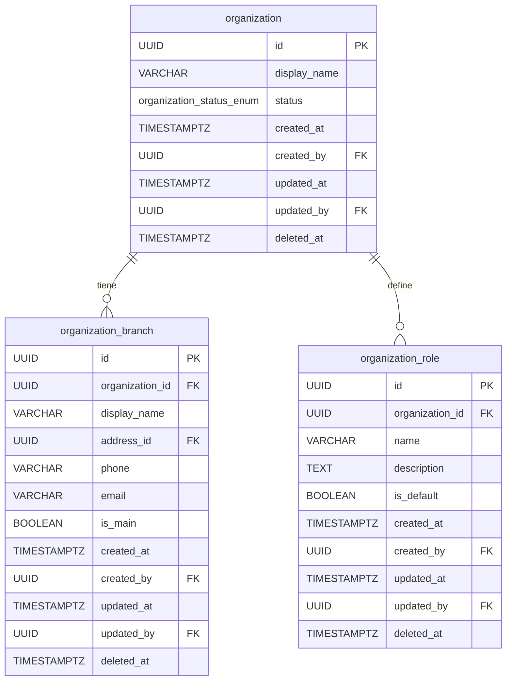
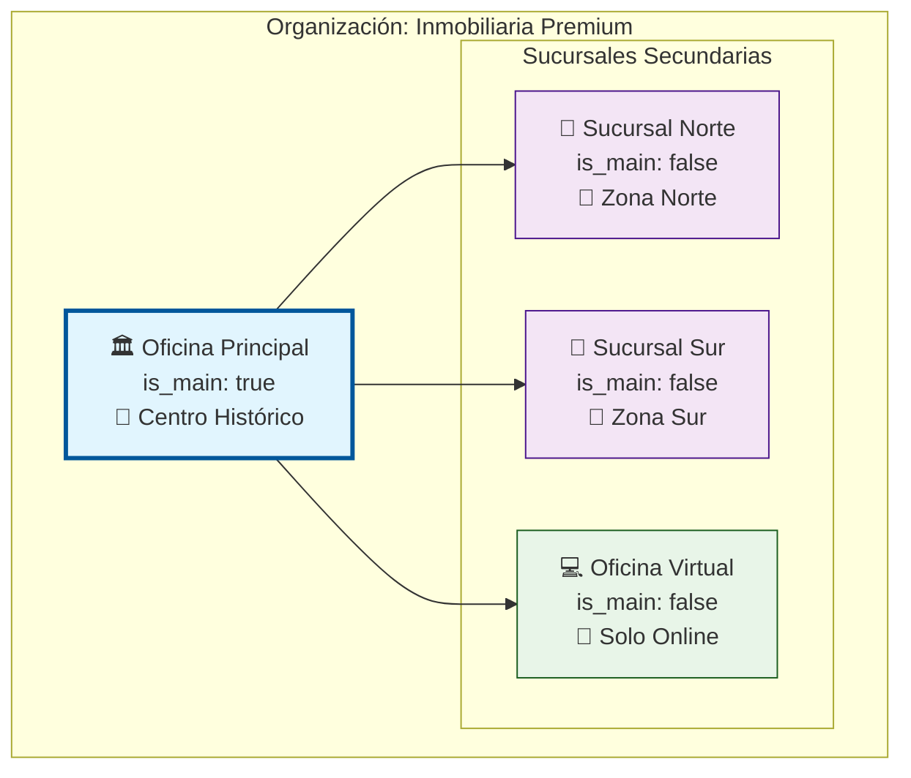
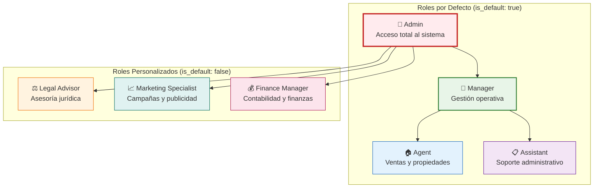
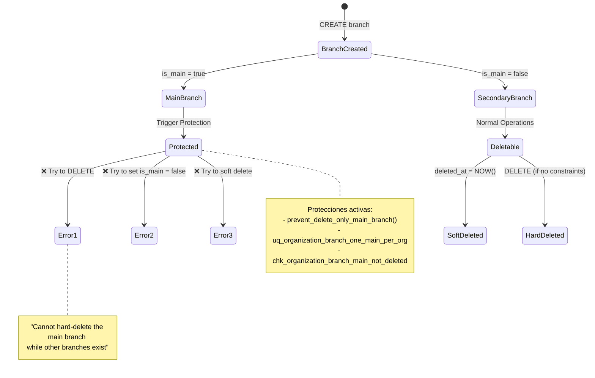

# Migration 0003: Estructura Organizacional

## 📋 Descripción General

La migración `0003_create_structure.up.sql` establece la **estructura interna** de las organizaciones inmobiliarias mediante sucursales y roles. Esta migración define:

- **2 tablas estructurales** para la jerarquía organizacional
- **6 funciones especializadas** para business logic y protección de datos
- **8 triggers** para integridad y automatización
- **Constraints únicos inteligentes** con índices parciales optimizados
- **Sistema de roles y sucursales** con protecciones para elementos críticos

## 🏗️ Arquitectura Estructural

### 📊 Diagrama Entidad-Relación



### 🏢 Diagrama de Arquitectura de Sucursales



### 👥 Diagrama de Jerarquía de Roles



### 🔄 Diagrama de Estados y Protecciones



## 📋 Especificaciones de Tablas

### 🏢 Tabla: `organization_branch`

#### Estructura y Campos

```sql
CREATE TABLE organization_branch (
    id              UUID         PRIMARY KEY DEFAULT generate_uuid(),
    organization_id UUID         NOT NULL,
    display_name    VARCHAR(120) NOT NULL,
    address_id      UUID,        -- FK externa → address-svc
    phone           VARCHAR(32),
    email           VARCHAR(160),
    is_main         BOOLEAN      NOT NULL DEFAULT false,
    
    -- Auditoría completa
    created_at      TIMESTAMP WITH TIME ZONE NOT NULL DEFAULT current_timestamp_utc(),
    created_by      UUID NOT NULL,
    updated_at      TIMESTAMP WITH TIME ZONE NOT NULL DEFAULT current_timestamp_utc(),
    updated_by      UUID,
    deleted_at      TIMESTAMP WITH TIME ZONE
);
```

#### 🔍 Descripción de Campos

| Campo | Tipo | Descripción | Constraints |
|-------|------|-------------|-------------|
| `id` | UUID | Identificador único de la sucursal | PK, auto-generado |
| `organization_id` | UUID | Organización propietaria | FK a `organization.id`, NOT NULL |
| `display_name` | VARCHAR(120) | Nombre comercial de la sucursal | NOT NULL, mín. 2 caracteres |
| `address_id` | UUID | **FK lógica** a `address-svc.address.id` | No enforced por DB |
| `phone` | VARCHAR(32) | Teléfono de contacto | Formato: `^[\+]?[0-9\s\-\(\)\.]{7,20}$` |
| `email` | VARCHAR(160) | Email de la sucursal | Validación con `is_valid_email()` |
| `is_main` | BOOLEAN | Indica si es la sucursal principal | Default: false, **solo una por org** |
| `created_at` | TIMESTAMPTZ | Timestamp de creación | Auto-asignado |
| `created_by` | UUID | **FK lógica** a `auth-identity-svc.users.id` | NOT NULL |
| `updated_at` | TIMESTAMPTZ | Última modificación | Auto-actualizado |
| `updated_by` | UUID | Usuario que hizo última modificación | Opcional |
| `deleted_at` | TIMESTAMPTZ | Soft delete timestamp | NULL = activo |

#### ⚠️ Constraints Críticos

```sql
-- Solo una sucursal principal por organización
CREATE UNIQUE INDEX uq_organization_branch_one_main_per_org 
ON organization_branch(organization_id) 
WHERE is_main = true AND deleted_at IS NULL;

-- Sucursal principal no puede ser soft-deleted
CONSTRAINT chk_organization_branch_main_not_deleted 
    CHECK (deleted_at IS NULL OR is_main = false)
```

**🔒 Protecciones Especiales:**
- **Una sola sucursal principal** por organización (índice único)
- **No eliminar sucursal principal** si existen otras sucursales
- **Validación de email** automática si se proporciona
- **Formato de teléfono** internacional flexible

#### 📊 Índices Optimizados

```sql
-- Consultas por organización (solo activas)
CREATE INDEX ix_organization_branch_organization_active 
ON organization_branch(organization_id) WHERE deleted_at IS NULL;

-- Búsqueda rápida de sucursal principal
CREATE INDEX ix_organization_branch_is_main 
ON organization_branch(organization_id, is_main) 
WHERE deleted_at IS NULL AND is_main = true;

-- Consultas por dirección
CREATE INDEX ix_organization_branch_address 
ON organization_branch(address_id) WHERE address_id IS NOT NULL;

-- Búsqueda por email
CREATE INDEX ix_organization_branch_email 
ON organization_branch(email) WHERE email IS NOT NULL;
```

### 👥 Tabla: `organization_role`

#### Estructura de Roles

```sql
CREATE TABLE organization_role (
    id              UUID         PRIMARY KEY DEFAULT generate_uuid(),
    organization_id UUID         NOT NULL,
    name            VARCHAR(64)  NOT NULL,
    description     TEXT,
    is_default      BOOLEAN      NOT NULL DEFAULT false,
    
    -- Auditoría completa
    created_at      TIMESTAMP WITH TIME ZONE NOT NULL DEFAULT current_timestamp_utc(),
    created_by      UUID NOT NULL,
    updated_at      TIMESTAMP WITH TIME ZONE NOT NULL DEFAULT current_timestamp_utc(),
    updated_by      UUID,
    deleted_at      TIMESTAMP WITH TIME ZONE
);
```

#### 🎭 Descripción de Campos

| Campo | Tipo | Descripción | Constraints |
|-------|------|-------------|-------------|
| `id` | UUID | Identificador único del rol | PK, auto-generado |
| `organization_id` | UUID | Organización propietaria | FK a `organization.id`, NOT NULL |
| `name` | VARCHAR(64) | Nombre del rol | NOT NULL, único por org (case-insensitive) |
| `description` | TEXT | Descripción detallada del rol | Opcional |
| `is_default` | BOOLEAN | Rol predeterminado del sistema | Default: false, **no eliminable** |
| `created_at` | TIMESTAMPTZ | Timestamp de creación | Auto-asignado |
| `created_by` | UUID | **FK lógica** a `auth-identity-svc.users.id` | NOT NULL |
| `updated_at` | TIMESTAMPTZ | Última modificación | Auto-actualizado |
| `updated_by` | UUID | Usuario que hizo última modificación | Opcional |
| `deleted_at` | TIMESTAMPTZ | Soft delete timestamp | NULL = activo |

#### 🎯 Roles por Defecto

Cuando se crea una organización, se generan automáticamente 4 roles predeterminados:

| Rol | Descripción | Permisos Típicos |
|-----|-------------|------------------|
| **Admin** | Acceso administrativo completo | Todas las funciones del sistema |
| **Manager** | Gestión operativa | Gestión de propiedades, empleados, reportes |
| **Agent** | Agente inmobiliario | Gestión de propiedades y clientes |
| **Assistant** | Asistente administrativo | Tareas de soporte limitadas |

#### 🔒 Protecciones de Roles

```sql
-- Nombre único por organización (case-insensitive)
CREATE UNIQUE INDEX uq_organization_role_name_case_insensitive 
ON organization_role(organization_id, LOWER(name)) 
WHERE deleted_at IS NULL;

-- Roles por defecto no eliminables
CREATE OR REPLACE FUNCTION prevent_delete_default_roles()
RETURNS TRIGGER AS $$
BEGIN
    IF OLD.is_default = true THEN
        RAISE EXCEPTION 'Cannot delete default role: %', OLD.name;
    END IF;
    RETURN OLD;
END;
$$ LANGUAGE plpgsql;
```

## 🛠️ Funciones Especializadas

### 🔒 Protección de Sucursal Principal

#### `prevent_delete_only_main_branch()`
```sql
CREATE OR REPLACE FUNCTION prevent_delete_only_main_branch()
RETURNS TRIGGER AS $$
BEGIN
    -- Verificar si hay otras sucursales en la organización
    IF OLD.is_main = true THEN
        IF (SELECT COUNT(*) FROM organization_branch 
            WHERE organization_id = OLD.organization_id 
            AND id != OLD.id 
            AND deleted_at IS NULL) > 0 THEN
            IF TG_OP = 'DELETE' THEN
                RAISE EXCEPTION 'Cannot hard-delete the main branch while other branches exist. Set another branch as main first.';
            ELSE
                RAISE EXCEPTION 'Cannot modify main branch while other branches exist. Set another branch as main first.';
            END IF;
        END IF;
    END IF;
    RETURN COALESCE(NEW, OLD);
END;
$$ LANGUAGE plpgsql;
```

**Lógica de Protección:**
1. **Solo aplica a sucursales principales** (`is_main = true`)
2. **Cuenta sucursales activas** (excluye soft-deleted)
3. **Bloquea eliminación** si existen otras sucursales
4. **Mensaje explicativo** guía la resolución del problema

**Escenarios Protegidos:**
- Hard delete de sucursal principal con otras sucursales activas
- Soft delete de sucursal principal con otras sucursales activas
- Cambiar `is_main` de `true` a `false` en sucursal principal

### 🎭 Protección de Roles por Defecto

#### `prevent_delete_default_roles()`
```sql
CREATE OR REPLACE FUNCTION prevent_delete_default_roles()
RETURNS TRIGGER AS $$
BEGIN
    IF OLD.is_default = true THEN
        IF TG_OP = 'DELETE' THEN
            RAISE EXCEPTION 'Cannot hard-delete default role: %', OLD.name;
        ELSE
            RAISE EXCEPTION 'Cannot soft-delete default role: %', OLD.name;
        END IF;
    END IF;
    RETURN OLD;
END;
$$ LANGUAGE plpgsql;
```

**Protección Total:**
- **Hard delete**: Completamente bloqueado
- **Soft delete**: Completamente bloqueado
- **Motivo**: Roles críticos para el funcionamiento del sistema
- **Alternativa**: Desactivar temporalmente sin eliminar

### 🎛️ Inicialización de Datos

#### `create_default_organization_roles(org_id, creator_id)`
```sql
CREATE OR REPLACE FUNCTION create_default_organization_roles(org_id UUID, creator_id UUID)
RETURNS VOID AS $$
BEGIN
    INSERT INTO organization_role (organization_id, name, description, is_default, created_by) VALUES
    (org_id, 'Admin', 'Full administrative access to all organization features', true, creator_id),
    (org_id, 'Manager', 'Management access to most organization features', true, creator_id),
    (org_id, 'Agent', 'Real estate agent with property and client management access', true, creator_id),
    (org_id, 'Assistant', 'Limited access for administrative support tasks', true, creator_id)
    ON CONFLICT (organization_id, name) DO NOTHING;
END;
$$ LANGUAGE plpgsql;
```

#### `create_default_main_branch(org_id, org_name, creator_id)`
```sql
CREATE OR REPLACE FUNCTION create_default_main_branch(org_id UUID, org_name VARCHAR, creator_id UUID)
RETURNS VOID AS $$
BEGIN
    INSERT INTO organization_branch (organization_id, display_name, is_main, created_by) VALUES
    (org_id, org_name || ' - Oficina Principal', true, creator_id)
    ON CONFLICT DO NOTHING;
END;
$$ LANGUAGE plpgsql;
```

**Características:**
- **Idempotentes**: No fallan si los datos ya existen
- **Automáticas**: Se pueden llamar desde triggers de otras migraciones
- **Flexibles**: Permiten personalización posterior

## 🔄 Sistema de Triggers

### ⏰ Triggers de Auditoría

```sql
-- Actualización automática de timestamps
CREATE TRIGGER trg_organization_branch_updated_at
    BEFORE UPDATE ON organization_branch
    FOR EACH ROW EXECUTE FUNCTION update_organization_updated_at();

CREATE TRIGGER trg_organization_role_updated_at
    BEFORE UPDATE ON organization_role
    FOR EACH ROW EXECUTE FUNCTION update_organization_updated_at();
```

### 🔒 Triggers de Protección - Sucursales

```sql
-- Protección contra modificación de sucursal principal
CREATE TRIGGER trg_organization_branch_prevent_delete_only_main
    BEFORE UPDATE OF deleted_at, is_main ON organization_branch
    FOR EACH ROW EXECUTE FUNCTION prevent_delete_only_main_branch();

-- Protección contra hard delete de sucursal principal
CREATE TRIGGER trg_organization_branch_prevent_hard_delete_main
    BEFORE DELETE ON organization_branch
    FOR EACH ROW EXECUTE FUNCTION prevent_delete_only_main_branch();
```

### 🎭 Triggers de Protección - Roles

```sql
-- Protección contra soft delete de roles por defecto
CREATE TRIGGER trg_organization_role_prevent_delete_default
    BEFORE UPDATE OF deleted_at ON organization_role
    FOR EACH ROW WHEN (NEW.deleted_at IS NOT NULL AND OLD.deleted_at IS NULL)
    EXECUTE FUNCTION prevent_delete_default_roles();

-- Protección contra hard delete de roles por defecto
CREATE TRIGGER trg_organization_role_prevent_hard_delete_default
    BEFORE DELETE ON organization_role
    FOR EACH ROW EXECUTE FUNCTION prevent_delete_default_roles();
```

## 📝 Ejemplos Prácticos

### 🏢 Creación Completa de Estructura Organizacional

```sql
-- 1. Crear organización (desde migración anterior)
INSERT INTO organization (display_name, created_by) 
VALUES ('Inmobiliaria Sunset Premium', '123e4567-e89b-12d3-a456-426614174000')
RETURNING id;
-- Resultado: '550e8400-e29b-41d4-a716-446655440001'

-- 2. Crear roles por defecto automáticamente
SELECT create_default_organization_roles(
    '550e8400-e29b-41d4-a716-446655440001',
    '123e4567-e89b-12d3-a456-426614174000'
);

-- 3. Crear sucursal principal automáticamente
SELECT create_default_main_branch(
    '550e8400-e29b-41d4-a716-446655440001',
    'Inmobiliaria Sunset Premium',
    '123e4567-e89b-12d3-a456-426614174000'
);
```

### 🏢 Gestión de Sucursales

```sql
-- 4. Agregar sucursales adicionales
INSERT INTO organization_branch (
    organization_id,
    display_name,
    address_id,
    phone,
    email,
    is_main,
    created_by
) VALUES 
-- Sucursal Norte
('550e8400-e29b-41d4-a716-446655440001', 
 'Sunset Premium - Sucursal Norte',
 '661f9510-f39c-52e5-b827-557766551001', -- ID del address-svc
 '+52 55 1234 5678',
 'norte@sunsetpremium.com',
 false,
 '123e4567-e89b-12d3-a456-426614174000'),

-- Sucursal Sur
('550e8400-e29b-41d4-a716-446655440001',
 'Sunset Premium - Sucursal Sur', 
 '661f9510-f39c-52e5-b827-557766551002',
 '+52 55 8765 4321',
 'sur@sunsetpremium.com',
 false,
 '123e4567-e89b-12d3-a456-426614174000'),

-- Oficina Virtual
('550e8400-e29b-41d4-a716-446655440001',
 'Sunset Premium - Oficina Virtual',
 NULL, -- Sin dirección física
 '+52 55 5555 0000',
 'virtual@sunsetpremium.com',
 false,
 '123e4567-e89b-12d3-a456-426614174000');
```

### 👥 Gestión de Roles Personalizados

```sql
-- 5. Agregar roles personalizados
INSERT INTO organization_role (
    organization_id,
    name,
    description,
    is_default,
    created_by
) VALUES
-- Rol especializado
('550e8400-e29b-41d4-a716-446655440001',
 'Legal Advisor',
 'Responsible for legal compliance, contract reviews, and regulatory matters',
 false,
 '123e4567-e89b-12d3-a456-426614174000'),

-- Rol de marketing
('550e8400-e29b-41d4-a716-446655440001',
 'Marketing Specialist', 
 'Manages marketing campaigns, social media, and lead generation',
 false,
 '123e4567-e89b-12d3-a456-426614174000'),

-- Rol financiero
('550e8400-e29b-41d4-a716-446655440001',
 'Finance Manager',
 'Handles accounting, financial reporting, and budget management',
 false,
 '123e4567-e89b-12d3-a456-426614174000');
```

### 🔄 Cambio de Sucursal Principal

```sql
-- 6. Proceso seguro para cambiar sucursal principal
BEGIN;

-- Paso 1: Obtener IDs de sucursales
WITH branch_info AS (
    SELECT id, display_name, is_main
    FROM organization_branch 
    WHERE organization_id = '550e8400-e29b-41d4-a716-446655440001'
    AND deleted_at IS NULL
)
SELECT * FROM branch_info;

-- Paso 2: Cambiar la sucursal principal (atomically)
-- Primero, quitar is_main de la actual
UPDATE organization_branch 
SET is_main = false,
    updated_by = '123e4567-e89b-12d3-a456-426614174000'
WHERE organization_id = '550e8400-e29b-41d4-a716-446655440001' 
AND is_main = true;

-- Después, asignar nueva sucursal principal
UPDATE organization_branch 
SET is_main = true,
    updated_by = '123e4567-e89b-12d3-a456-426614174000'
WHERE id = '661f9510-f39c-52e5-b827-557766551003' -- ID de la nueva principal
AND organization_id = '550e8400-e29b-41d4-a716-446655440001';

COMMIT;
```

### ❌ Operaciones Protegidas (Fallarán)

```sql
-- 7. Intentos que serán bloqueados por triggers

-- ❌ Intentar eliminar rol por defecto
DELETE FROM organization_role 
WHERE organization_id = '550e8400-e29b-41d4-a716-446655440001' 
AND name = 'Admin';
-- ERROR: Cannot hard-delete default role: Admin

-- ❌ Intentar soft-delete de rol por defecto  
UPDATE organization_role 
SET deleted_at = current_timestamp_utc()
WHERE organization_id = '550e8400-e29b-41d4-a716-446655440001'
AND name = 'Manager';
-- ERROR: Cannot soft-delete default role: Manager

-- ❌ Intentar eliminar sucursal principal con otras sucursales activas
DELETE FROM organization_branch 
WHERE organization_id = '550e8400-e29b-41d4-a716-446655440001'
AND is_main = true;
-- ERROR: Cannot hard-delete the main branch while other branches exist

-- ❌ Intentar crear segunda sucursal principal
INSERT INTO organization_branch (organization_id, display_name, is_main, created_by)
VALUES ('550e8400-e29b-41d4-a716-446655440001', 'Segunda Principal', true, 
        '123e4567-e89b-12d3-a456-426614174000');
-- ERROR: duplicate key value violates unique constraint "uq_organization_branch_one_main_per_org"
```

## 🔍 Consultas de Análisis y Monitoreo

### 🏢 Análisis de Sucursales

```sql
-- Resumen de sucursales por organización
SELECT 
    o.display_name as organization,
    COUNT(ob.id) as total_branches,
    COUNT(CASE WHEN ob.is_main THEN 1 END) as main_branches,
    COUNT(CASE WHEN ob.email IS NOT NULL THEN 1 END) as branches_with_email,
    COUNT(CASE WHEN ob.phone IS NOT NULL THEN 1 END) as branches_with_phone,
    COUNT(CASE WHEN ob.address_id IS NOT NULL THEN 1 END) as branches_with_address
FROM organization o
LEFT JOIN organization_branch ob ON o.id = ob.organization_id 
    AND ob.deleted_at IS NULL
WHERE o.deleted_at IS NULL
GROUP BY o.id, o.display_name
ORDER BY total_branches DESC;

-- Detectar organizaciones sin sucursal principal
SELECT 
    o.display_name,
    COUNT(ob.id) as total_branches,
    MAX(CASE WHEN ob.is_main THEN 1 ELSE 0 END) as has_main_branch
FROM organization o
LEFT JOIN organization_branch ob ON o.id = ob.organization_id 
    AND ob.deleted_at IS NULL
WHERE o.deleted_at IS NULL
GROUP BY o.id, o.display_name
HAVING MAX(CASE WHEN ob.is_main THEN 1 ELSE 0 END) = 0
ORDER BY o.display_name;
```

### 👥 Análisis de Roles

```sql
-- Distribución de roles por organización
SELECT 
    o.display_name as organization,
    COUNT(or_.id) as total_roles,
    COUNT(CASE WHEN or_.is_default THEN 1 END) as default_roles,
    COUNT(CASE WHEN NOT or_.is_default THEN 1 END) as custom_roles,
    string_agg(CASE WHEN or_.is_default THEN or_.name END, ', ') as default_role_names,
    string_agg(CASE WHEN NOT or_.is_default THEN or_.name END, ', ') as custom_role_names
FROM organization o
LEFT JOIN organization_role or_ ON o.id = or_.organization_id 
    AND or_.deleted_at IS NULL
WHERE o.deleted_at IS NULL
GROUP BY o.id, o.display_name
ORDER BY custom_roles DESC, total_roles DESC;

-- Verificar integridad de roles por defecto
WITH expected_default_roles AS (
    SELECT unnest(ARRAY['Admin', 'Manager', 'Agent', 'Assistant']) as role_name
),
org_default_roles AS (
    SELECT 
        o.id as org_id,
        o.display_name,
        or_.name as existing_role
    FROM organization o
    LEFT JOIN organization_role or_ ON o.id = or_.organization_id 
        AND or_.is_default = true 
        AND or_.deleted_at IS NULL
    WHERE o.deleted_at IS NULL
)
SELECT 
    odr.display_name as organization,
    edr.role_name as expected_role,
    CASE 
        WHEN odr.existing_role IS NOT NULL THEN '✅ Present'
        ELSE '❌ Missing'
    END as status
FROM expected_default_roles edr
CROSS JOIN (SELECT DISTINCT org_id, display_name FROM org_default_roles) orgs
LEFT JOIN org_default_roles odr ON orgs.org_id = odr.org_id 
    AND edr.role_name = odr.existing_role
ORDER BY orgs.display_name, edr.role_name;
```

### 📊 Análisis de Integridad y Performance

```sql
-- Verificar constraints únicos
SELECT 
    'organization_branch' as table_name,
    'main_branch_uniqueness' as constraint_type,
    organization_id,
    COUNT(*) as violations
FROM organization_branch 
WHERE is_main = true AND deleted_at IS NULL
GROUP BY organization_id
HAVING COUNT(*) > 1

UNION ALL

SELECT 
    'organization_role' as table_name,
    'role_name_uniqueness' as constraint_type,
    organization_id,
    COUNT(*) as violations
FROM organization_role 
WHERE deleted_at IS NULL
GROUP BY organization_id, LOWER(name)
HAVING COUNT(*) > 1;

-- Análisis de uso de campos opcionales
SELECT 
    'organization_branch' as table_name,
    COUNT(*) as total_records,
    COUNT(address_id) as with_address,
    COUNT(phone) as with_phone, 
    COUNT(email) as with_email,
    ROUND(COUNT(address_id) * 100.0 / COUNT(*), 2) as address_percentage,
    ROUND(COUNT(phone) * 100.0 / COUNT(*), 2) as phone_percentage,
    ROUND(COUNT(email) * 100.0 / COUNT(*), 2) as email_percentage
FROM organization_branch 
WHERE deleted_at IS NULL;
```

### 🔧 Consultas de Diagnóstico

```sql
-- Estado de triggers y funciones
SELECT 
    t.tgname as trigger_name,
    c.relname as table_name,
    p.proname as function_name,
    t.tgenabled as enabled
FROM pg_trigger t
JOIN pg_class c ON t.tgrelid = c.oid
JOIN pg_proc p ON t.tgfoid = p.oid
WHERE c.relname IN ('organization_branch', 'organization_role')
ORDER BY c.relname, t.tgname;

-- Verificar índices únicos
SELECT 
    i.indexname,
    i.tablename,
    i.indexdef
FROM pg_indexes i
WHERE i.tablename IN ('organization_branch', 'organization_role')
AND i.indexname LIKE 'uq_%'
ORDER BY i.tablename, i.indexname;

-- Estadísticas de uso por organización
SELECT 
    o.display_name,
    COUNT(ob.id) as branches,
    COUNT(or_.id) as roles,
    MAX(ob.created_at) as last_branch_created,
    MAX(or_.created_at) as last_role_created,
    extract(days from current_timestamp_utc() - o.created_at) as days_since_creation
FROM organization o
LEFT JOIN organization_branch ob ON o.id = ob.organization_id AND ob.deleted_at IS NULL
LEFT JOIN organization_role or_ ON o.id = or_.organization_id AND or_.deleted_at IS NULL
WHERE o.deleted_at IS NULL
GROUP BY o.id, o.display_name, o.created_at
ORDER BY days_since_creation DESC;
```

## ⚠️ Consideraciones Importantes

### 🔒 Integridad y Consistencia

#### Sucursal Principal Única
- **Constraint crítico**: Solo una sucursal puede ser `is_main = true` por organización
- **Implementación**: Índice único parcial más eficiente que triggers
- **Protección**: No se puede eliminar sucursal principal si existen otras

#### Roles por Defecto Protegidos
- **Inmutables**: Los 4 roles por defecto no se pueden eliminar
- **Críticos**: Necesarios para el funcionamiento básico del sistema
- **Flexibles**: Se pueden modificar nombres y descripciones (no recomendado)

### 🚀 Performance y Escalabilidad

#### Índices Optimizados
- **Parciales**: Solo indexan registros activos (deleted_at IS NULL)
- **Específicos**: Diseñados para consultas frecuentes
- **Únicos**: Garantizan integridad con performance óptima

#### FK Lógicas
- **Flexibilidad**: Permite deployment independiente de servicios
- **Responsabilidad**: Validación en capa de aplicación
- **Beneficio**: Evita deadlocks entre microservicios

### 🔧 Mantenimiento y Operaciones

#### Triggers de Auditoría
- **Automáticos**: updated_at se actualiza en todos los UPDATEs
- **Consistentes**: Reutilizan función genérica de migración 0002
- **Extensibles**: Fácil agregar auditoría a nuevas tablas

#### Funciones de Inicialización
- **Idempotentes**: Safe para ejecutar múltiples veces
- **Flexibles**: Permiten personalización posterior
- **Automáticas**: Se pueden integrar en flujos de creación

### 📈 Patterns y Mejores Prácticas

#### Soft Delete Consistente
- **Estándar**: Todas las tablas estructurales soportan soft delete
- **Indexado**: Índices excluyen registros eliminados
- **Queries**: Siempre filtrar por deleted_at IS NULL

#### Validaciones en Base de Datos
- **Defense in Depth**: Validaciones tanto en DB como en aplicación
- **Formato**: Email y teléfono validados con regex
- **Business Rules**: Lógica crítica protegida con triggers

## 📚 Referencias Técnicas

### 🔗 Dependencias Externas

| Campo | Servicio | Tabla | Descripción |
|-------|----------|-------|-------------|
| `organization_id` | organization-svc | organization | Organización propietaria |
| `address_id` | address-svc | address | Dirección física de la sucursal |
| `created_by` | auth-identity-svc | users | Usuario que creó el registro |
| `updated_by` | auth-identity-svc | users | Usuario que modificó el registro |

### 📊 Funciones Reutilizadas

| Función | Migración Origen | Uso |
|---------|------------------|-----|
| `generate_uuid()` | 0001 | Generación de PKs |
| `current_timestamp_utc()` | 0001 | Timestamps consistentes |
| `is_valid_email()` | 0001 | Validación de emails |
| `update_organization_updated_at()` | 0002 | Triggers de auditoría |

### 🏛️ Arquitectura de Constraints

| Constraint | Tipo | Tabla | Propósito |
|------------|------|-------|-----------|
| `uq_organization_branch_one_main_per_org` | Unique Index | organization_branch | Una sucursal principal por org |
| `uq_organization_role_name_case_insensitive` | Unique Index | organization_role | Nombres únicos case-insensitive |
| `chk_organization_branch_main_not_deleted` | Check | organization_branch | Sucursal principal no soft-deleteable |

## 📋 Próximos Pasos

### 🔄 Migraciones Siguientes
1. **0004**: Empleados y asignación a sucursales/roles
2. **0005**: Sistema de invitaciones para nuevos empleados
3. **0006**: Integraciones externas con logs particionados
4. **0007**: Dominios personalizados por organización
5. **0008**: Mejoras y optimizaciones finales

### 🎯 Integraciones Futuras
- **Employee Management**: Asignar empleados a sucursales y roles
- **Permission System**: ACL basado en roles definidos aquí
- **Reporting**: Analytics por sucursal y rol
- **Address Integration**: Sincronización con address-svc

### 🧪 Testing y Validación

```sql
-- Smoke test incluido en migración
SELECT 1 FROM organization_branch LIMIT 0;
SELECT 1 FROM organization_role LIMIT 0;

INSERT INTO organization_branch (organization_id, display_name, is_main, created_by) 
VALUES (generate_uuid(), 'Test Branch', true, generate_uuid());

SELECT create_default_organization_roles(generate_uuid(), generate_uuid());

SELECT indexname FROM pg_indexes 
WHERE tablename IN ('organization_branch', 'organization_role') 
AND indexname LIKE 'uq_%';
```

---

**⚡ Nota Crítica**: Esta migración establece la estructura jerárquica fundamental. Los cambios en constraints únicos o protecciones de roles por defecto pueden impactar significativamente el sistema de permisos y la lógica de negocio.
