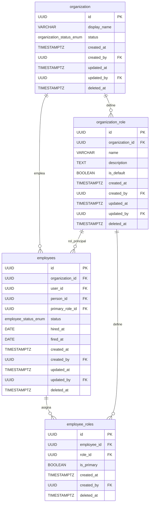
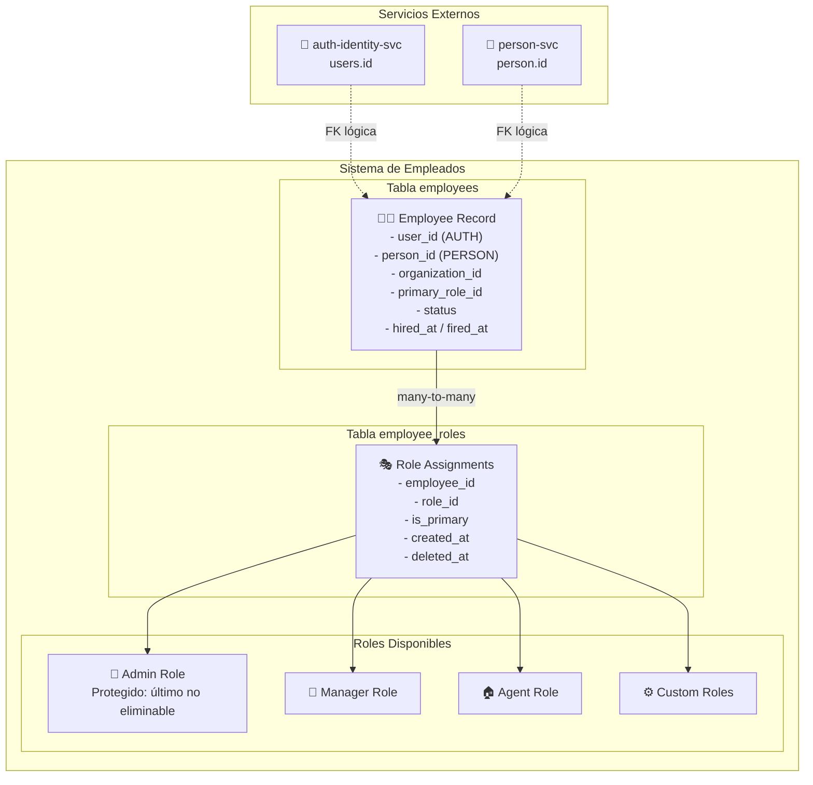
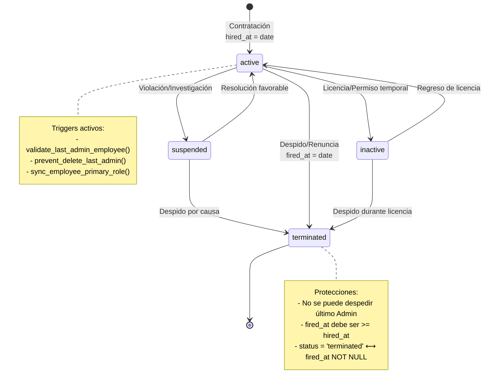
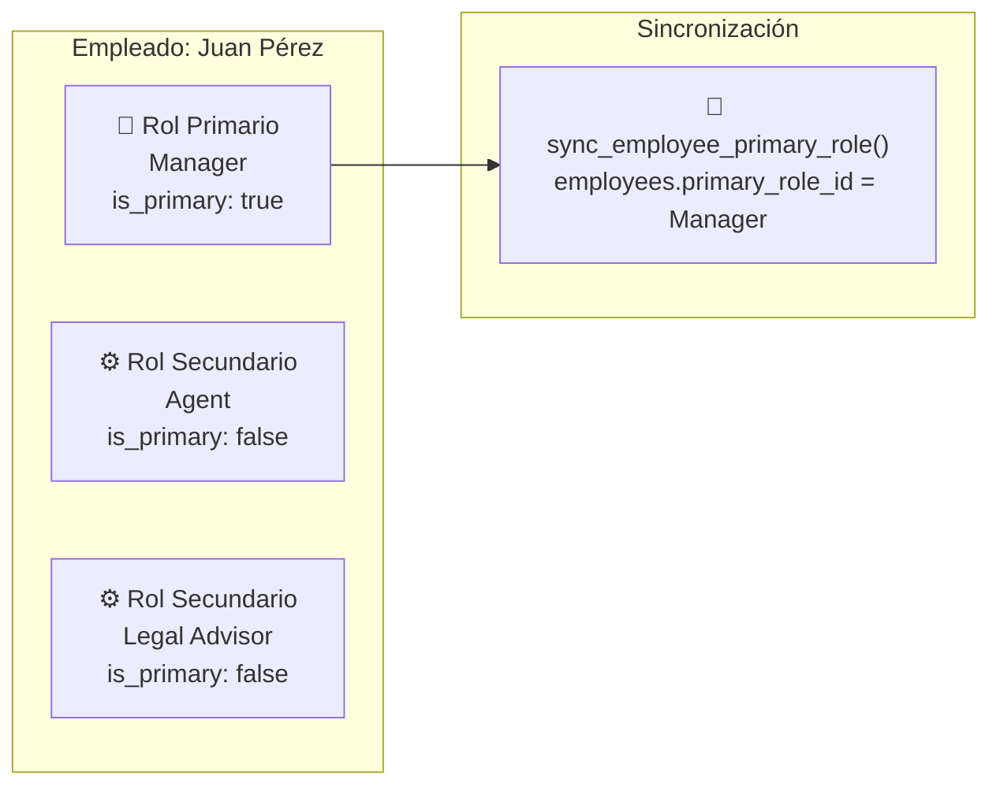

# Migration 0004: Gestión de Empleados

## 📋 Descripción General

La migración `0004_create_employee.up.sql` establece el **sistema de gestión de empleados** para las organizaciones inmobiliarias. Esta migración define:

- **2 tablas principales** para empleados y asignación de roles
- **5 funciones especializadas** para business logic y protección de datos críticos
- **4 triggers avanzados** para sincronización automática y validaciones
- **Constraints únicos inteligentes** que garantizan integridad organizacional
- **Protección del último administrador** para evitar lockout organizacional

## 🏗️ Arquitectura del Sistema de Empleados

### 📊 Diagrama Entidad-Relación



### 👥 Diagrama de Arquitectura de Empleados



### 🔄 Diagrama de Estados de Empleado



### 🎭 Diagrama de Asignación de Roles



## 📋 Especificaciones de Tablas

### 👨‍💼 Tabla: `employees`

#### Estructura y Campos

```sql
CREATE TABLE employees (
    id               UUID         PRIMARY KEY DEFAULT generate_uuid(),
    organization_id  UUID         NOT NULL,
    user_id          UUID         NOT NULL, -- FK lógica → auth-identity-svc
    person_id        UUID,        -- FK lógica → person-svc
    primary_role_id  UUID,        -- FK → organization_role.id
    status           employee_status_enum NOT NULL DEFAULT 'active',
    hired_at         DATE,
    fired_at         DATE,
    
    -- Auditoría completa
    created_at       TIMESTAMP WITH TIME ZONE NOT NULL DEFAULT current_timestamp_utc(),
    created_by       UUID NOT NULL,
    updated_at       TIMESTAMP WITH TIME ZONE NOT NULL DEFAULT current_timestamp_utc(),
    updated_by       UUID,
    deleted_at       TIMESTAMP WITH TIME ZONE
);
```

#### 🔍 Descripción de Campos

| Campo | Tipo | Descripción | Constraints |
|-------|------|-------------|-------------|
| `id` | UUID | Identificador único del empleado | PK, auto-generado |
| `organization_id` | UUID | Organización empleadora | FK a `organization.id`, NOT NULL |
| `user_id` | UUID | **FK lógica** a `auth-identity-svc.users.id` | NOT NULL, UUID válido, único por org |
| `person_id` | UUID | **FK lógica** a `person-svc.person.id` | Opcional, para datos personales |
| `primary_role_id` | UUID | Rol principal del empleado | FK a `organization_role.id`, ON DELETE SET NULL |
| `status` | employee_status_enum | Estado laboral del empleado | Default: 'active' |
| `hired_at` | DATE | Fecha de contratación | No puede ser futura |
| `fired_at` | DATE | Fecha de despido | Debe ser >= hired_at si existe |
| `created_at` | TIMESTAMPTZ | Timestamp de creación | Auto-asignado |
| `created_by` | UUID | **FK lógica** a `auth-identity-svc.users.id` | NOT NULL |
| `updated_at` | TIMESTAMPTZ | Última modificación | Auto-actualizado |
| `updated_by` | UUID | Usuario que hizo última modificación | Opcional |
| `deleted_at` | TIMESTAMPTZ | Soft delete timestamp | NULL = activo |

#### ⚠️ Constraints Críticos

```sql
-- Usuario único por organización
CONSTRAINT uq_employees_user_organization 
    UNIQUE (user_id, organization_id) DEFERRABLE INITIALLY DEFERRED

-- Consistencia de fechas de contratación/despido
CONSTRAINT chk_employees_hire_fire_dates 
    CHECK (fired_at IS NULL OR hired_at IS NULL OR fired_at >= hired_at)

-- Fecha de contratación no futura
CONSTRAINT chk_employees_hired_not_future 
    CHECK (hired_at IS NULL OR hired_at <= CURRENT_DATE)

-- Consistencia entre status y fecha de despido
CONSTRAINT chk_employees_status_fire_consistency 
    CHECK ((status = 'terminated' AND fired_at IS NOT NULL) OR 
           (status != 'terminated' AND fired_at IS NULL))
```

**🔒 Protecciones Especiales:**
- **Usuario único** por organización (evita duplicados)
- **Consistencia temporal** en fechas de contratación/despido
- **Estados coherentes** entre `status` y `fired_at`
- **Protección del último admin** no eliminable

#### 📊 Índices Optimizados

```sql
-- Consultas por organización (solo activos)
CREATE INDEX ix_employees_organization_active 
ON employees(organization_id) WHERE deleted_at IS NULL;

-- Consultas por usuario (solo activos)
CREATE INDEX ix_employees_user_active 
ON employees(user_id) WHERE deleted_at IS NULL;

-- Consultas por datos personales
CREATE INDEX ix_employees_person_active 
ON employees(person_id) WHERE person_id IS NOT NULL AND deleted_at IS NULL;

-- Consultas por rol principal
CREATE INDEX ix_employees_primary_role 
ON employees(primary_role_id) WHERE primary_role_id IS NOT NULL;
```

### 🎭 Tabla: `employee_roles`

#### Estructura de Asignación de Roles

```sql
CREATE TABLE employee_roles (
    id               UUID         PRIMARY KEY DEFAULT generate_uuid(),
    employee_id      UUID         NOT NULL,
    role_id          UUID         NOT NULL,
    is_primary       BOOLEAN      NOT NULL DEFAULT false,
    
    -- Auditoría mejorada
    created_at       TIMESTAMP WITH TIME ZONE NOT NULL DEFAULT current_timestamp_utc(),
    created_by       UUID NOT NULL,
    deleted_at       TIMESTAMP WITH TIME ZONE
);
```

#### 🎯 Descripción de Campos

| Campo | Tipo | Descripción | Constraints |
|-------|------|-------------|-------------|
| `id` | UUID | Identificador único de la asignación | PK, auto-generado |
| `employee_id` | UUID | Empleado al que se asigna el rol | FK a `employees.id`, NOT NULL |
| `role_id` | UUID | Rol que se asigna | FK a `organization_role.id`, NOT NULL |
| `is_primary` | BOOLEAN | Indica si es el rol principal | Default: false, **solo uno por empleado** |
| `created_at` | TIMESTAMPTZ | Timestamp de asignación | Auto-asignado |
| `created_by` | UUID | **FK lógica** a `auth-identity-svc.users.id` | NOT NULL |
| `deleted_at` | TIMESTAMPTZ | Soft delete de la asignación | NULL = activo |

#### 🔄 Sistema de Roles Múltiples

**Concepto:**
- Un empleado puede tener **múltiples roles** simultáneamente
- Solo **uno puede ser primario** (`is_primary = true`)
- El rol primario se sincroniza automáticamente con `employees.primary_role_id`
- Los roles se pueden agregar/quitar dinámicamente

#### 🔒 Protecciones de Roles

```sql
-- Asignación única por empleado-rol
CONSTRAINT uq_employee_roles_unique 
    UNIQUE (employee_id, role_id) DEFERRABLE INITIALLY DEFERRED

-- Solo un rol primario por empleado
CREATE UNIQUE INDEX uq_employee_roles_one_primary_per_employee 
ON employee_roles(employee_id) 
WHERE is_primary = true AND deleted_at IS NULL;
```

## 🛠️ Funciones Especializadas

### 🔄 Sincronización de Rol Principal

#### `sync_employee_primary_role()`
```sql
CREATE OR REPLACE FUNCTION sync_employee_primary_role()
RETURNS TRIGGER AS $$
DECLARE
    current_depth INTEGER;
BEGIN
    -- Prevenir recursión infinita
    current_depth := pg_trigger_depth();
    IF current_depth > 1 THEN
        RETURN COALESCE(NEW, OLD);
    END IF;
    
    IF TG_OP = 'INSERT' OR TG_OP = 'UPDATE' THEN
        -- Si se marca un rol como primario
        IF NEW.is_primary = true THEN
            -- Actualizar employees.primary_role_id
            UPDATE employees 
            SET primary_role_id = NEW.role_id,
                updated_at = current_timestamp_utc()
            WHERE id = NEW.employee_id;
            
            -- Desmarcar otros roles como primarios
            UPDATE employee_roles 
            SET is_primary = false
            WHERE employee_id = NEW.employee_id 
            AND role_id != NEW.role_id 
            AND is_primary = true
            AND deleted_at IS NULL;
        END IF;
        RETURN NEW;
    END IF;
    
    IF TG_OP = 'DELETE' THEN
        -- Si se elimina el rol primario, limpiar reference
        IF OLD.is_primary = true THEN
            UPDATE employees 
            SET primary_role_id = NULL,
                updated_at = current_timestamp_utc()
            WHERE id = OLD.employee_id
            AND primary_role_id = OLD.role_id;
        END IF;
        RETURN OLD;
    END IF;
    
    RETURN NULL;
END;
$$ LANGUAGE plpgsql;
```

**Lógica de Sincronización:**
1. **Previene recursión infinita** usando `pg_trigger_depth()`
2. **Actualiza automáticamente** `employees.primary_role_id`
3. **Desmarca otros roles primarios** para el mismo empleado
4. **Limpia referencias** cuando se elimina rol primario

### 🛡️ Protección del Último Administrador

#### `validate_last_admin_employee()`
```sql
CREATE OR REPLACE FUNCTION validate_last_admin_employee()
RETURNS TRIGGER AS $$
DECLARE
    admin_role_id UUID;
    admin_count INTEGER;
BEGIN
    -- Solo validar si se está despidiendo (terminando)
    IF (NEW.status = 'terminated' AND OLD.status != 'terminated') OR 
       (NEW.fired_at IS NOT NULL AND OLD.fired_at IS NULL) THEN
        
        -- Obtener el ID del rol Admin
        SELECT id INTO admin_role_id 
        FROM organization_role 
        WHERE organization_id = NEW.organization_id 
        AND LOWER(name) = 'admin' 
        AND deleted_at IS NULL;
        
        -- Verificar si este empleado es Admin
        IF EXISTS (SELECT 1 FROM employee_roles 
                  WHERE employee_id = NEW.id 
                  AND role_id = admin_role_id
                  AND deleted_at IS NULL) THEN
            
            -- Contar otros admins activos
            SELECT COUNT(*) INTO admin_count
            FROM employees e
            JOIN employee_roles er ON e.id = er.employee_id
            WHERE e.organization_id = NEW.organization_id
            AND e.id != NEW.id
            AND e.status = 'active'
            AND e.deleted_at IS NULL
            AND er.role_id = admin_role_id
            AND er.deleted_at IS NULL;
            
            -- Si no hay otros admins, bloquear
            IF admin_count = 0 THEN
                RAISE EXCEPTION 'Cannot terminate the last Admin of the organization. Assign Admin role to another employee first.';
            END IF;
        END IF;
    END IF;
    
    RETURN NEW;
END;
$$ LANGUAGE plpgsql;
```

#### `prevent_delete_last_admin()`
```sql
CREATE OR REPLACE FUNCTION prevent_delete_last_admin()
RETURNS TRIGGER AS $$
-- Implementación similar para hard delete
```

**Protección Multicapa:**
- **Soft delete**: `validate_last_admin_employee()` previene despido
- **Hard delete**: `prevent_delete_last_admin()` previene eliminación directa
- **Lógica compartida**: Cuenta admins activos excluyendo el actual
- **Mensaje claro**: Guía para resolver la situación

## 🔄 Sistema de Triggers

### ⏰ Triggers de Auditoría

```sql
-- Actualización automática de timestamps
CREATE TRIGGER trg_employees_updated_at
    BEFORE UPDATE ON employees
    FOR EACH ROW EXECUTE FUNCTION update_organization_updated_at();
```

### 🔄 Triggers de Sincronización

```sql
-- Sincronización de rol primario
CREATE TRIGGER trg_employee_roles_sync_primary
    AFTER INSERT OR UPDATE OF is_primary OR DELETE ON employee_roles
    FOR EACH ROW
    WHEN (TG_OP = 'INSERT' OR TG_OP = 'DELETE' OR 
          (TG_OP = 'UPDATE' AND OLD.is_primary IS DISTINCT FROM NEW.is_primary))
    EXECUTE FUNCTION sync_employee_primary_role();
```

### 🛡️ Triggers de Protección

```sql
-- Protección contra despido del último admin
CREATE TRIGGER trg_employees_validate_last_admin
    BEFORE UPDATE ON employees
    FOR EACH ROW EXECUTE FUNCTION validate_last_admin_employee();

-- Protección contra hard delete del último admin
CREATE TRIGGER trg_employees_prevent_delete_last_admin
    BEFORE DELETE ON employees
    FOR EACH ROW EXECUTE FUNCTION prevent_delete_last_admin();
```

## 📝 Ejemplos Prácticos

### 👨‍💼 Contratación Completa de Empleado

```sql
-- 1. Crear empleado con rol principal
WITH new_employee AS (
    INSERT INTO employees (
        organization_id,
        user_id,
        person_id,
        status,
        hired_at,
        created_by
    ) VALUES (
        '550e8400-e29b-41d4-a716-446655440001', -- Organización
        '123e4567-e89b-12d3-a456-426614174001', -- Usuario de auth-identity-svc
        '661f9510-f39c-52e5-b827-557766551001', -- Datos personales de person-svc
        'active'::employee_status_enum,
        CURRENT_DATE,
        '123e4567-e89b-12d3-a456-426614174000'  -- Usuario creador
    ) RETURNING id
),
agent_role AS (
    SELECT id FROM organization_role 
    WHERE organization_id = '550e8400-e29b-41d4-a716-446655440001'
    AND name = 'Agent'
    AND deleted_at IS NULL
)
-- 2. Asignar rol principal automáticamente
INSERT INTO employee_roles (
    employee_id,
    role_id,
    is_primary,
    created_by
) SELECT 
    ne.id,
    ar.id,
    true, -- Es el rol primario
    '123e4567-e89b-12d3-a456-426614174000'
FROM new_employee ne, agent_role ar;

-- Resultado: employees.primary_role_id se actualiza automáticamente por trigger
```

### 🎭 Gestión de Roles Múltiples

```sql
-- 3. Agregar roles adicionales a un empleado
INSERT INTO employee_roles (
    employee_id,
    role_id,
    is_primary,
    created_by
) VALUES
-- Rol secundario: Legal Advisor
('employee_id_aqui',
 (SELECT id FROM organization_role WHERE name = 'Legal Advisor' AND organization_id = '550e8400-e29b-41d4-a716-446655440001'),
 false, -- No es primario
 '123e4567-e89b-12d3-a456-426614174000'),

-- Rol secundario: Marketing Specialist  
('employee_id_aqui',
 (SELECT id FROM organization_role WHERE name = 'Marketing Specialist' AND organization_id = '550e8400-e29b-41d4-a716-446655440001'),
 false, -- No es primario
 '123e4567-e89b-12d3-a456-426614174000');

-- 4. Cambiar rol primario (trigger automático)
UPDATE employee_roles 
SET is_primary = true
WHERE employee_id = 'employee_id_aqui'
AND role_id = (SELECT id FROM organization_role WHERE name = 'Legal Advisor');

-- Resultado: 
-- - El rol anterior se marca como is_primary = false automáticamente
-- - employees.primary_role_id se actualiza automáticamente
```

### 👑 Gestión de Administradores

```sql
-- 5. Crear primer administrador (siempre permitido)
WITH new_admin AS (
    INSERT INTO employees (
        organization_id,
        user_id,
        status,
        hired_at,
        created_by
    ) VALUES (
        '550e8400-e29b-41d4-a716-446655440001',
        '123e4567-e89b-12d3-a456-426614174002',
        'active'::employee_status_enum,
        CURRENT_DATE,
        '123e4567-e89b-12d3-a456-426614174000'
    ) RETURNING id
)
INSERT INTO employee_roles (
    employee_id,
    role_id,
    is_primary,
    created_by
) SELECT 
    ne.id,
    (SELECT id FROM organization_role WHERE name = 'Admin' AND organization_id = '550e8400-e29b-41d4-a716-446655440001'),
    true,
    '123e4567-e89b-12d3-a456-426614174000'
FROM new_admin ne;

-- 6. Transferir rol de Admin antes de despedir
-- Paso 1: Asignar Admin a otro empleado
INSERT INTO employee_roles (
    employee_id,
    role_id,
    is_primary,
    created_by
) VALUES (
    'otro_empleado_id',
    (SELECT id FROM organization_role WHERE name = 'Admin'),
    false, -- Puede ser secundario inicialmente
    '123e4567-e89b-12d3-a456-426614174000'
);

-- Paso 2: Ahora se puede despedir al admin anterior
UPDATE employees 
SET status = 'terminated'::employee_status_enum,
    fired_at = CURRENT_DATE,
    updated_by = '123e4567-e89b-12d3-a456-426614174000'
WHERE id = 'admin_anterior_id';
```

### ❌ Operaciones Protegidas (Fallarán)

```sql
-- 7. Intentos que serán bloqueados por triggers

-- ❌ Intentar despedir al último Admin
UPDATE employees 
SET status = 'terminated'::employee_status_enum,
    fired_at = CURRENT_DATE
WHERE id = 'ultimo_admin_id';
-- ERROR: Cannot terminate the last Admin of the organization. Assign Admin role to another employee first.

-- ❌ Intentar hard-delete del último Admin
DELETE FROM employees WHERE id = 'ultimo_admin_id';
-- ERROR: Cannot hard-delete the last Admin of the organization. Assign Admin role to another employee first.

-- ❌ Crear empleado con fecha de contratación futura
INSERT INTO employees (organization_id, user_id, hired_at, created_by)
VALUES ('550e8400-e29b-41d4-a716-446655440001', 
        '123e4567-e89b-12d3-a456-426614174003',
        CURRENT_DATE + INTERVAL '1 day',
        '123e4567-e89b-12d3-a456-426614174000');
-- ERROR: new row for relation "employees" violates check constraint "chk_employees_hired_not_future"

-- ❌ Crear segundo empleado con mismo user_id en misma organización
INSERT INTO employees (organization_id, user_id, created_by)
VALUES ('550e8400-e29b-41d4-a716-446655440001',
        '123e4567-e89b-12d3-a456-426614174001', -- Usuario ya existe
        '123e4567-e89b-12d3-a456-426614174000');
-- ERROR: duplicate key value violates unique constraint "uq_employees_user_organization"
```

## 🔍 Consultas de Análisis y Monitoreo

### 👥 Análisis de Empleados

```sql
-- Resumen de empleados por organización y estado
SELECT 
    o.display_name as organization,
    e.status,
    COUNT(e.id) as employee_count,
    COUNT(e.id) * 100.0 / SUM(COUNT(e.id)) OVER (PARTITION BY o.id) as percentage
FROM organization o
JOIN employees e ON o.id = e.organization_id
WHERE o.deleted_at IS NULL AND e.deleted_at IS NULL
GROUP BY o.id, o.display_name, e.status
ORDER BY o.display_name, e.status;

-- Análisis de antiguedad de empleados
SELECT 
    o.display_name as organization,
    e.status,
    COUNT(e.id) as total_employees,
    AVG(CASE WHEN e.hired_at IS NOT NULL THEN extract(days from CURRENT_DATE - e.hired_at) END) as avg_days_employed,
    MIN(e.hired_at) as oldest_hire_date,
    MAX(e.hired_at) as newest_hire_date
FROM organization o
JOIN employees e ON o.id = e.organization_id
WHERE o.deleted_at IS NULL AND e.deleted_at IS NULL
GROUP BY o.id, o.display_name, e.status
ORDER BY o.display_name, avg_days_employed DESC NULLS LAST;
```

### 🎭 Análisis de Roles

```sql
-- Distribución de roles por organización
SELECT 
    o.display_name as organization,
    r.name as role_name,
    r.is_default,
    COUNT(er.id) as employees_with_role,
    COUNT(CASE WHEN er.is_primary THEN 1 END) as employees_primary_role
FROM organization o
JOIN organization_role r ON o.id = r.organization_id
LEFT JOIN employee_roles er ON r.id = er.role_id AND er.deleted_at IS NULL
JOIN employees e ON er.employee_id = e.id AND e.deleted_at IS NULL AND e.status = 'active'
WHERE o.deleted_at IS NULL AND r.deleted_at IS NULL
GROUP BY o.id, o.display_name, r.id, r.name, r.is_default
ORDER BY o.display_name, employees_with_role DESC;

-- Empleados con roles múltiples
SELECT 
    o.display_name as organization,
    e.id as employee_id,
    COUNT(er.id) as total_roles,
    string_agg(r.name, ', ') as assigned_roles,
    MAX(CASE WHEN er.is_primary THEN r.name END) as primary_role
FROM organization o
JOIN employees e ON o.id = e.organization_id
JOIN employee_roles er ON e.id = er.employee_id
JOIN organization_role r ON er.role_id = r.id
WHERE o.deleted_at IS NULL 
    AND e.deleted_at IS NULL 
    AND e.status = 'active'
    AND er.deleted_at IS NULL 
    AND r.deleted_at IS NULL
GROUP BY o.id, o.display_name, e.id
HAVING COUNT(er.id) > 1
ORDER BY total_roles DESC, o.display_name;
```

### 🛡️ Análisis de Administradores

```sql
-- Verificar cantidad de admins por organización (crítico)
SELECT 
    o.display_name as organization,
    COUNT(e.id) as admin_count,
    string_agg(e.id::text, ', ') as admin_employee_ids,
    CASE 
        WHEN COUNT(e.id) = 0 THEN '🚨 SIN ADMINS'
        WHEN COUNT(e.id) = 1 THEN '⚠️ SOLO UN ADMIN' 
        ELSE '✅ MÚLTIPLES ADMINS'
    END as admin_status
FROM organization o
LEFT JOIN employees e ON o.id = e.organization_id 
    AND e.deleted_at IS NULL 
    AND e.status = 'active'
LEFT JOIN employee_roles er ON e.id = er.employee_id 
    AND er.deleted_at IS NULL
LEFT JOIN organization_role r ON er.role_id = r.id 
    AND r.deleted_at IS NULL 
    AND LOWER(r.name) = 'admin'
WHERE o.deleted_at IS NULL
GROUP BY o.id, o.display_name
ORDER BY admin_count ASC, o.display_name;

-- Detectar inconsistencias en primary_role_id
SELECT 
    e.id as employee_id,
    e.primary_role_id,
    er.role_id as employee_roles_primary_role_id,
    CASE 
        WHEN e.primary_role_id = er.role_id THEN '✅ Consistent'
        WHEN e.primary_role_id IS NULL AND er.role_id IS NULL THEN '⚠️ No primary role'
        ELSE '🚨 INCONSISTENT'
    END as consistency_status
FROM employees e
LEFT JOIN employee_roles er ON e.id = er.employee_id 
    AND er.is_primary = true 
    AND er.deleted_at IS NULL
WHERE e.deleted_at IS NULL
AND (e.primary_role_id IS DISTINCT FROM er.role_id)
ORDER BY consistency_status, e.id;
```

### 📊 Análisis de Performance

```sql
-- Análisis de rotación de empleados
WITH employee_stats AS (
    SELECT 
        o.id as org_id,
        o.display_name,
        COUNT(CASE WHEN e.status = 'active' THEN 1 END) as active_employees,
        COUNT(CASE WHEN e.status = 'terminated' THEN 1 END) as terminated_employees,
        COUNT(CASE WHEN e.hired_at > CURRENT_DATE - INTERVAL '90 days' THEN 1 END) as recent_hires,
        COUNT(CASE WHEN e.fired_at > CURRENT_DATE - INTERVAL '90 days' THEN 1 END) as recent_terminations
    FROM organization o
    LEFT JOIN employees e ON o.id = e.organization_id AND e.deleted_at IS NULL
    WHERE o.deleted_at IS NULL
    GROUP BY o.id, o.display_name
)
SELECT 
    display_name as organization,
    active_employees,
    terminated_employees,
    recent_hires,
    recent_terminations,
    CASE 
        WHEN active_employees > 0 THEN 
            ROUND(terminated_employees * 100.0 / (active_employees + terminated_employees), 2)
        ELSE 0 
    END as turnover_rate_percent,
    CASE 
        WHEN active_employees > 0 THEN 
            ROUND(recent_terminations * 100.0 / active_employees, 2)
        ELSE 0 
    END as recent_turnover_rate_percent
FROM employee_stats
ORDER BY recent_turnover_rate_percent DESC;
```

## ⚠️ Consideraciones Importantes

### 🔒 Integridad y Consistencia

#### Usuario Único por Organización
- **Constraint crítico**: Un usuario no puede ser empleado múltiples veces en la misma organización
- **Soft delete aware**: Permite re-contratación después de soft delete
- **DEFERRABLE**: Permite reorganización temporal en transacciones complejas

#### Protección del Último Admin
- **Business critical**: Previene lockout organizacional
- **Multicapa**: Protege tanto soft delete como hard delete
- **Mensaje claro**: Guía para resolver la situación antes de despedir

#### Sincronización de Roles
- **Automática**: `primary_role_id` siempre sincronizado con `employee_roles`
- **Única fuente de verdad**: `employee_roles` es el sistema de record
- **Prevención de recursión**: Usa `pg_trigger_depth()` para evitar loops

### 🚀 Performance y Escalabilidad

#### Índices Optimizados
- **Parciales**: Solo indexan registros activos para mejor performance
- **Específicos**: Diseñados para consultas frecuentes del dominio
- **Unique constraints**: Garantizan integridad con performance óptima

#### FK Lógicas Estratégicas
- **user_id**: Vincula con sistema de autenticación externo
- **person_id**: Datos personales opcionales pero normalizados
- **Flexibilidad**: Permite deployment independiente sin deadlocks

### 🔧 Mantenimiento y Operaciones

#### Triggers Inteligentes
- **Condicionales**: Solo se ejecutan cuando es necesario (WHEN clauses)
- **Prevención de recursión**: Diseño robusto para evitar loops infinitos
- **Performance**: Mínimo impacto en operaciones frecuentes

#### Soft Delete Universal
- **Consistente**: Todas las tablas soportan soft delete
- **Auditoria**: Preserva historial completo de empleados
- **Reversible**: Permite reactivación si es necesario

### 📈 Patterns y Mejores Prácticas

#### Sistema de Roles Múltiples
- **Flexibilidad**: Empleados pueden tener múltiples responsabilidades
- **Claridad**: Un rol primario siempre definido
- **Evolución**: Fácil agregar/quitar roles sin cambiar estructura

#### Validaciones Temporales
- **Fechas coherentes**: `hired_at` no puede ser posterior a `fired_at`
- **Realismo**: `hired_at` no puede ser futura
- **Estados consistentes**: `status = 'terminated'` ⟷ `fired_at IS NOT NULL`

## 📚 Referencias Técnicas

### 🔗 Dependencias Externas

| Campo | Servicio | Tabla | Descripción |
|-------|----------|-------|-------------|
| `organization_id` | organization-svc | organization | Organización empleadora |
| `user_id` | auth-identity-svc | users | Usuario del sistema de autenticación |
| `person_id` | person-svc | person | Datos personales del empleado |
| `primary_role_id` | organization-svc | organization_role | Rol principal del empleado |
| `created_by` | auth-identity-svc | users | Usuario que creó el registro |
| `updated_by` | auth-identity-svc | users | Usuario que modificó el registro |

### 📊 ENUMs Utilizados

| ENUM | Valores | Migración Origen |
|------|---------|------------------|
| `employee_status_enum` | active, inactive, suspended, terminated | 0001 |

### 🛠️ Funciones Reutilizadas

| Función | Migración Origen | Uso |
|---------|------------------|-----|
| `generate_uuid()` | 0001 | Generación de PKs |
| `current_timestamp_utc()` | 0001 | Timestamps consistentes |
| `is_valid_uuid()` | 0001 | Validación de UUIDs |
| `update_organization_updated_at()` | 0002 | Triggers de auditoría |

### 🏛️ Arquitectura de Constraints

| Constraint | Tipo | Tabla | Propósito |
|------------|------|-------|-----------|
| `uq_employees_user_organization` | Unique | employees | Usuario único por organización |
| `uq_employee_roles_unique` | Unique | employee_roles | Asignación única empleado-rol |
| `uq_employee_roles_one_primary_per_employee` | Unique Index | employee_roles | Solo un rol primario por empleado |
| `chk_employees_status_fire_consistency` | Check | employees | Consistencia status-fired_at |

## 📋 Próximos Pasos

### 🔄 Migraciones Siguientes
1. **0005**: Sistema de invitaciones para nuevos empleados
2. **0006**: Integraciones externas con logs particionados
3. **0007**: Dominios personalizados por organización
4. **0008**: Mejoras y optimizaciones finales

### 🎯 Integraciones Futuras
- **Permission System**: ACL granular basado en roles de empleados
- **Time Tracking**: Sistema de registro de tiempo por empleado
- **Performance Reviews**: Evaluaciones periódicas de empleados
- **Payroll Integration**: Integración con sistemas de nómina

### 🧪 Testing y Validación

```sql
-- Smoke test incluido en migración
SELECT 1 FROM employees LIMIT 0;
SELECT 1 FROM employee_roles LIMIT 0;

SELECT conname, contype FROM pg_constraint 
WHERE conrelid IN ('employees'::regclass, 'employee_roles'::regclass);

SELECT indexname FROM pg_indexes 
WHERE tablename IN ('employees', 'employee_roles') 
AND indexname LIKE 'uq_%';

-- Test de constraint de fecha futura (debe fallar)
-- INSERT INTO employees (organization_id, user_id, hired_at, created_by) 
-- VALUES (generate_uuid(), generate_uuid(), CURRENT_DATE + 1, generate_uuid());
```

---

**⚡ Nota Crítica**: Esta migración establece el sistema de empleados que es fundamental para el control de acceso y permisos. Las protecciones del último administrador son críticas para evitar lockout organizacional. Cualquier cambio debe considerar el impacto en el sistema de autenticación y autorización.
