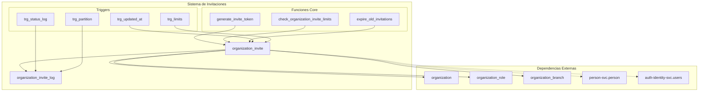
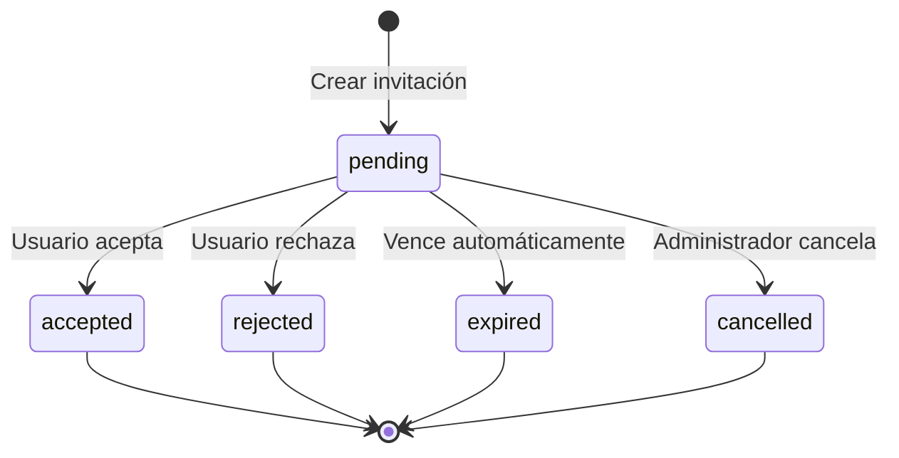
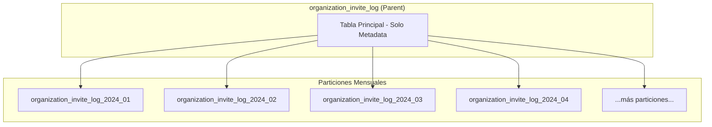
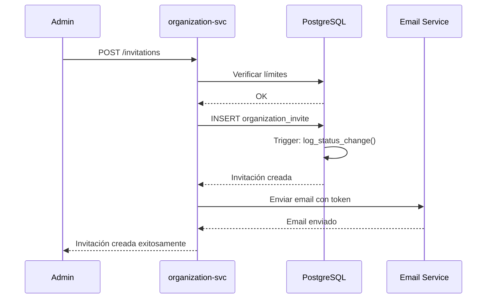
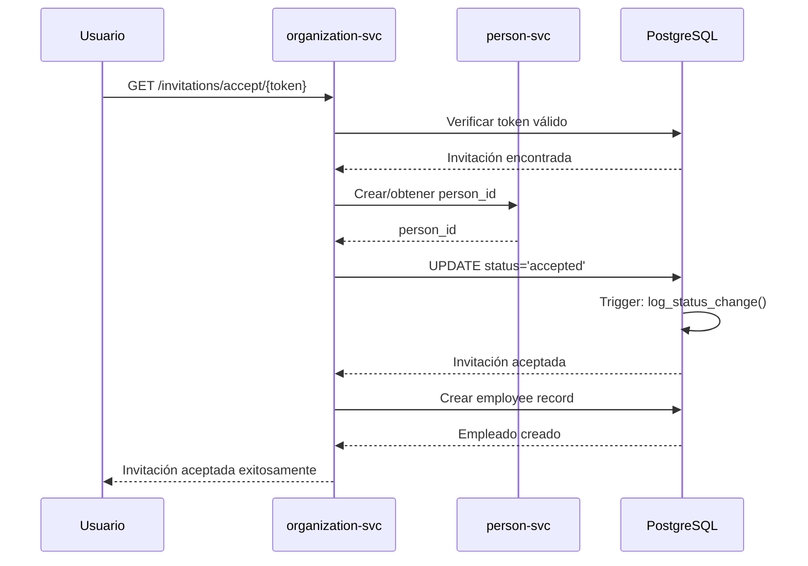
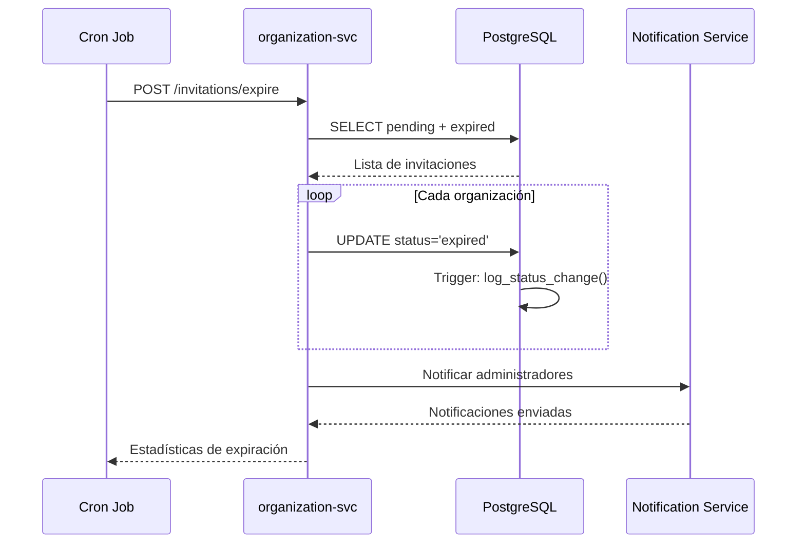

# Migración 0005: Sistema de Invitaciones a Organizaciones

## 📋 Información General

| Atributo | Valor |
|----------|-------|
| **Archivo** | `0005_create_organization_invite.up.sql` |
| **Propósito** | Implementar sistema completo de invitaciones a organizaciones con seguridad avanzada y auditoría |
| **Dependencias** | 0001 (ENUMs), 0002 (organization), 0003 (organization_role, organization_branch) |
| **Reversible** | ✅ Sí |
| **Particionado** | ✅ Logs particionados mensualmente |

---

## 🎯 Objetivos

1. **Sistema de Invitaciones Robusto**: Workflow completo para invitar usuarios a organizaciones
2. **Seguridad Avanzada**: Tokens criptográficamente seguros y validaciones estrictas
3. **Auditoría Completa**: Trazabilidad total de todas las operaciones
4. **Performance Optimizada**: Índices especializados y particionado de logs
5. **Límites Dinámicos**: Control configurable de invitaciones pendientes
6. **Gestión de Expiración**: Cleanup automático de invitaciones vencidas

---

## 🏗️ Arquitectura del Sistema



---

## 📊 Entidades Principales

### 1. **organization_invite** - Tabla Principal de Invitaciones

```sql
CREATE TABLE organization_invite (
    id                  UUID PRIMARY KEY DEFAULT generate_uuid(),
    organization_id     UUID NOT NULL,           -- FK a organization
    inviter_person_id   UUID NOT NULL,           -- FK lógica a person-svc
    invitee_email       VARCHAR(255) NOT NULL,   -- Email del invitado
    invitee_person_id   UUID,                    -- FK lógica opcional
    role_id             UUID NOT NULL,           -- FK a organization_role
    branch_id           UUID,                    -- FK opcional a branch
    token               VARCHAR(500) NOT NULL UNIQUE, -- Token URL-safe
    status              invitation_status_enum NOT NULL DEFAULT 'pending',
    expires_at          TIMESTAMP WITH TIME ZONE NOT NULL,
    accepted_at         TIMESTAMP WITH TIME ZONE,
    rejected_at         TIMESTAMP WITH TIME ZONE,
    cancelled_at        TIMESTAMP WITH TIME ZONE,
    metadata            JSONB DEFAULT '{}',      -- Datos adicionales
    -- Auditoría
    created_at          TIMESTAMP WITH TIME ZONE NOT NULL DEFAULT current_timestamp_utc(),
    created_by          UUID NOT NULL,           -- FK lógica a auth-identity-svc
    updated_at          TIMESTAMP WITH TIME ZONE NOT NULL DEFAULT current_timestamp_utc(),
    updated_by          UUID                     -- FK lógica a auth-identity-svc
);
```

#### **Estados del Workflow de Invitaciones**



#### **Reglas de Negocio**

| Regla | Descripción | Implementación |
|-------|-------------|----------------|
| **Email Único** | No duplicar invitaciones pendientes al mismo email | Constraint `uq_organization_invite_pending_email_ci` |
| **Token Seguro** | Tokens de 32-128 caracteres URL-safe | Constraint `chk_organization_invite_token_security` |
| **Fechas Válidas** | `expires_at` debe ser futuro | Constraint `chk_organization_invite_future_expiry` |
| **Estado Consistente** | Solo una fecha de acción por estado | Constraint `chk_organization_invite_acceptance_logic` |
| **Límites Dinámicos** | Máximo configurable de invitaciones pendientes | Trigger `check_organization_invite_limits()` |

### 2. **organization_invite_log** - Auditoría Completa

```sql
CREATE TABLE organization_invite_log (
    id                  UUID PRIMARY KEY DEFAULT generate_uuid(),
    invite_id           UUID NOT NULL,               -- FK a organization_invite
    action              invitation_log_action_enum NOT NULL,
    old_status          invitation_status_enum,
    new_status          invitation_status_enum,
    actor_person_id     UUID,                        -- FK lógica a person-svc
    actor_type          VARCHAR(20) DEFAULT 'user',  -- user|system|cron
    client_ip           INET,                        -- IP para auditoría
    user_agent          TEXT,                        -- Cliente info
    notes               TEXT,                        -- Descripción del cambio
    error_details       JSONB,                       -- Errores para debugging
    created_at          TIMESTAMP WITH TIME ZONE NOT NULL DEFAULT current_timestamp_utc()
) PARTITION BY RANGE (created_at);
```

#### **Tipos de Acciones de Log**

| Acción | Descripción | Momento |
|--------|-------------|---------|
| `created` | Invitación creada | INSERT |
| `accepted` | Invitación aceptada | UPDATE status → 'accepted' |
| `rejected` | Invitación rechazada | UPDATE status → 'rejected' |
| `expired` | Invitación expirada | Batch job automático |
| `cancelled` | Invitación cancelada | UPDATE status → 'cancelled' |
| `updated` | Otros cambios | UPDATE de campos no-status |

---

## 🔧 Funciones Especializadas

### 1. **generate_invite_token()** - Generación Segura de Tokens

```sql
CREATE OR REPLACE FUNCTION generate_invite_token(token_length INTEGER DEFAULT 64)
RETURNS TEXT
```

#### **Características**

- **CSPRNG**: Usa `gen_random_bytes()` para máxima entropía
- **URL-Safe**: Reemplaza `/` → `_` y `+` → `-`
- **Único**: Verifica unicidad contra tokens existentes
- **Retry Logic**: Hasta 10 intentos para evitar colisiones
- **Validación**: Longitud entre 32-128 caracteres

#### **Ejemplo de Uso**

```sql
-- Generar token estándar de 64 caracteres
SELECT generate_invite_token();
-- Resultado: 'xK8nQ2mP_vR5hW9tL3bA7cF6dG1jS4uY8zN0qE5iO2pM3wX7rT6gH9vB4nC1sA'

-- Generar token corto de 32 caracteres
SELECT generate_invite_token(32);
-- Resultado: 'a8F2kP5vN3xL9mQ6rT1wH4jS7bG0cE2z'
```

### 2. **check_organization_invite_limits()** - Control de Límites

```sql
CREATE OR REPLACE FUNCTION check_organization_invite_limits()
RETURNS TRIGGER
```

#### **Lógica de Límites**

1. **Obtener Límite**: Lee `organization_settings.max_pending_invites`
2. **Soporte Multi-formato**: Soporta valores en texto plano o JSON
3. **Validación**: Límite entre 1-1000 (default: 50)
4. **Conteo**: Solo invitaciones `pending` no expiradas
5. **Error Específico**: `ERRCODE 23514` para captura desde servicio

#### **Configuración de Límites**

```sql
-- Límite simple en texto
INSERT INTO organization_settings (organization_id, setting_key, setting_value)
VALUES ('org-uuid', 'max_pending_invites', '100');

-- Límite en JSON con metadata
INSERT INTO organization_settings (organization_id, setting_key, setting_value)
VALUES ('org-uuid', 'max_pending_invites', '{"limit": 100, "last_updated": "2024-01-01"}');
```

### 3. **expire_old_invitations()** - Gestión de Expiración

```sql
CREATE OR REPLACE FUNCTION expire_old_invitations(batch_size INTEGER DEFAULT 1000)
RETURNS TABLE(expired_count INTEGER, processed_orgs INTEGER, execution_time_ms INTEGER)
```

#### **Estrategia de Procesamiento**

1. **Por Organización**: Procesa en lotes por organización para mejor control
2. **Estadísticas**: Retorna métricas detalladas de ejecución
3. **Logging**: Progreso cada 100 organizaciones
4. **Performance**: Límite configurable de organizaciones por ejecución

#### **Ejemplo de Uso**

```sql
-- Expirar en lotes pequeños (desarrollo)
SELECT * FROM expire_old_invitations(100);

-- Expirar en lotes grandes (producción)
SELECT * FROM expire_old_invitations(5000);
```

### 4. **get_organization_invite_stats()** - Estadísticas Detalladas

```sql
CREATE OR REPLACE FUNCTION get_organization_invite_stats(org_id UUID)
RETURNS TABLE(
    total_invites BIGINT,
    pending_invites BIGINT,
    accepted_invites BIGINT,
    rejected_invites BIGINT,
    expired_invites BIGINT,
    cancelled_invites BIGINT,
    acceptance_rate NUMERIC(5,2)
)
```

#### **Métricas Calculadas**

| Métrica | Descripción | Cálculo |
|---------|-------------|---------|
| `total_invites` | Total de invitaciones | COUNT(*) |
| `pending_invites` | Invitaciones pendientes | WHERE status = 'pending' |
| `accepted_invites` | Invitaciones aceptadas | WHERE status = 'accepted' |
| `rejected_invites` | Invitaciones rechazadas | WHERE status = 'rejected' |
| `expired_invites` | Invitaciones expiradas | WHERE status = 'expired' |
| `cancelled_invites` | Invitaciones canceladas | WHERE status = 'cancelled' |
| `acceptance_rate` | Tasa de aceptación (%) | accepted/(accepted+rejected)*100 |

---

## 🚀 Performance y Optimización

### **Índices Especializados**

```sql
-- Búsquedas básicas
CREATE INDEX ix_organization_invite_organization_id ON organization_invite(organization_id);
CREATE INDEX ix_organization_invite_invitee_email_ci ON organization_invite(LOWER(invitee_email));
CREATE UNIQUE INDEX ix_organization_invite_token_unique ON organization_invite(token);

-- Operaciones de estado y fecha
CREATE INDEX ix_organization_invite_status_expires ON organization_invite(status, expires_at);
CREATE INDEX ix_organization_invite_pending_expired ON organization_invite(expires_at) 
    WHERE status = 'pending';

-- Búsquedas de negocio frecuentes
CREATE INDEX ix_organization_invite_active_lookup ON organization_invite(organization_id, status, expires_at)
    WHERE status IN ('pending', 'accepted');
CREATE INDEX ix_organization_invite_org_email_pending ON organization_invite(organization_id, LOWER(invitee_email))
    WHERE status = 'pending';

-- Logs particionados
CREATE INDEX ix_organization_invite_log_invite_id ON organization_invite_log(invite_id);
CREATE INDEX ix_organization_invite_log_action_date ON organization_invite_log(action, created_at DESC);
```

### **Estrategia de Particionado**



#### **Beneficios del Particionado**

- **Performance**: Consultas solo tocan particiones relevantes
- **Mantenimiento**: Eliminación rápida de datos antiguos
- **Escalabilidad**: Crecimiento horizontal automático
- **Backup**: Respaldo granular por período

---

## 📋 Ejemplos Prácticos

### **1. Crear Invitación Completa**

```sql
-- Crear invitación con todos los campos
INSERT INTO organization_invite (
    organization_id,
    inviter_person_id,
    invitee_email,
    role_id,
    branch_id,
    token,
    expires_at,
    metadata,
    created_by
) VALUES (
    'org-uuid-123',
    'person-uuid-456',
    'nuevo@empresa.com',
    'role-admin-uuid',
    'branch-central-uuid',
    generate_invite_token(64),
    current_timestamp_utc() + INTERVAL '7 days',
    '{"source": "admin_panel", "ip": "192.168.1.100", "user_agent": "Mozilla/5.0..."}',
    'user-uuid-789'
);
```

### **2. Aceptar Invitación**

```sql
-- Aceptar invitación y registrar automáticamente en log
UPDATE organization_invite 
SET 
    status = 'accepted',
    accepted_at = current_timestamp_utc(),
    invitee_person_id = 'new-person-uuid',
    updated_by = 'accepting-user-uuid',
    metadata = metadata || '{"accepted_from_ip": "203.0.113.45"}'
WHERE token = 'xK8nQ2mP_vR5hW9tL3bA7cF6dG1jS4uY8zN0qE5iO2pM3wX7rT6gH9vB4nC1sA'
AND status = 'pending'
AND expires_at > current_timestamp_utc();
```

### **3. Búsquedas Frecuentes**

```sql
-- Listar invitaciones pendientes de una organización
SELECT 
    i.id,
    i.invitee_email,
    r.role_name,
    COALESCE(b.branch_name, 'Toda la organización') as scope,
    i.expires_at,
    i.created_at
FROM organization_invite i
JOIN organization_role r ON i.role_id = r.id
LEFT JOIN organization_branch b ON i.branch_id = b.id
WHERE i.organization_id = 'org-uuid'
AND i.status = 'pending'
AND i.expires_at > current_timestamp_utc()
ORDER BY i.created_at DESC;

-- Buscar invitación por token
SELECT 
    i.*,
    o.organization_name,
    r.role_name,
    r.permissions
FROM organization_invite i
JOIN organization o ON i.organization_id = o.id
JOIN organization_role r ON i.role_id = r.id
WHERE i.token = 'token-aqui'
AND i.status = 'pending'
AND i.expires_at > current_timestamp_utc();

-- Historial completo de una invitación
SELECT 
    l.action,
    l.old_status,
    l.new_status,
    l.actor_type,
    l.notes,
    l.created_at
FROM organization_invite_log l
WHERE l.invite_id = 'invite-uuid'
ORDER BY l.created_at ASC;
```

### **4. Estadísticas y Reportes**

```sql
-- Estadísticas por organización
SELECT * FROM get_organization_invite_stats('org-uuid');

-- Top organizaciones por invitaciones activas
SELECT 
    o.organization_name,
    COUNT(*) FILTER (WHERE i.status = 'pending') as pending,
    COUNT(*) FILTER (WHERE i.status = 'accepted') as accepted,
    COUNT(*) as total
FROM organization o
LEFT JOIN organization_invite i ON o.id = i.organization_id
GROUP BY o.id, o.organization_name
HAVING COUNT(*) > 0
ORDER BY pending DESC, total DESC
LIMIT 10;

-- Invitaciones próximas a expirar (próximas 24 horas)
SELECT 
    i.invitee_email,
    o.organization_name,
    i.expires_at,
    EXTRACT(EPOCH FROM i.expires_at - current_timestamp_utc())/3600 as hours_until_expiry
FROM organization_invite i
JOIN organization o ON i.organization_id = o.id
WHERE i.status = 'pending'
AND i.expires_at BETWEEN current_timestamp_utc() AND current_timestamp_utc() + INTERVAL '24 hours'
ORDER BY i.expires_at ASC;
```

### **5. Mantenimiento y Administración**

```sql
-- Expirar invitaciones vencidas manualmente
SELECT * FROM expire_old_invitations(1000);

-- Cleanup de datos antiguos (mantener solo últimos 12 meses)
SELECT * FROM cleanup_old_invitations(12);

-- Renovar token de invitación (por seguridad)
SELECT renew_invite_token('invite-uuid-here');

-- Verificar límites de organización
SELECT 
    organization_id,
    COUNT(*) as pending_count,
    (SELECT setting_value FROM organization_settings 
     WHERE organization_id = i.organization_id 
     AND setting_key = 'max_pending_invites') as configured_limit
FROM organization_invite i
WHERE status = 'pending'
AND expires_at > current_timestamp_utc()
GROUP BY organization_id
HAVING COUNT(*) > 10
ORDER BY pending_count DESC;
```

---

## 🔍 Consultas de Diagnóstico

### **1. Verificar Salud del Sistema**

```sql
-- Estado general del sistema de invitaciones
SELECT 
    status,
    COUNT(*) as count,
    ROUND(COUNT(*) * 100.0 / SUM(COUNT(*)) OVER(), 2) as percentage
FROM organization_invite
GROUP BY status
ORDER BY count DESC;

-- Invitaciones por rango de antigüedad
SELECT 
    CASE 
        WHEN age(current_timestamp, created_at) < INTERVAL '1 day' THEN '< 1 día'
        WHEN age(current_timestamp, created_at) < INTERVAL '1 week' THEN '< 1 semana'
        WHEN age(current_timestamp, created_at) < INTERVAL '1 month' THEN '< 1 mes'
        ELSE '> 1 mes'
    END as age_range,
    COUNT(*) as count
FROM organization_invite
GROUP BY 
    CASE 
        WHEN age(current_timestamp, created_at) < INTERVAL '1 day' THEN '< 1 día'
        WHEN age(current_timestamp, created_at) < INTERVAL '1 week' THEN '< 1 semana'
        WHEN age(current_timestamp, created_at) < INTERVAL '1 month' THEN '< 1 mes'
        ELSE '> 1 mes'
    END
ORDER BY count DESC;
```

### **2. Performance y Recursos**

```sql
-- Tamaño de tablas y particiones
SELECT 
    schemaname,
    tablename,
    pg_size_pretty(pg_total_relation_size(schemaname||'.'||tablename)) as size
FROM pg_tables 
WHERE tablename LIKE 'organization_invite%'
ORDER BY pg_total_relation_size(schemaname||'.'||tablename) DESC;

-- Uso de índices más importantes
SELECT 
    indexname,
    idx_tup_read,
    idx_tup_fetch,
    idx_scan
FROM pg_stat_user_indexes 
WHERE relname LIKE 'organization_invite%'
ORDER BY idx_scan DESC;

-- Queries más lentas relacionadas con invitaciones
SELECT 
    query,
    calls,
    total_time,
    mean_time,
    rows
FROM pg_stat_statements 
WHERE query ILIKE '%organization_invite%'
ORDER BY mean_time DESC
LIMIT 10;
```

### **3. Auditoría y Seguridad**

```sql
-- Actividad de invitaciones por IP (detectar patrones sospechosos)
SELECT 
    client_ip,
    COUNT(*) as invitation_actions,
    COUNT(DISTINCT invite_id) as unique_invitations,
    MIN(created_at) as first_activity,
    MAX(created_at) as last_activity
FROM organization_invite_log
WHERE client_ip IS NOT NULL
AND created_at > current_timestamp - INTERVAL '7 days'
GROUP BY client_ip
HAVING COUNT(*) > 10
ORDER BY invitation_actions DESC;

-- Tokens próximos a expirar sin actividad
SELECT 
    i.token,
    i.invitee_email,
    o.organization_name,
    i.expires_at,
    i.created_at,
    EXTRACT(EPOCH FROM i.expires_at - current_timestamp_utc())/3600 as hours_remaining
FROM organization_invite i
JOIN organization o ON i.organization_id = o.id
WHERE i.status = 'pending'
AND i.expires_at > current_timestamp_utc()
AND i.expires_at < current_timestamp_utc() + INTERVAL '48 hours'
AND NOT EXISTS (
    SELECT 1 FROM organization_invite_log l 
    WHERE l.invite_id = i.id 
    AND l.action IN ('accepted', 'rejected')
)
ORDER BY hours_remaining ASC;
```

---

## ⚠️ Consideraciones y Limitaciones

### **1. Foreign Keys Lógicas**

Las referencias a servicios externos (`person-svc`, `auth-identity-svc`) son **lógicas** únicamente:

```sql
-- ❌ NO hay constraint físico
CONSTRAINT fk_logical_person -- No existe en DB
    FOREIGN KEY (inviter_person_id) REFERENCES person_svc.person(id)

-- ✅ Solo validación de formato UUID
CONSTRAINT chk_organization_invite_valid_inviter 
    CHECK (is_valid_uuid(inviter_person_id::TEXT))
```

**Implicaciones**:
- La aplicación debe validar existencia de IDs externos
- Posible inconsistencia si se eliminan registros en servicios externos
- Mayor flexibilidad para despliegues independientes

### **2. Particionado de Logs**

**Trigger como Safety-Net**:
```sql
-- ⚠️ DDL en trigger puede causar locks en alta concurrencia
CREATE TRIGGER trg_organization_invite_log_partition
    BEFORE INSERT ON organization_invite_log
    FOR EACH ROW
    EXECUTE FUNCTION organization_invite_log_partition_trigger();
```

**Recomendaciones**:
- **Desarrollo**: Usar trigger para simplicidad
- **Producción**: Pre-crear particiones con `pg_cron` y deshabilitar trigger

### **3. Límites de Performance**

| Escenario | Límite Recomendado | Consideraciones |
|-----------|-------------------|-----------------|
| Invitaciones pendientes por org | < 1000 | Configurar límites apropiados |
| Batch de expiración | < 5000 orgs | Evitar locks prolongados |
| Logs de auditoría | 6-12 meses | Particionar y archivar |
| Tokens simultáneos | < 10000 | Usar conexión pool |

### **4. Seguridad**

**Vectores de Ataque**:
- **Token Bruteforce**: Tokens de 64 chars tienen ~10^115 posibilidades
- **Email Flooding**: Limitado por constraints de unicidad
- **Rate Limiting**: Implementar en capa de aplicación
- **Token Leakage**: URLs con tokens deben usar HTTPS + expiración corta

---

## 🔄 Workflows de Integración

### **1. Crear Invitación (Servicio)**



### **2. Aceptar Invitación (Usuario)**



### **3. Batch de Expiración (Cron)**



---

## 📚 Referencias y Recursos

### **Documentación Relacionada**

- [README_0001.md](./README_0001.md) - ENUMs y funciones base
- [README_0002.md](./README_0002.md) - Organización core
- [README_0003.md](./README_0003.md) - Estructura organizacional
- [README_0004.md](./README_0004.md) - Gestión de empleados

### **Extensiones PostgreSQL Utilizadas**

- `pgcrypto`: Generación de tokens seguros
- `uuid-ossp`: Generación de UUIDs (si no se usa gen_random_uuid)

### **Patrones Implementados**

- **Audit Trail**: Log completo de cambios con contexto
- **State Machine**: Estados bien definidos con transiciones válidas
- **Batch Processing**: Operaciones masivas optimizadas
- **Token Security**: Tokens criptográficamente seguros
- **Soft Limits**: Límites configurables por organización

### **Métricas de Monitoreo Sugeridas**

```sql
-- Dashboard queries para monitoreo
SELECT 'pending_invitations' as metric, COUNT(*) as value
FROM organization_invite WHERE status = 'pending'
UNION ALL
SELECT 'expired_today' as metric, COUNT(*) as value  
FROM organization_invite WHERE status = 'expired' 
AND DATE(updated_at) = CURRENT_DATE
UNION ALL
SELECT 'acceptance_rate_7d' as metric, 
       ROUND(COUNT(*) FILTER (WHERE status = 'accepted') * 100.0 / 
             COUNT(*) FILTER (WHERE status IN ('accepted', 'rejected')), 2) as value
FROM organization_invite WHERE created_at > CURRENT_DATE - INTERVAL '7 days';
```

---

**Migración completada exitosamente** ✅  
*Sistema de invitaciones implementado con seguridad avanzada y auditoría completa*
