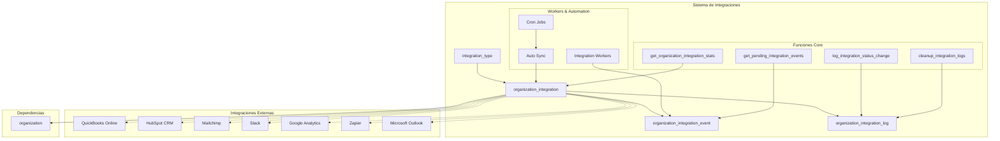
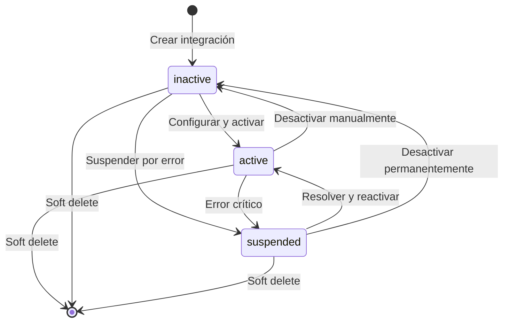
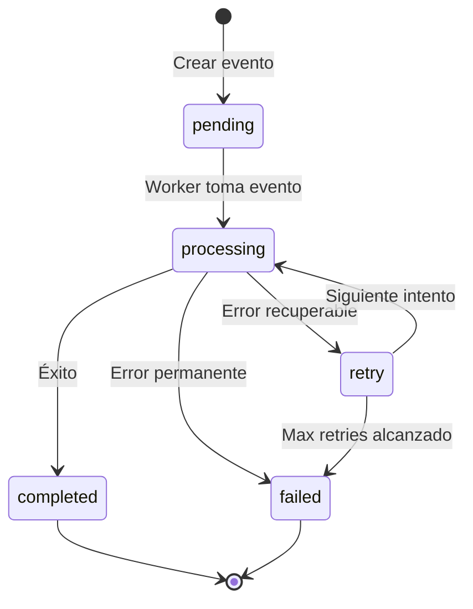
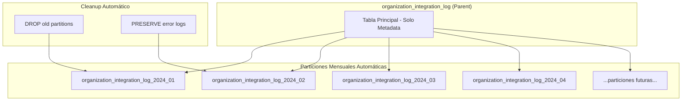
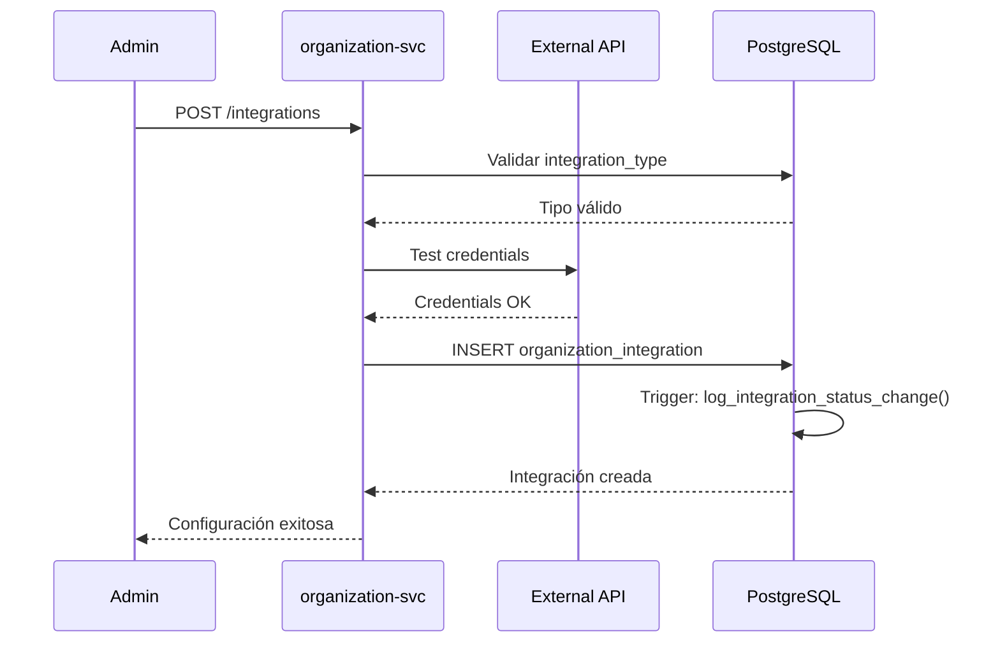
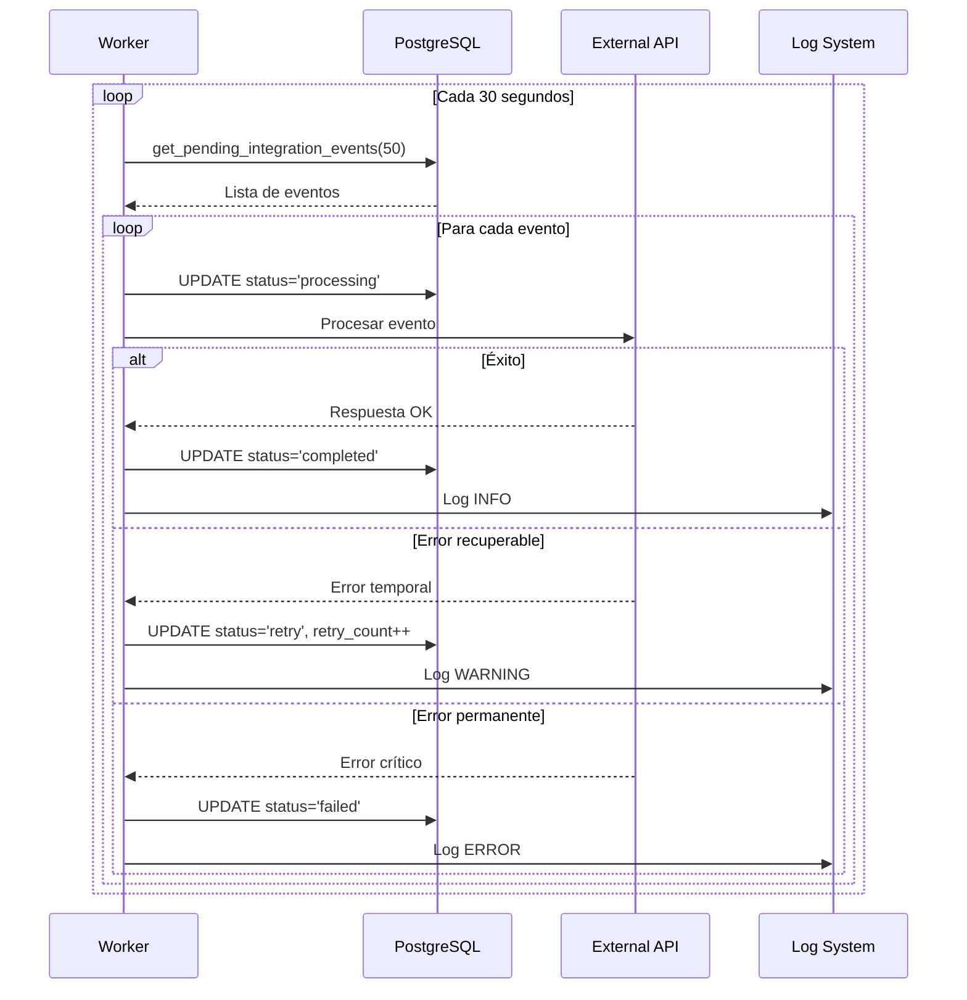
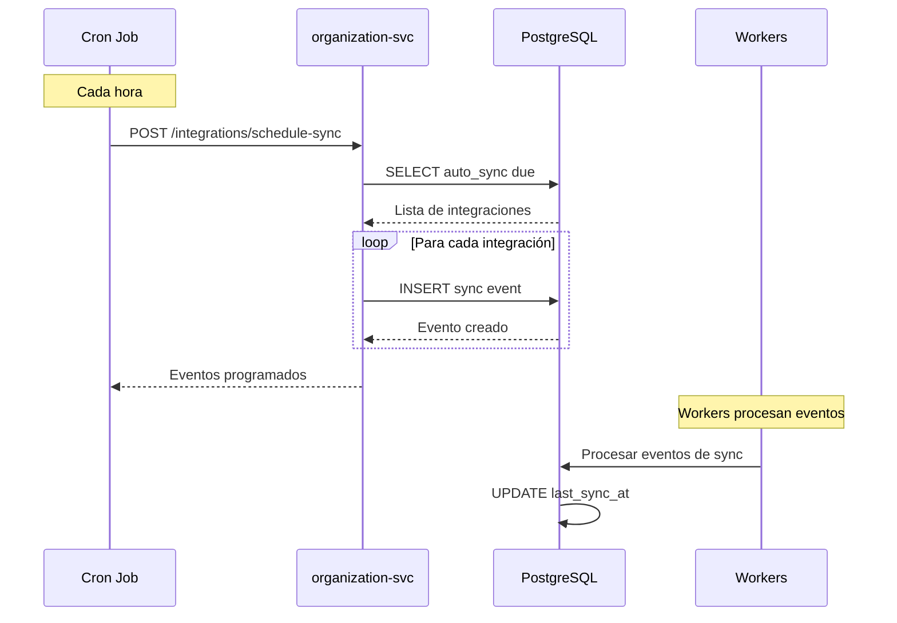

# Migración 0006: Sistema de Integraciones Organizacionales

## 📋 Información General

| Atributo | Valor |
|----------|-------|
| **Archivo** | `0006_create_organization_integration.up.sql` |
| **Propósito** | Implementar sistema completo de integraciones de terceros con auditoría y cola de eventos |
| **Dependencias** | 0001 (ENUMs), 0002 (organization), 0005 (organization_invite) |
| **Reversible** | ✅ Sí |
| **Particionado** | ✅ Logs particionados mensualmente |

---

## 🎯 Objetivos

1. **Catálogo de Integraciones**: Tipos de integración disponibles con metadatos
2. **Configuración por Organización**: Integraciones específicas con credenciales seguras
3. **Cola de Eventos**: Sistema asíncrono para workers de integración
4. **Auditoría Completa**: Logs detallados con particionado para performance
5. **Soporte Multi-Protocolo**: OAuth, API Keys, Webhooks
6. **Sincronización Automática**: Configuración de frecuencia y estado

---

## 🏗️ Arquitectura del Sistema



---

## 📊 Entidades Principales

### 1. **integration_type** - Catálogo de Tipos de Integración

```sql
CREATE TABLE integration_type (
    id                  UUID PRIMARY KEY DEFAULT generate_uuid(),
    name                VARCHAR(100) NOT NULL UNIQUE,      -- snake_case identifier
    display_name        VARCHAR(200) NOT NULL,             -- Human-readable name
    description         TEXT,                               -- Description
    category            integration_category_enum NOT NULL, -- accounting|crm|marketing|etc.
    provider            VARCHAR(100) NOT NULL,              -- Company/service provider
    version             VARCHAR(20) NOT NULL DEFAULT '1.0', -- API version
    is_active           BOOLEAN NOT NULL DEFAULT true,      -- Available for use
    configuration_schema JSONB,                             -- Required/optional fields
    webhook_support     BOOLEAN NOT NULL DEFAULT false,    -- Supports webhooks
    oauth_support       BOOLEAN NOT NULL DEFAULT false,    -- Supports OAuth
    api_key_support     BOOLEAN NOT NULL DEFAULT true,     -- Supports API keys
    -- Auditoría
    created_at          TIMESTAMP WITH TIME ZONE NOT NULL DEFAULT current_timestamp_utc(),
    updated_at          TIMESTAMP WITH TIME ZONE NOT NULL DEFAULT current_timestamp_utc(),
    updated_by          UUID                                -- FK lógica a auth-identity-svc
);
```

#### **Tipos de Integración Predefinidos**

| Nombre | Display Name | Categoría | Provider | Protocolos Soportados |
|--------|--------------|-----------|----------|----------------------|
| `quickbooks_online` | QuickBooks Online | accounting | Intuit | OAuth, Webhooks |
| `hubspot_crm` | HubSpot CRM | crm | HubSpot | OAuth, API Key, Webhooks |
| `mailchimp` | Mailchimp | marketing | Mailchimp | OAuth, API Key, Webhooks |
| `slack` | Slack | communication | Slack | OAuth, Webhooks |
| `google_analytics` | Google Analytics | analytics | Google | OAuth |
| `zapier_webhook` | Zapier Webhooks | automation | Zapier | Webhooks |
| `microsoft_outlook` | Microsoft Outlook | communication | Microsoft | OAuth, Webhooks |

#### **Esquemas de Configuración**

```json
// QuickBooks Online
{
  "required": ["client_id", "client_secret", "redirect_uri"],
  "optional": ["sandbox_mode", "company_id"]
}

// HubSpot CRM
{
  "required": ["api_key"],
  "optional": ["portal_id", "rate_limit"]
}

// Slack
{
  "required": ["bot_token"],
  "optional": ["signing_secret", "channel_id"]
}
```

### 2. **organization_integration** - Configuraciones por Organización

```sql
CREATE TABLE organization_integration (
    id                  UUID PRIMARY KEY DEFAULT generate_uuid(),
    organization_id     UUID NOT NULL,                     -- FK a organization
    integration_type_id UUID NOT NULL,                     -- FK a integration_type
    name                VARCHAR(200) NOT NULL,             -- Nombre personalizado
    description         TEXT,                              -- Descripción opcional
    status              integration_status_enum NOT NULL DEFAULT 'inactive',
    configuration       JSONB NOT NULL DEFAULT '{}',      -- Configuración específica
    credentials         JSONB DEFAULT '{}',               -- Credenciales encriptadas
    last_sync_at        TIMESTAMP WITH TIME ZONE,         -- Última sincronización
    last_sync_status    sync_status_enum,                 -- Estado de última sync
    last_sync_error     TEXT,                             -- Error de última sync
    sync_frequency      sync_frequency_enum,              -- Frecuencia automática
    auto_sync_enabled   BOOLEAN NOT NULL DEFAULT false,   -- Sincronización automática
    webhook_url         VARCHAR(500),                     -- URL para webhooks
    webhook_secret      VARCHAR(100),                     -- Secret para webhooks
    oauth_token         JSONB DEFAULT '{}',               -- Tokens OAuth encriptados
    api_usage_count     INTEGER NOT NULL DEFAULT 0,       -- Contador de uso API
    api_rate_limit      INTEGER,                          -- Límite de rate
    is_active           BOOLEAN NOT NULL DEFAULT true,    -- Activa/Inactiva
    -- Auditoría
    created_at          TIMESTAMP WITH TIME ZONE NOT NULL DEFAULT current_timestamp_utc(),
    created_by          UUID NOT NULL,                    -- FK lógica a auth-identity-svc
    updated_at          TIMESTAMP WITH TIME ZONE NOT NULL DEFAULT current_timestamp_utc(),
    updated_by          UUID,                             -- FK lógica a auth-identity-svc
    deleted_at          TIMESTAMP WITH TIME ZONE          -- Soft delete
);
```

#### **Estados de Integración**



#### **Frecuencias de Sincronización**

| Valor | Descripción | Uso Típico |
|-------|-------------|------------|
| `hourly` | Cada hora | Datos críticos tiempo real |
| `daily` | Diaria | Datos de negocio estándar |
| `weekly` | Semanal | Reportes y analytics |
| `monthly` | Mensual | Datos históricos |
| `on_demand` | Bajo demanda | Integraciones manuales |

### 3. **organization_integration_event** - Cola de Eventos

```sql
CREATE TABLE organization_integration_event (
    id                  UUID PRIMARY KEY DEFAULT generate_uuid(),
    integration_id      UUID NOT NULL,                         -- FK a organization_integration
    event_type          integration_event_type_enum NOT NULL,  -- sync|webhook|oauth_refresh
    event_data          JSONB NOT NULL DEFAULT '{}',          -- Datos del evento
    status              integration_event_status_enum NOT NULL DEFAULT 'pending',
    error_message       TEXT,                                  -- Error si falla
    retry_count         INTEGER NOT NULL DEFAULT 0,            -- Intentos realizados
    max_retries         INTEGER NOT NULL DEFAULT 3,            -- Máximo intentos
    scheduled_at        TIMESTAMP WITH TIME ZONE,              -- Cuándo procesar
    processed_at        TIMESTAMP WITH TIME ZONE,              -- Cuándo se procesó
    created_at          TIMESTAMP WITH TIME ZONE NOT NULL DEFAULT current_timestamp_utc()
);
```

#### **Tipos de Eventos**

| Tipo | Descripción | Datos Típicos |
|------|-------------|---------------|
| `sync` | Sincronización de datos | `{"direction": "pull", "entity": "contacts"}` |
| `webhook` | Procesamiento de webhook | `{"source_ip": "...", "payload": {...}}` |
| `oauth_refresh` | Renovación de token OAuth | `{"token_expires_at": "..."}` |
| `test_connection` | Prueba de conectividad | `{"endpoint": "...", "method": "GET"}` |
| `data_export` | Exportación de datos | `{"format": "csv", "entities": [...]}` |

#### **Estados de Eventos**



### 4. **organization_integration_log** - Auditoría Detallada

```sql
CREATE TABLE organization_integration_log (
    id                  UUID PRIMARY KEY DEFAULT generate_uuid(),
    integration_id      UUID NOT NULL,              -- FK a organization_integration
    event_id            UUID,                       -- FK opcional a event
    level               log_level_enum NOT NULL DEFAULT 'info',
    message             TEXT NOT NULL,              -- Mensaje descriptivo
    context             JSONB DEFAULT '{}',         -- Contexto adicional
    created_at          TIMESTAMP WITH TIME ZONE NOT NULL DEFAULT current_timestamp_utc()
) PARTITION BY RANGE (created_at);
```

#### **Niveles de Log**

| Nivel | Uso | Ejemplos |
|-------|-----|----------|
| `debug` | Información detallada | Requests/responses completos |
| `info` | Eventos normales | "Integration activated", "Sync completed" |
| `warning` | Situaciones no críticas | "Rate limit approaching", "Token expires soon" |
| `error` | Errores recuperables | "API timeout", "Invalid credentials" |
| `critical` | Errores críticos | "Integration suspended", "Data corruption" |

---

## 🔧 Funciones Especializadas

### 1. **log_integration_status_change()** - Auditoría Automática

```sql
CREATE OR REPLACE FUNCTION log_integration_status_change()
RETURNS TRIGGER
```

#### **Eventos Registrados Automáticamente**

- **Creación**: Nueva integración configurada
- **Cambio de Estado**: inactive ↔ active ↔ suspended
- **Activación/Desactivación**: is_active toggle
- **Configuración**: Cambios en configuration, sync_frequency, auto_sync_enabled

#### **Contexto Capturado**

```json
{
  "timestamp": "2024-01-15T10:30:00Z",
  "trigger_operation": "UPDATE",
  "old_status": "inactive",
  "new_status": "active",
  "updated_by": "user-uuid-123",
  "auto_sync_changed": true,
  "frequency_changed": false,
  "config_changed": true
}
```

### 2. **cleanup_integration_logs()** - Gestión de Logs

```sql
CREATE OR REPLACE FUNCTION cleanup_integration_logs(
    days_to_keep INTEGER DEFAULT 30,
    keep_errors BOOLEAN DEFAULT TRUE
)
RETURNS TABLE(deleted_count INTEGER, preserved_errors INTEGER, partitions_dropped INTEGER)
```

#### **Estrategias de Limpieza**

1. **Eliminación de Particiones**: Borra particiones completas cuando son anteriores al cutoff
2. **Eliminación Selectiva**: Borra registros individuales preservando errores críticos
3. **Preservación de Errores**: Mantiene logs de error/critical para troubleshooting

#### **Ejemplo de Uso**

```sql
-- Limpiar logs > 30 días, preservar errores
SELECT * FROM cleanup_integration_logs(30, true);

-- Limpiar todo > 7 días para testing
SELECT * FROM cleanup_integration_logs(7, false);

-- Limpieza agresiva para emergencias de espacio
SELECT * FROM cleanup_integration_logs(1, false);
```

### 3. **get_organization_integration_stats()** - Estadísticas

```sql
CREATE OR REPLACE FUNCTION get_organization_integration_stats(org_id UUID)
RETURNS TABLE(
    total_integrations BIGINT,
    active_integrations BIGINT,
    error_integrations BIGINT,
    suspended_integrations BIGINT,
    last_sync_avg_age INTERVAL,
    auto_sync_enabled_count BIGINT
)
```

#### **Métricas Calculadas**

| Métrica | Descripción | Uso |
|---------|-------------|-----|
| `total_integrations` | Total configuradas | Dashboard general |
| `active_integrations` | Funcionando correctamente | Health check |
| `error_integrations` | Con errores | Alertas de soporte |
| `suspended_integrations` | Suspendidas | Revisión manual |
| `last_sync_avg_age` | Tiempo promedio desde última sync | Performance monitor |
| `auto_sync_enabled_count` | Con sincronización automática | Carga del sistema |

### 4. **get_pending_integration_events()** - Worker Queue

```sql
CREATE OR REPLACE FUNCTION get_pending_integration_events(limit_count INTEGER DEFAULT 100)
RETURNS TABLE(
    event_id UUID,
    integration_id UUID,
    event_type integration_event_type_enum,
    event_data JSONB,
    retry_count INTEGER,
    scheduled_at TIMESTAMP WITH TIME ZONE,
    created_at TIMESTAMP WITH TIME ZONE
)
```

#### **Lógica de Priorización**

1. **Retry Count**: Eventos nuevos (retry_count = 0) tienen prioridad
2. **FIFO**: Dentro del mismo retry_count, orden cronológico
3. **Scheduling**: Solo eventos cuyo scheduled_at <= NOW()

---

## 🚀 Performance y Optimización

### **Índices Especializados**

```sql
-- Catálogo de tipos
CREATE INDEX ix_integration_type_category_active ON integration_type(category, is_active);
CREATE INDEX ix_integration_type_provider ON integration_type(provider);

-- Integraciones organizacionales
CREATE INDEX ix_organization_integration_org_status_active ON organization_integration(organization_id, status)
    WHERE deleted_at IS NULL AND status = 'active';
CREATE INDEX ix_organization_integration_sync_lookup ON organization_integration(auto_sync_enabled, sync_frequency, last_sync_at) 
    WHERE auto_sync_enabled = true AND deleted_at IS NULL;

-- Cola de workers
CREATE INDEX ix_organization_integration_event_worker_queue ON organization_integration_event(status, created_at ASC)
    WHERE status IN ('pending', 'retry');
CREATE INDEX ix_organization_integration_event_retry_tracking ON organization_integration_event(status, retry_count, max_retries) 
    WHERE status IN ('error', 'retry');

-- Logs de auditoría
CREATE INDEX ix_organization_integration_log_errors ON organization_integration_log(integration_id, created_at DESC)
    WHERE level IN ('error', 'critical');
```

### **Particionado Inteligente**



---

## 📋 Ejemplos Prácticos

### **1. Configurar Nueva Integración HubSpot**

```sql
-- 1. Obtener el tipo de integración
SELECT id, configuration_schema 
FROM integration_type 
WHERE name = 'hubspot_crm';

-- 2. Crear integración para organización
INSERT INTO organization_integration (
    organization_id,
    integration_type_id,
    name,
    description,
    configuration,
    credentials,
    webhook_url,
    auto_sync_enabled,
    sync_frequency,
    created_by
) VALUES (
    'org-uuid-123',
    (SELECT id FROM integration_type WHERE name = 'hubspot_crm'),
    'HubSpot CRM Principal',
    'Integración principal con HubSpot para gestión de leads',
    '{"portal_id": "12345678", "rate_limit": 100}',
    '{"api_key": "encrypted-api-key-here"}',  -- Encriptado en aplicación
    'https://api.empresa.com/webhooks/hubspot',
    true,
    'daily',
    'user-uuid-456'
);
```

### **2. Procesar Cola de Eventos (Worker)**

```sql
-- Worker obtiene próximos eventos
WITH next_events AS (
    SELECT * FROM get_pending_integration_events(50)
)
SELECT 
    ne.*,
    oi.name as integration_name,
    it.display_name as integration_type_name,
    it.provider
FROM next_events ne
JOIN organization_integration oi ON ne.integration_id = oi.id
JOIN integration_type it ON oi.integration_type_id = it.id
ORDER BY ne.retry_count ASC, ne.created_at ASC;

-- Marcar evento como procesando
UPDATE organization_integration_event 
SET status = 'processing',
    processed_at = current_timestamp_utc()
WHERE id = 'event-uuid-here';

-- Completar evento exitosamente
UPDATE organization_integration_event 
SET status = 'completed'
WHERE id = 'event-uuid-here';

-- Fallar evento con retry
UPDATE organization_integration_event 
SET status = 'retry',
    retry_count = retry_count + 1,
    error_message = 'API timeout after 30s',
    scheduled_at = current_timestamp_utc() + INTERVAL '5 minutes'
WHERE id = 'event-uuid-here';
```

### **3. Sincronización Automática (Cron Job)**

```sql
-- Buscar integraciones que necesitan sync
SELECT 
    oi.id,
    oi.name,
    oi.sync_frequency,
    oi.last_sync_at,
    CASE oi.sync_frequency
        WHEN 'hourly' THEN oi.last_sync_at + INTERVAL '1 hour'
        WHEN 'daily' THEN oi.last_sync_at + INTERVAL '1 day'
        WHEN 'weekly' THEN oi.last_sync_at + INTERVAL '1 week'
        WHEN 'monthly' THEN oi.last_sync_at + INTERVAL '1 month'
    END as next_sync_due
FROM organization_integration oi
WHERE oi.auto_sync_enabled = true
AND oi.status = 'active'
AND oi.deleted_at IS NULL
AND oi.sync_frequency != 'on_demand'
AND (
    oi.last_sync_at IS NULL OR
    CASE oi.sync_frequency
        WHEN 'hourly' THEN oi.last_sync_at + INTERVAL '1 hour' <= current_timestamp_utc()
        WHEN 'daily' THEN oi.last_sync_at + INTERVAL '1 day' <= current_timestamp_utc()
        WHEN 'weekly' THEN oi.last_sync_at + INTERVAL '1 week' <= current_timestamp_utc()
        WHEN 'monthly' THEN oi.last_sync_at + INTERVAL '1 month' <= current_timestamp_utc()
    END
)
ORDER BY oi.last_sync_at ASC NULLS FIRST;

-- Crear eventos de sync para cada integración
INSERT INTO organization_integration_event (
    integration_id,
    event_type,
    event_data
)
SELECT 
    id,
    'sync',
    jsonb_build_object(
        'trigger', 'auto_sync',
        'frequency', sync_frequency,
        'last_sync_at', last_sync_at
    )
FROM organization_integration
WHERE auto_sync_enabled = true
AND status = 'active'
AND deleted_at IS NULL;
```

### **4. Monitoreo y Alertas**

```sql
-- Dashboard de estado general
SELECT 
    it.display_name,
    COUNT(*) as total_configured,
    COUNT(*) FILTER (WHERE oi.status = 'active') as active_count,
    COUNT(*) FILTER (WHERE oi.status = 'error') as error_count,
    COUNT(*) FILTER (WHERE oi.status = 'suspended') as suspended_count,
    ROUND(AVG(oi.api_usage_count)) as avg_api_usage,
    MAX(oi.last_sync_at) as last_sync_anywhere
FROM integration_type it
LEFT JOIN organization_integration oi ON it.id = oi.integration_type_id 
    AND oi.deleted_at IS NULL
WHERE it.is_active = true
GROUP BY it.id, it.display_name
ORDER BY total_configured DESC;

-- Integraciones con problemas
SELECT 
    o.organization_name,
    oi.name as integration_name,
    it.display_name as integration_type,
    oi.status,
    oi.last_sync_error,
    oi.last_sync_at,
    CASE 
        WHEN oi.last_sync_at IS NULL THEN 'Never synced'
        WHEN oi.last_sync_at < current_timestamp_utc() - INTERVAL '7 days' THEN 'Stale sync'
        WHEN oi.last_sync_status = 'error' THEN 'Sync failed'
        ELSE 'OK'
    END as health_status
FROM organization_integration oi
JOIN organization o ON oi.organization_id = o.id
JOIN integration_type it ON oi.integration_type_id = it.id
WHERE oi.deleted_at IS NULL
AND (
    oi.status IN ('error', 'suspended') OR
    oi.last_sync_status = 'error' OR
    oi.last_sync_at < current_timestamp_utc() - INTERVAL '7 days'
)
ORDER BY oi.last_sync_at ASC NULLS FIRST;

-- Eventos fallidos que necesitan atención
SELECT 
    oie.id,
    oi.name as integration_name,
    oie.event_type,
    oie.retry_count,
    oie.max_retries,
    oie.error_message,
    oie.created_at,
    CASE 
        WHEN oie.retry_count >= oie.max_retries THEN 'Max retries reached'
        WHEN oie.scheduled_at > current_timestamp_utc() THEN 'Scheduled for retry'
        ELSE 'Immediate retry needed'
    END as action_needed
FROM organization_integration_event oie
JOIN organization_integration oi ON oie.integration_id = oi.id
WHERE oie.status IN ('error', 'retry', 'failed')
ORDER BY oie.retry_count DESC, oie.created_at ASC;
```

### **5. Gestión de Webhooks**

```sql
-- Configurar webhook para integración
UPDATE organization_integration 
SET webhook_url = 'https://api.empresa.com/webhooks/hubspot',
    webhook_secret = 'secure-secret-here',
    updated_by = 'admin-user-uuid'
WHERE id = 'integration-uuid'
AND organization_id = 'org-uuid';

-- Procesar webhook entrante (crear evento)
INSERT INTO organization_integration_event (
    integration_id,
    event_type,
    event_data
) VALUES (
    'integration-uuid',
    'webhook',
    jsonb_build_object(
        'source_ip', '192.168.1.100',
        'user_agent', 'HubSpot Webhook',
        'signature', 'sha256=...',
        'payload', '{"contact_id": 12345, "action": "updated"}'
    )
);

-- Verificar actividad de webhooks
SELECT 
    oi.name,
    oi.webhook_url,
    COUNT(oie.id) as webhook_events_24h,
    MAX(oie.created_at) as last_webhook,
    COUNT(oie.id) FILTER (WHERE oie.status = 'failed') as failed_webhooks
FROM organization_integration oi
LEFT JOIN organization_integration_event oie ON oi.id = oie.integration_id
    AND oie.event_type = 'webhook'
    AND oie.created_at > current_timestamp_utc() - INTERVAL '24 hours'
WHERE oi.webhook_url IS NOT NULL
AND oi.deleted_at IS NULL
GROUP BY oi.id, oi.name, oi.webhook_url
ORDER BY webhook_events_24h DESC;
```

---

## 🔍 Consultas de Diagnóstico

### **1. Performance y Capacidad**

```sql
-- Tamaño de tablas y particiones
SELECT 
    schemaname,
    tablename,
    pg_size_pretty(pg_total_relation_size(schemaname||'.'||tablename)) as size,
    CASE 
        WHEN tablename LIKE '%_log_%' THEN 'Log Partition'
        WHEN tablename LIKE '%_log' THEN 'Log Parent'
        WHEN tablename LIKE '%_event' THEN 'Event Queue'
        ELSE 'Core Table'
    END as table_type
FROM pg_tables 
WHERE tablename LIKE 'organization_integration%' 
   OR tablename LIKE 'integration_type'
ORDER BY pg_total_relation_size(schemaname||'.'||tablename) DESC;

-- Cola de eventos - análisis de carga
SELECT 
    event_type,
    status,
    COUNT(*) as count,
    MIN(created_at) as oldest_event,
    MAX(created_at) as newest_event,
    AVG(retry_count) as avg_retries
FROM organization_integration_event
GROUP BY event_type, status
ORDER BY count DESC;

-- Uso de API por integración
SELECT 
    it.display_name,
    AVG(oi.api_usage_count) as avg_usage,
    MAX(oi.api_usage_count) as max_usage,
    COUNT(*) FILTER (WHERE oi.api_usage_count > COALESCE(oi.api_rate_limit * 0.8, 1000)) as near_limit
FROM organization_integration oi
JOIN integration_type it ON oi.integration_type_id = it.id
WHERE oi.deleted_at IS NULL
GROUP BY it.id, it.display_name
ORDER BY avg_usage DESC;
```

### **2. Health Checks y Alertas**

```sql
-- Integraciones "zombie" (configuradas pero nunca usadas)
SELECT 
    o.organization_name,
    oi.name,
    it.display_name,
    oi.created_at,
    age(current_timestamp, oi.created_at) as age_since_creation,
    oi.status
FROM organization_integration oi
JOIN organization o ON oi.organization_id = o.id
JOIN integration_type it ON oi.integration_type_id = it.id
WHERE oi.deleted_at IS NULL
AND oi.last_sync_at IS NULL
AND oi.created_at < current_timestamp_utc() - INTERVAL '30 days'
ORDER BY oi.created_at ASC;

-- Tokens OAuth próximos a expirar
SELECT 
    oi.name,
    o.organization_name,
    (oi.oauth_token->>'expires_at')::timestamp as expires_at,
    EXTRACT(EPOCH FROM (oi.oauth_token->>'expires_at')::timestamp - current_timestamp_utc())/3600 as hours_until_expiry
FROM organization_integration oi
JOIN organization o ON oi.organization_id = o.id
WHERE oi.deleted_at IS NULL
AND oi.oauth_token IS NOT NULL
AND (oi.oauth_token->>'expires_at') IS NOT NULL
AND (oi.oauth_token->>'expires_at')::timestamp < current_timestamp_utc() + INTERVAL '7 days'
ORDER BY expires_at ASC;

-- Patrones de error recurrentes
SELECT 
    SUBSTRING(error_message FROM 1 FOR 100) as error_pattern,
    COUNT(*) as occurrences,
    COUNT(DISTINCT integration_id) as affected_integrations,
    MIN(created_at) as first_occurrence,
    MAX(created_at) as last_occurrence
FROM organization_integration_event
WHERE status IN ('error', 'failed')
AND created_at > current_timestamp_utc() - INTERVAL '7 days'
GROUP BY SUBSTRING(error_message FROM 1 FOR 100)
HAVING COUNT(*) > 5
ORDER BY occurrences DESC;
```

### **3. Seguridad y Auditoría**

```sql
-- Actividad de configuración sospechosa
SELECT 
    oi.name,
    o.organization_name,
    COUNT(*) as config_changes_24h,
    ARRAY_AGG(DISTINCT oi.updated_by) as users_who_modified,
    MIN(oi.updated_at) as first_change,
    MAX(oi.updated_at) as last_change
FROM organization_integration oi
JOIN organization o ON oi.organization_id = o.id
WHERE oi.updated_at > current_timestamp_utc() - INTERVAL '24 hours'
AND oi.deleted_at IS NULL
GROUP BY oi.id, oi.name, o.organization_name
HAVING COUNT(*) > 5
ORDER BY config_changes_24h DESC;

-- Logs de error críticos recientes
SELECT 
    oil.created_at,
    oi.name as integration_name,
    o.organization_name,
    oil.level,
    oil.message,
    oil.context
FROM organization_integration_log oil
JOIN organization_integration oi ON oil.integration_id = oi.id
JOIN organization o ON oi.organization_id = o.id
WHERE oil.level IN ('error', 'critical')
AND oil.created_at > current_timestamp_utc() - INTERVAL '24 hours'
ORDER BY oil.created_at DESC
LIMIT 50;

-- Uso de webhooks por IP (detectar patrones anómalos)
SELECT 
    (oil.context->>'source_ip') as source_ip,
    COUNT(*) as webhook_calls,
    COUNT(DISTINCT oil.integration_id) as unique_integrations,
    MIN(oil.created_at) as first_call,
    MAX(oil.created_at) as last_call
FROM organization_integration_log oil
WHERE oil.context->>'source_ip' IS NOT NULL
AND oil.created_at > current_timestamp_utc() - INTERVAL '7 days'
GROUP BY (oil.context->>'source_ip')
HAVING COUNT(*) > 100
ORDER BY webhook_calls DESC;
```

---

## ⚠️ Consideraciones de Seguridad

### **1. Encriptación de Credenciales**

```sql
-- ❌ NUNCA almacenar credenciales en texto plano
INSERT INTO organization_integration (credentials) 
VALUES ('{"api_key": "real-api-key-here"}');

-- ✅ Encriptar en la aplicación antes de guardar
INSERT INTO organization_integration (credentials) 
VALUES ('{"api_key": "encrypted:AES256:iv:encrypted_data"}');
```

### **2. Validación de Webhooks**

```sql
-- Validar signature de webhook entrante
SELECT 
    webhook_secret,
    CASE 
        WHEN webhook_secret IS NOT NULL THEN
            -- Validar usando HMAC-SHA256 en aplicación
            'Signature validation required'
        ELSE 
            'Warning: No webhook secret configured'
    END as security_status
FROM organization_integration 
WHERE webhook_url IS NOT NULL;
```

### **3. Rate Limiting**

```sql
-- Monitorear uso de API cerca de límites
SELECT 
    name,
    api_usage_count,
    api_rate_limit,
    ROUND(api_usage_count * 100.0 / NULLIF(api_rate_limit, 0), 2) as usage_percentage
FROM organization_integration
WHERE api_rate_limit IS NOT NULL
AND api_usage_count > api_rate_limit * 0.8  -- 80% del límite
ORDER BY usage_percentage DESC;
```

---

## 🔄 Workflows de Integración

### **1. Configuración de Nueva Integración**



### **2. Procesamiento de Eventos por Workers**



### **3. Sincronización Automática**



---

## 📚 Referencias y Recursos

### **Documentación Relacionada**

- [README_0001.md](./README_0001.md) - ENUMs y funciones base
- [README_0002.md](./README_0002.md) - Organización core
- [README_0005.md](./README_0005.md) - Sistema de invitaciones

### **Extensiones PostgreSQL Utilizadas**

- `pgcrypto`: Para tokens y encriptación
- **Particionado Nativo**: PostgreSQL 10+ con RANGE partitioning

### **Patrones Implementados**

- **Event Sourcing**: Cola de eventos con retry logic
- **Audit Trail**: Log completo de cambios con contexto
- **Soft Delete**: Retención de configuraciones históricas
- **Partitioning**: Logs particionados por fecha para performance
- **Worker Queue**: Cola de trabajos con priorización

### **Integración con Servicios Externos**

```bash
# Ejemplos de configuración de webhooks
curl -X POST https://api.hubspot.com/webhooks/v3/subscriptions \
  -H "Authorization: Bearer ${HUBSPOT_TOKEN}" \
  -H "Content-Type: application/json" \
  -d '{"eventType": "contact.creation", "webhookUrl": "https://api.empresa.com/webhooks/hubspot"}'

# Test de conectividad
curl -X GET https://api.quickbooks.com/v3/company/${COMPANY_ID}/companyinfo/${COMPANY_ID} \
  -H "Authorization: Bearer ${QB_TOKEN}" \
  -H "Accept: application/json"
```

### **Métricas de Monitoreo**

```sql
-- Queries para dashboard de monitoreo
SELECT 'total_integrations' as metric, COUNT(*) as value
FROM organization_integration WHERE deleted_at IS NULL
UNION ALL
SELECT 'active_integrations', COUNT(*)
FROM organization_integration WHERE status = 'active' AND deleted_at IS NULL
UNION ALL
SELECT 'pending_events', COUNT(*)
FROM organization_integration_event WHERE status IN ('pending', 'retry')
UNION ALL
SELECT 'failed_events_24h', COUNT(*)
FROM organization_integration_event 
WHERE status = 'failed' AND created_at > CURRENT_TIMESTAMP - INTERVAL '24 hours';
```

---

**Migración completada exitosamente** ✅  
*Sistema de integraciones implementado con arquitectura robusta, cola de eventos y auditoría completa*
