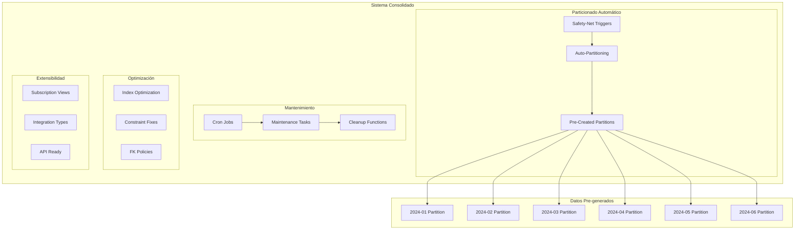

# Migración 0008: Mejoras Finales y Optimizaciones

## 📋 Información General

| Atributo | Valor |
|----------|-------|
| **Archivo** | `0008_apply_improvements.up.sql` |
| **Propósito** | Aplicar optimizaciones finales, particionado avanzado y consolidación del sistema |
| **Dependencias** | 0001-0007 (cadena completa de dependencias) |
| **Reversible** | ✅ Sí |
| **Impacto** | Alto - Consolida todo el sistema y mejora performance |

---

## 🎯 Objetivos

1. **Particionado Proactivo**: Pre-crear particiones para los próximos 6 meses
2. **Mantenimiento Automático**: Sistema unificado de limpieza y mantenimiento
3. **Consolidación de Índices**: Eliminar duplicados y optimizar performance
4. **Constraints Mejorados**: Validaciones robustas y constraints únicos corregidos
5. **Vista de Suscripciones**: Preparación para integración con billing-svc
6. **Safety-Net para Particionado**: Triggers de respaldo para evitar errores

---

## 🏗️ Arquitectura de Mejoras



---

## 🔧 Funciones Principales

### 1. **trg_monthly_partition()** - Particionado Safety-Net

```sql
CREATE OR REPLACE FUNCTION trg_monthly_partition()
RETURNS TRIGGER
```

#### **Propósito y Advertencias**

⚠️ **ADVERTENCIA**: DDL en triggers puede causar dead-locks en alta concurrencia  
✅ **RECOMENDACIÓN**: Usar solo como safety-net hasta implementar cron job de pre-creación

#### **Estrategia Recomendada**

1. **Desarrollo**: Usar triggers para simplicidad
2. **Staging**: Pre-crear particiones + mantener triggers como backup
3. **Producción**: Pre-crear particiones + considerar deshabilitar triggers

#### **Aplicación Automática**

```sql
-- Se aplica automáticamente a todas las tablas de log:
- organization_invite_log
- organization_integration_log  
- organization_domain_verification_log
```

#### **Logging de Safety-Net**

```sql
-- Si el trigger se activa, indica que el cron job falló
RAISE NOTICE 'SAFETY-NET: Created partition for % on %', TG_TABLE_NAME, NEW.created_at::date;
```

### 2. **run_maintenance_tasks()** - Mantenimiento Unificado

```sql
CREATE OR REPLACE FUNCTION run_maintenance_tasks()
RETURNS JSON
```

#### **Tareas Ejecutadas**

| Tarea | Función | Retención | Descripción |
|-------|---------|-----------|-------------|
| **Invite Logs** | `cleanup_old_invite_logs(180)` | 6 meses | Limpia logs de invitaciones |
| **Integration Logs** | `cleanup_old_integration_logs(90)` | 3 meses | Limpia logs de integraciones |
| **Domain Logs** | `cleanup_old_domain_verification_logs(30)` | 1 mes | Limpia logs de verificación DNS |
| **Expire Invites** | `expire_old_invitations()` | Variable | Expira invitaciones vencidas |
| **Integration Types** | `ensure_default_integration_types()` | N/A | Mantiene tipos por defecto |

#### **Resultado JSON**

```json
{
  "timestamp": "2024-01-15T10:30:00Z",
  "invite_logs_cleaned": 1250,
  "integration_logs_cleaned": 890,
  "domain_logs_cleaned": 340,
  "status": "completed",
  "version": "2.0"
}
```

#### **Configuración con pg_cron**

```sql
-- Configurar tarea semanal
SELECT cron.schedule(
    'partition-maintenance', 
    '0 0 * * 0',  -- Domingos a medianoche
    'SELECT run_maintenance_tasks();'
);
```

### 3. **ensure_default_integration_types()** - Tipos de Integración

```sql
CREATE OR REPLACE FUNCTION ensure_default_integration_types()
RETURNS VOID
```

#### **Tipos Pre-configurados**

| Nombre | Display Name | Categoría | Provider | Protocolos |
|--------|--------------|-----------|----------|------------|
| `quickbooks_online` | QuickBooks Online | accounting | Intuit | OAuth, Webhooks |
| `hubspot_crm` | HubSpot CRM | crm | HubSpot | OAuth, API Key, Webhooks |
| `mailchimp` | Mailchimp | marketing | Mailchimp | OAuth, API Key, Webhooks |
| `slack` | Slack | communication | Slack | OAuth, Webhooks |
| `google_analytics` | Google Analytics | analytics | Google | OAuth |
| `zapier` | Zapier | automation | Zapier | Webhooks, API Key |
| `stripe` | Stripe | payment | Stripe | API Key, Webhooks |

#### **Configuración Automática**

```sql
-- Upsert automático con ON CONFLICT
ON CONFLICT (name) DO UPDATE SET
    display_name = EXCLUDED.display_name,
    description = EXCLUDED.description,
    configuration_schema = EXCLUDED.configuration_schema,
    updated_at = CURRENT_TIMESTAMP;
```

### 4. **validate_admin_exists_check()** - Validación de Administradores

```sql
CREATE OR REPLACE FUNCTION validate_admin_exists_check()
RETURNS TRIGGER
```

#### **Regla de Negocio**

- Cada organización debe tener al menos un Admin activo
- Se aplica a cambios en `employee_roles`
- Emite WARNING si no hay admins (no bloquea operaciones)

#### **Aplicación**

```sql
CREATE TRIGGER trg_validate_admin_exists
    AFTER INSERT OR UPDATE OR DELETE ON employee_roles
    FOR EACH ROW EXECUTE FUNCTION validate_admin_exists_check();
```

---

## 🚀 Optimizaciones Implementadas

### **1. Particionado Proactivo**

#### **Particiones Pre-creadas**

```sql
-- Para cada tabla de logs, se crean particiones para los próximos 6 meses:
SELECT create_monthly_partition('organization_invite_log', current_date + interval '0 months');
SELECT create_monthly_partition('organization_invite_log', current_date + interval '1 months');
SELECT create_monthly_partition('organization_invite_log', current_date + interval '2 months');
SELECT create_monthly_partition('organization_invite_log', current_date + interval '3 months');
SELECT create_monthly_partition('organization_invite_log', current_date + interval '4 months');
SELECT create_monthly_partition('organization_invite_log', current_date + interval '5 months');
```

#### **Beneficios**

- **Performance**: No DDL durante INSERTs de alta frecuencia
- **Concurrencia**: Evita locks de creación de particiones
- **Predictibilidad**: Particiones listas antes de necesitarlas

### **2. Consolidación de Índices**

#### **Índices Eliminados (Duplicados)**

```sql
-- Eliminados de migraciones anteriores:
DROP INDEX IF EXISTS idx_organization_integration_status;
DROP INDEX IF EXISTS ix_organization_integration_active_lookup;

-- Reemplazados por índices más específicos:
ix_organization_integration_org_status_active  -- Más eficiente
```

#### **Índices Nuevos Optimizados**

```sql
-- Empleados activos por organización
CREATE INDEX ix_employees_org_status_active 
ON employees(organization_id, status) 
WHERE deleted_at IS NULL AND status = 'active';

-- Invitaciones pendientes con expiración
CREATE INDEX ix_organization_invite_org_status_expires 
ON organization_invite(organization_id, status, expires_at) 
WHERE status = 'pending';

-- Dominios primarios por organización
CREATE INDEX ix_organization_domain_org_primary 
ON organization_domain(organization_id, is_primary) 
WHERE deleted_at IS NULL AND is_primary = true;
```

### **3. Constraints Corregidos**

#### **Problema Original (0004)**

```sql
-- ❌ Constraint incorrecto usando person_id
ALTER TABLE employees ADD CONSTRAINT uq_employees_organization_person 
    UNIQUE (organization_id, person_id);
```

#### **Solución Implementada (0008)**

```sql
-- ✅ Constraint correcto usando user_id
ALTER TABLE employees ADD CONSTRAINT uq_employees_organization_user 
    UNIQUE (organization_id, user_id);
```

#### **Migración Segura**

```sql
DO $$
BEGIN
    -- Eliminar constraints anteriores
    ALTER TABLE employees DROP CONSTRAINT IF EXISTS employees_organization_id_person_id_key;
    ALTER TABLE employees DROP CONSTRAINT IF EXISTS uq_employees_organization_person;
    ALTER TABLE employees DROP CONSTRAINT IF EXISTS uq_employees_user_organization;
    
    -- Crear constraint correcto
    ALTER TABLE employees ADD CONSTRAINT uq_employees_organization_user 
        UNIQUE (organization_id, user_id);
EXCEPTION 
    WHEN duplicate_object THEN NULL;  -- Ya existe
END;
$$;
```

### **4. Políticas de FK Optimizadas**

#### **Cambio de RESTRICT a CASCADE**

```sql
-- employee_roles -> organization_role
-- Cambiado de RESTRICT a CASCADE para simplificar eliminación de roles
ALTER TABLE employee_roles DROP CONSTRAINT IF EXISTS fk_employee_roles_role;
ALTER TABLE employee_roles ADD CONSTRAINT fk_employee_roles_role 
    FOREIGN KEY (role_id) REFERENCES organization_role(id) ON DELETE CASCADE;
```

#### **Mantener RESTRICT para Seguridad**

```sql
-- integration_type -> organization_integration
-- Se mantiene RESTRICT para evitar eliminar tipos en uso
-- No se modifica: ON DELETE RESTRICT
```

---

## 📊 Vista de Suscripciones

### **organization_subscription_details** - Vista Preparada

```sql
CREATE OR REPLACE VIEW organization_subscription_details AS
SELECT 
    os.id,
    os.organization_id,
    os.status,
    -- TODO v2.0: Campos futuros cuando billing-svc esté listo:
    -- sp.plan_name,
    -- sp.max_users,
    -- os.current_period_start,
    -- os.current_period_end,
    -- os.trial_end
    os.created_at,
    os.updated_at
FROM organization_subscription os;
-- LEFT JOIN subscription_plan sp ON os.plan_id = sp.id; -- Futuro
```

#### **Estrategia de Extensión**

1. **Fase 1** (0008): Vista básica con campos existentes
2. **Fase 2** (Futura): Migración dedicada para agregar JOIN con billing-svc
3. **Fase 3** (Futura): Campos calculados y métricas avanzadas

#### **Robustez**

- No falla si faltan columnas futuras
- Compatible con CI/CD sin dependencias externas
- Extensible sin romper código existente

---

## 📋 Ejemplos Prácticos

### **1. Configurar Mantenimiento Automático**

```sql
-- Opción 1: pg_cron (Recomendado)
SELECT cron.schedule(
    'weekly-maintenance',
    '0 2 * * 0',  -- Domingos a las 2 AM
    'SELECT run_maintenance_tasks();'
);

-- Opción 2: Llamada manual desde aplicación
SELECT run_maintenance_tasks();

-- Opción 3: pgAgent o scheduler externo
-- Ejecutar: SELECT run_maintenance_tasks();
```

### **2. Pre-crear Particiones para el Próximo Año**

```sql
-- Script para crear particiones futuras
DO $$
DECLARE
    month_offset INTEGER;
    target_date DATE;
    tables TEXT[] := ARRAY[
        'organization_invite_log',
        'organization_integration_log', 
        'organization_domain_verification_log'
    ];
    table_name TEXT;
BEGIN
    -- Crear particiones para los próximos 12 meses
    FOR month_offset IN 6..17 LOOP  -- 6-17 = próximos 6-17 meses
        target_date := current_date + (month_offset || ' months')::INTERVAL;
        
        FOREACH table_name IN ARRAY tables LOOP
            PERFORM create_monthly_partition(table_name, target_date);
            RAISE NOTICE 'Created partition for % - %', table_name, target_date;
        END LOOP;
    END LOOP;
    
    RAISE NOTICE 'Pre-created partitions for next 12 months';
END;
$$;
```

### **3. Verificar Estado del Sistema**

```sql
-- Dashboard de salud del sistema
SELECT 
    'maintenance_last_run' as metric,
    COALESCE(
        (SELECT created_at FROM organization_integration_log 
         WHERE message LIKE '%maintenance%' 
         ORDER BY created_at DESC LIMIT 1)::TEXT,
        'Never'
    ) as value

UNION ALL

SELECT 
    'partitions_created',
    COUNT(*)::TEXT
FROM pg_tables 
WHERE tablename LIKE '%_log_%'

UNION ALL

SELECT 
    'unique_constraints_fixed',
    CASE WHEN EXISTS(
        SELECT 1 FROM pg_constraint 
        WHERE conname = 'uq_employees_organization_user'
    ) THEN 'Yes' ELSE 'No' END

UNION ALL

SELECT 
    'integration_types_available',
    COUNT(*)::TEXT
FROM integration_type 
WHERE is_active = true;
```

### **4. Monitorear Performance de Particionado**

```sql
-- Tamaño de particiones por tabla
SELECT 
    schemaname,
    tablename,
    pg_size_pretty(pg_total_relation_size(schemaname||'.'||tablename)) as size,
    CASE 
        WHEN tablename LIKE '%_log_%' THEN 
            SUBSTRING(tablename FROM '.*_([0-9]{4}_[0-9]{2})$')
        ELSE 'parent'
    END as partition_period
FROM pg_tables 
WHERE tablename LIKE '%organization%log%'
ORDER BY pg_total_relation_size(schemaname||'.'||tablename) DESC;

-- Estadísticas de uso de triggers de safety-net
-- (Si aparecen mensajes, indica que el cron job no está funcionando)
SELECT 
    schemaname||'.'||tablename as full_table_name,
    n_tup_ins as inserts_today,
    CASE 
        WHEN n_tup_ins > 0 THEN 'Active'
        ELSE 'Idle'
    END as activity_status
FROM pg_stat_user_tables 
WHERE relname LIKE '%_log_%'
ORDER BY n_tup_ins DESC;
```

### **5. Troubleshooting de Particiones**

```sql
-- Verificar particiones faltantes para próximos 3 meses
DO $$
DECLARE
    check_date DATE;
    table_name TEXT;
    partition_name TEXT;
    tables TEXT[] := ARRAY[
        'organization_invite_log',
        'organization_integration_log',
        'organization_domain_verification_log'
    ];
BEGIN
    FOR check_date IN 
        SELECT generate_series(
            current_date, 
            current_date + INTERVAL '3 months', 
            INTERVAL '1 month'
        )::DATE
    LOOP
        FOREACH table_name IN ARRAY tables LOOP
            partition_name := table_name || '_' || to_char(check_date, 'YYYY_MM');
            
            IF NOT EXISTS(SELECT 1 FROM pg_tables WHERE tablename = partition_name) THEN
                RAISE NOTICE 'MISSING PARTITION: % for %', partition_name, check_date;
                -- Crear automáticamente
                PERFORM create_monthly_partition(table_name, check_date);
                RAISE NOTICE 'CREATED: %', partition_name;
            END IF;
        END LOOP;
    END LOOP;
END;
$$;

-- Verificar constraint pruning (optimization)
EXPLAIN (ANALYZE, BUFFERS) 
SELECT COUNT(*) 
FROM organization_invite_log 
WHERE created_at >= '2024-01-01' 
AND created_at < '2024-02-01';
-- Debe mostrar solo la partición de enero en "Partitions"
```

---

## 🔍 Consultas de Diagnóstico

### **1. Health Check Completo**

```sql
-- Estado general del sistema después de 0008
WITH system_health AS (
    SELECT 
        'triggers_safety_net' as component,
        COUNT(*) as value,
        'Auto-partitioning triggers' as description
    FROM pg_trigger t 
    JOIN pg_class c ON t.tgrelid = c.oid 
    WHERE t.tgname LIKE '%auto_part%'
    
    UNION ALL
    
    SELECT 
        'partitions_precreated',
        COUNT(*),
        'Pre-created log partitions'
    FROM pg_tables 
    WHERE tablename LIKE '%_log_[0-9][0-9][0-9][0-9]_[0-9][0-9]'
    
    UNION ALL
    
    SELECT 
        'constraints_fixed',
        CASE WHEN EXISTS(
            SELECT 1 FROM pg_constraint 
            WHERE conname = 'uq_employees_organization_user'
        ) THEN 1 ELSE 0 END,
        'Fixed unique constraints'
    
    UNION ALL
    
    SELECT 
        'integration_types',
        COUNT(*),
        'Available integration types'
    FROM integration_type 
    WHERE is_active = true
    
    UNION ALL
    
    SELECT 
        'maintenance_functions',
        COUNT(*),
        'Maintenance functions available'
    FROM pg_proc 
    WHERE proname IN (
        'run_maintenance_tasks',
        'cleanup_old_invite_logs',
        'cleanup_old_integration_logs',
        'ensure_default_integration_types'
    )
)
SELECT 
    component,
    value,
    description,
    CASE 
        WHEN component = 'triggers_safety_net' AND value >= 3 THEN '✅ OK'
        WHEN component = 'partitions_precreated' AND value >= 15 THEN '✅ OK'  -- 3 tables × 5+ months
        WHEN component = 'constraints_fixed' AND value = 1 THEN '✅ OK'
        WHEN component = 'integration_types' AND value >= 5 THEN '✅ OK'
        WHEN component = 'maintenance_functions' AND value = 4 THEN '✅ OK'
        ELSE '⚠️ CHECK'
    END as status
FROM system_health;
```

### **2. Performance After Optimization**

```sql
-- Análisis de mejoras de performance
WITH index_usage AS (
    SELECT 
        schemaname,
        tablename,
        indexname,
        idx_scan,
        idx_tup_read,
        idx_tup_fetch,
        pg_size_pretty(pg_relation_size(indexrelid)) as index_size
    FROM pg_stat_user_indexes 
    WHERE schemaname = 'public'
    AND tablename LIKE 'organization%'
),
table_stats AS (
    SELECT 
        schemaname,
        tablename,
        n_tup_ins + n_tup_upd + n_tup_del as total_changes,
        pg_size_pretty(pg_total_relation_size(schemaname||'.'||tablename)) as table_size
    FROM pg_stat_user_tables 
    WHERE schemaname = 'public'
    AND tablename LIKE 'organization%'
)
SELECT 
    t.tablename,
    t.table_size,
    t.total_changes,
    COUNT(i.indexname) as index_count,
    SUM(i.idx_scan) as total_index_scans,
    ARRAY_AGG(i.indexname ORDER BY i.idx_scan DESC) FILTER (WHERE i.idx_scan > 0) as used_indexes
FROM table_stats t
LEFT JOIN index_usage i ON t.tablename = i.tablename
GROUP BY t.tablename, t.table_size, t.total_changes
ORDER BY t.total_changes DESC;
```

### **3. Partitioning Efficiency**

```sql
-- Eficiencia del particionado
SELECT 
    pt.schemaname,
    pt.tablename,
    COUNT(*) as partition_count,
    pg_size_pretty(SUM(pg_total_relation_size(pt.schemaname||'.'||pt.tablename))) as total_size,
    pg_size_pretty(AVG(pg_total_relation_size(pt.schemaname||'.'||pt.tablename))) as avg_partition_size,
    MIN(pt.tablename) as oldest_partition,
    MAX(pt.tablename) as newest_partition
FROM pg_tables pt
WHERE pt.tablename LIKE '%_log_[0-9][0-9][0-9][0-9]_[0-9][0-9]'
GROUP BY pt.schemaname, SUBSTRING(pt.tablename FROM '^(.+)_log_[0-9]{4}_[0-9]{2}$')
ORDER BY total_size DESC;
```

---

## ⚠️ Consideraciones de Producción

### **1. Estrategia de Deployment**

#### **Pre-Deploy**

```sql
-- Verificar espacio en disco para nuevas particiones
SELECT 
    pg_size_pretty(SUM(pg_database_size(datname))) as total_db_size
FROM pg_database 
WHERE datname = current_database();

-- Verificar que no hay locks prolongados
SELECT 
    pid,
    state,
    query_start,
    query
FROM pg_stat_activity 
WHERE state != 'idle' 
AND query_start < now() - INTERVAL '5 minutes';
```

#### **Durante Deploy**

```bash
# Aplicar migración en ventana de mantenimiento
# Monitorear locks:
SELECT 
    blocked_locks.pid AS blocked_pid,
    blocked_activity.usename AS blocked_user,
    blocking_locks.pid AS blocking_pid,
    blocking_activity.usename AS blocking_user,
    blocked_activity.query AS blocked_statement,
    blocking_activity.query AS current_statement_in_blocking_process
FROM pg_catalog.pg_locks blocked_locks
JOIN pg_catalog.pg_stat_activity blocked_activity ON blocked_activity.pid = blocked_locks.pid
JOIN pg_catalog.pg_locks blocking_locks ON blocking_locks.locktype = blocked_locks.locktype
JOIN pg_catalog.pg_stat_activity blocking_activity ON blocking_activity.pid = blocking_locks.pid
WHERE NOT blocked_locks.GRANTED;
```

#### **Post-Deploy**

```sql
-- Verificar que todo funciona
SELECT run_maintenance_tasks();

-- Configurar cron job
SELECT cron.schedule('weekly-maintenance', '0 2 * * 0', 'SELECT run_maintenance_tasks();');
```

### **2. Monitoring Continuo**

#### **Alertas Recomendadas**

```sql
-- Alerta: Particiones no creadas para próximo mes
SELECT 
    table_name,
    next_month_partition
FROM (
    SELECT 
        unnest(ARRAY[
            'organization_invite_log',
            'organization_integration_log',
            'organization_domain_verification_log'
        ]) as table_name,
        to_char(current_date + INTERVAL '1 month', 'YYYY_MM') as next_month_partition
) expected
WHERE NOT EXISTS (
    SELECT 1 FROM pg_tables 
    WHERE tablename = expected.table_name || '_' || expected.next_month_partition
);

-- Alerta: Triggers de safety-net activándose
-- (Buscar en logs de PostgreSQL: "SAFETY-NET: Created partition")
```

#### **Métricas de Performance**

```sql
-- Dashboard de métricas para monitoreo
SELECT 
    'avg_maintenance_duration' as metric,
    COALESCE(
        EXTRACT(EPOCH FROM AVG(
            CASE 
                WHEN context->>'status' = 'completed' 
                THEN (context->>'timestamp')::TIMESTAMP - created_at
            END
        )), 0
    )::INTEGER as value_seconds
FROM organization_integration_log 
WHERE message LIKE '%maintenance%' 
AND created_at > current_timestamp - INTERVAL '30 days'

UNION ALL

SELECT 
    'partition_growth_rate',
    COUNT(*)::INTEGER
FROM pg_tables 
WHERE tablename LIKE '%_log_%'
AND tablename ~ '_[0-9]{4}_[0-9]{2}$'

UNION ALL

SELECT 
    'safety_net_activations',
    COUNT(*)::INTEGER
FROM pg_logs  -- Requiere configurar log_destination
WHERE message LIKE '%SAFETY-NET:%'
AND log_time > current_timestamp - INTERVAL '7 days';
```

### **3. Rollback Plan**

#### **Rollback Inmediato (Si es necesario)**

```sql
-- Deshabilitar triggers de auto-particionado
DROP TRIGGER IF EXISTS trg_organization_invite_log_auto_part ON organization_invite_log;
DROP TRIGGER IF EXISTS trg_organization_integration_log_auto_part ON organization_integration_log;
DROP TRIGGER IF EXISTS trg_organization_domain_verification_log_auto_part ON organization_domain_verification_log;

-- Revertir constraint único si causa problemas
ALTER TABLE employees DROP CONSTRAINT IF EXISTS uq_employees_organization_user;
-- (Re-crear el anterior si es necesario)
```

#### **Rollback Completo**

```sql
-- Usar migración 0008 down para rollback completo
-- Ver: 0008_apply_improvements.down.sql
```

---

## 📚 Referencias y Recursos

### **Documentación Relacionada**

- [README_0001.md](./README_0001.md) - Funciones base y particionado
- [README_0005.md](./README_0005.md) - Sistema de invitaciones
- [README_0006.md](./README_0006.md) - Sistema de integraciones
- [README_0007.md](./README_0007.md) - Sistema de dominios

### **Herramientas de Monitoreo**

#### **pg_cron Setup**

```sql
-- Instalar pg_cron
CREATE EXTENSION IF NOT EXISTS pg_cron;

-- Ver trabajos programados
SELECT * FROM cron.job;

-- Ver historial de ejecución
SELECT * FROM cron.job_run_details ORDER BY start_time DESC LIMIT 10;
```

#### **Comandos de Administración**

```bash
# Verificar tamaño de particiones
psql -c "
SELECT 
    tablename,
    pg_size_pretty(pg_total_relation_size('public.'||tablename)) as size
FROM pg_tables 
WHERE tablename LIKE '%_log_%' 
ORDER BY pg_total_relation_size('public.'||tablename) DESC;"

# Monitorear locks durante maintenance
watch -n 5 "psql -c \"SELECT count(*) as active_locks FROM pg_locks WHERE granted = false;\""

# Verificar cron jobs
psql -c "SELECT * FROM cron.job WHERE active = true;"
```

### **Patrones Implementados**

- **Proactive Partitioning**: Particiones creadas antes de necesitarlas
- **Safety-Net Pattern**: Triggers como backup para evitar errores
- **Maintenance Consolidation**: Todas las tareas en una función unificada
- **Index Optimization**: Eliminación sistemática de duplicados
- **Constraint Evolution**: Corrección progresiva de constraints

### **Checklist de Producción**

#### **Pre-Deploy** ✅

- [ ] Verificar espacio en disco para particiones
- [ ] Revisar locks activos
- [ ] Backup completo de la base de datos
- [ ] Plan de rollback documentado

#### **Deploy** ✅

- [ ] Aplicar migración en ventana de mantenimiento
- [ ] Monitorear locks durante aplicación
- [ ] Verificar que triggers se crean correctamente
- [ ] Confirmar que particiones se pre-crean

#### **Post-Deploy** ✅

- [ ] Ejecutar `run_maintenance_tasks()` manualmente
- [ ] Configurar pg_cron job para mantenimiento semanal
- [ ] Configurar alertas para particiones faltantes
- [ ] Monitorear activación de safety-net triggers
- [ ] Verificar performance de queries principales

---

**Migración completada exitosamente** ✅  
*Sistema consolidado con particionado proactivo, mantenimiento automático y optimizaciones finales*
