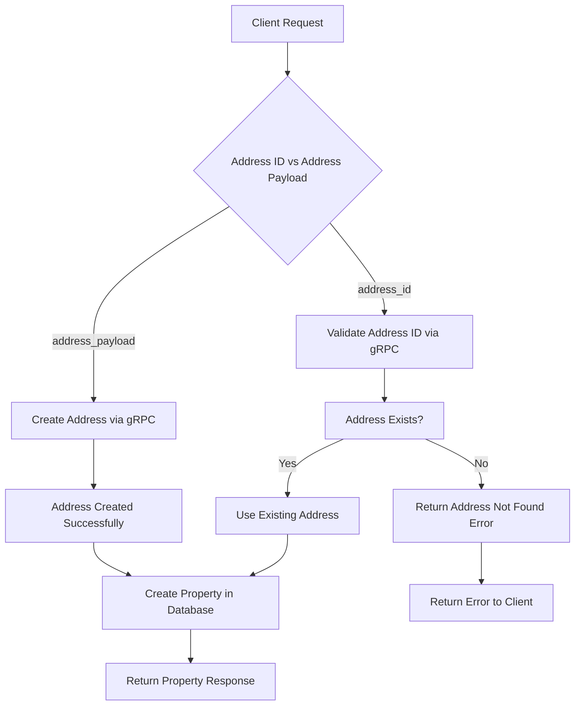

# 🏠 Property Service - REM Platform

Microservicio para la gestión de propiedades inmobiliarias, amenities y management de propiedades dentro de la plataforma REM.

## 📋 Funcionalidades

### 🏢 Gestión de Propiedades
- ✅ **CRUD completo** de propiedades inmobiliarias
- ✅ **Integración gRPC** con Address Service para manejo automático de direcciones
- ✅ **Creación automática de direcciones** cuando no existen
- ✅ **Reutilización de direcciones existentes** por ID
- ✅ **Tipos de propiedad**: Departamento, Casa, Local comercial, Oficina, Terreno, Nave industrial
- ✅ **Filtros avanzados**: por tipo, propietario, búsqueda por texto
- ✅ **Paginación** optimizada
- ✅ **Códigos internos** únicos para organización

### 🎯 Gestión de Amenities
- ✅ **CRUD completo** de amenities (servicios/comodidades)
- ✅ **Categorización** por tipo (seguridad, recreación, servicios)
- ✅ **Asociación** flexible entre propiedades y amenities
- ✅ **Búsqueda** por nombre y categoría

### 🏢 Property Management
- ✅ **Gestión de administración** de propiedades por organizaciones
- ✅ **Períodos de gestión** con fechas de inicio y fin
- ✅ **Comisiones** por gestión
- ✅ **Estados activos/inactivos**

## � Integración con Servicios

### Address Service (gRPC)
El Property Service se integra con el Address Service mediante gRPC para:

- **Validación automática**: Verifica si una dirección existe antes de crear la propiedad
- **Creación inteligente**: Si la dirección no existe, la crea automáticamente
- **Reutilización eficiente**: Si la dirección ya existe, la reutiliza por su ID
- **Fallback resiliente**: Mecanismo de recuperación con validaciones mock durante desarrollo

### Flujo de Creación de Propiedades

#### Opción 1: Usando Address ID Existente
```json
{
  "owner_person_id": "11111111-1111-1111-1111-111111111111",
  "address_id": "existing-address-uuid",
  "property_type": "APARTMENT",
  "bedrooms": 2
}
```

#### Opción 2: Creando Nueva Dirección
```json
{
  "owner_person_id": "11111111-1111-1111-1111-111111111111",
  "address_payload": {
    "street": "Av. Corrientes",
    "number": 1234,
    "floor": "5",
    "unit": "A",
    "city": "Buenos Aires",
    "state": "CABA",
    "zip": "C1043AAZ",
    "country": "AR"
  },
  "property_type": "APARTMENT",
  "bedrooms": 2
}
```

> **Nota**: `address_id` y `address_payload` son **mutuamente excluyentes**. Solo se debe enviar uno de los dos.

## �🗄️ Modelo de Datos

### Principales Entidades

| Entidad | Descripción | Campos Clave |
|---------|-------------|--------------|
| **Property** | Propiedad inmobiliaria | `owner_person_id`, `address_id`, `property_type`, `internal_code` |
| **PropertyManagement** | Gestión de propiedades | `property_id`, `organization_id`, `commission_percent` |
| **Amenity** | Servicios/Comodidades | `name`, `category`, `icon` |
| **PropertyAmenity** | Relación N:N | `property_id`, `amenity_id` |

### Tipos de Propiedad
- `APARTMENT` - Departamento
- `HOUSE` - Casa
- `COMMERCIAL_SPACE` - Local comercial
- `OFFICE` - Oficina
- `LAND` - Terreno
- `INDUSTRIAL_WAREHOUSE` - Nave industrial

## 🚀 API Endpoints

### Properties
```http
POST   /properties              # Crear propiedad
GET    /properties              # Listar propiedades (con filtros)
GET    /properties/:id          # Obtener propiedad específica
PUT    /properties/:id          # Actualizar propiedad
DELETE /properties/:id          # Eliminar propiedad
```

### Amenities
```http
POST   /amenities               # Crear amenity
GET    /amenities               # Listar amenities
GET    /amenities/:id           # Obtener amenity específico
PUT    /amenities/:id           # Actualizar amenity
DELETE /amenities/:id           # Eliminar amenity
```

### Property-Amenity Management
```http
POST   /properties/:property_id/amenities/:amenity_id    # Agregar amenity a propiedad
DELETE /properties/:property_id/amenities/:amenity_id    # Quitar amenity de propiedad
```

### Health Check
```http
GET    /health                  # Estado del servicio
```

## 🔧 Configuración

### Variables de Entorno (.env.development)
```bash
REM_SERVICE_NAME=property
REM_ENVIRONMENT=development
REM_PROPERTY_HTTP_PORT=4004
REM_PROPERTY_GRPC_PORT=50054

# Address Service Integration
REM_ADDRESS_GRPC_HOST=0.0.0.0
REM_ADDRESS_GRPC_PORT=50052
```

### Puertos Asignados
- **HTTP**: `4004` (desarrollo)
- **gRPC**: `50054` (para comunicación entre servicios)

### Dependencias de Servicios
- **Address Service**: Puerto `50052` (gRPC) - Requerido para manejo de direcciones
- **Database**: PostgreSQL `rem_development` - Base de datos compartida

### Inicio con Verificación de Dependencias
El servicio incluye un mecanismo de health check que:
- ✅ Espera hasta 30 segundos a que el Address Service esté disponible
- ✅ Verifica conectividad TCP antes de intentar conexión gRPC
- ✅ Falla rápido si las dependencias no están disponibles
- ✅ Proporciona logs detallados del proceso de inicialización

## 📊 Testing y Validación

### Testing de Integración con Address Service

El servicio se puede probar de manera integral verificando que:

#### 1. Creación con Dirección Existente
```bash
# Primero verificar direcciones disponibles en Address Service
curl -H "X-Api-Key: supersecret-api-key-for-dev" \
     "http://localhost:4000/addresses"

# Crear propiedad usando address_id existente
curl -X POST "http://localhost:4004/properties" \
     -H "Content-Type: application/json" \
     -H "X-Api-Key: supersecret-api-key-for-dev" \
     -d '{
       "owner_person_id": "11111111-1111-1111-1111-111111111111",
       "address_id": "existing-address-id-from-previous-call",
       "property_type": "APARTMENT",
       "bedrooms": 2
     }'
```

#### 2. Creación con Nueva Dirección
```bash
# Crear propiedad con nueva dirección (automáticamente crea en Address Service)
curl -X POST "http://localhost:4004/properties" \
     -H "Content-Type: application/json" \
     -H "X-Api-Key: supersecret-api-key-for-dev" \
     -d '{
       "owner_person_id": "11111111-1111-1111-1111-111111111111",
       "address_payload": {
         "street": "Av. Rivadavia",
         "number": 5678,
         "city": "Buenos Aires",
         "country": "AR"
       },
       "property_type": "HOUSE",
       "bedrooms": 3
     }'

# Verificar que la dirección fue creada en Address Service
curl -H "X-Api-Key: supersecret-api-key-for-dev" \
     "http://localhost:4000/addresses"
```

#### 3. Validación de Errores
```bash
# Error: Ambos campos enviados (debe fallar)
curl -X POST "http://localhost:4004/properties" \
     -H "Content-Type: application/json" \
     -H "X-Api-Key: supersecret-api-key-for-dev" \
     -d '{
       "owner_person_id": "11111111-1111-1111-1111-111111111111",
       "address_id": "some-id",
       "address_payload": {"street": "Test"},
       "property_type": "APARTMENT"
     }'
```

### Datos Dummy/Mock
El servicio incluye IDs mock para testing:

```json
{
  "mock_owner_person_ids": [
    "11111111-1111-1111-1111-111111111111",
    "22222222-2222-2222-2222-222222222222"
  ],
  "mock_address_ids": [
    "aaaaaaaa-aaaa-aaaa-aaaa-aaaaaaaaaaaa",
    "bbbbbbbb-bbbb-bbbb-bbbb-bbbbbbbbbbbb"
  ],
  "mock_organization_ids": [
    "99999999-9999-9999-9999-999999999999"
  ]
}
```

### Ejemplo de Payload - Crear Propiedad (Address ID Existente)
```json
{
  "owner_person_id": "11111111-1111-1111-1111-111111111111",
  "address_id": "aaaaaaaa-aaaa-aaaa-aaaa-aaaaaaaaaaaa",
  "property_type": "APARTMENT",
  "internal_code": "DEPT-001",
  "year_built": 2020,
  "bedrooms": 2,
  "bathrooms": 1.5,
  "total_area_sqm": 85.50,
  "covered_area_sqm": 75.00,
  "description": "Departamento moderno en zona céntrica",
  "management": {
    "organization_id": "99999999-9999-9999-9999-999999999999",
    "commission_percent": 3.5
  }
}
```

### Ejemplo de Payload - Crear Propiedad (Nueva Dirección)
```json
{
  "owner_person_id": "11111111-1111-1111-1111-111111111111",
  "address_payload": {
    "street": "Av. Santa Fe",
    "number": 2450,
    "floor": "8",
    "unit": "B",
    "city": "Buenos Aires",
    "state": "CABA",
    "zip": "C1123AAP",
    "country": "AR"
  },
  "property_type": "APARTMENT",
  "internal_code": "DEPT-002",
  "year_built": 2021,
  "bedrooms": 3,
  "bathrooms": 2.0,
  "total_area_sqm": 120.00,
  "covered_area_sqm": 110.00,
  "description": "Departamento amplio con balcón",
  "management": {
    "organization_id": "99999999-9999-9999-9999-999999999999",
    "commission_percent": 4.0
  }
}
```

## 🏗️ Arquitectura

### Comunicación gRPC
- **✅ Address Service**: Integración activa para validación y creación de direcciones
- **🔄 Person Service**: Preparado para validación de propietarios
- **🔄 Organization Service**: Preparado para validación de organizaciones gestoras

### Flujo de Datos - Creación de Propiedades



### Capas de la Aplicación

1. **Controller Layer**: Manejo de HTTP requests/responses y validación de entrada
2. **Service Layer**: Lógica de negocio e integración con servicios externos (gRPC)
3. **Repository Layer**: Acceso a datos y operaciones de base de datos
4. **Model Layer**: Definición de entidades y estructuras de datos

### Proto Files (Activos)
```proto
// rem-common/protos/address/v1/address.proto
service AddressService {
  rpc GetAddress(GetAddressRequest) returns (AddressResponse);
  rpc CreateAddress(CreateAddressRequest) returns (AddressResponse);
  rpc ListAddresses(ListAddressesRequest) returns (ListAddressesResponse);
}
```

## 📝 Comandos de Desarrollo

### Desarrollo Local
```bash
# Iniciar con hot-reload
air

# Ejecutar directamente
REM_ENVIRONMENT=development go run ./cmd/api/main.go

# Ejecutar migraciones
go run cmd/migrate/main.go

# Build manual
go build -o tmp/main.exe cmd/api/main.go
```

### Verificar Dependencias
```bash
# Verificar que Address Service esté corriendo
netstat -ano | findstr :50052

# Verificar Property Service
netstat -ano | findstr :4004

# Logs detallados del Property Service
REM_ENVIRONMENT=development go run ./cmd/api/main.go
```

### Orden de Inicio Recomendado
1. **Base de datos**: PostgreSQL debe estar corriendo
2. **Address Service**: Puerto 50052 (gRPC)
3. **Property Service**: Puerto 4004 (HTTP) - Se conectará automáticamente al Address Service

## 🔄 Estado del Desarrollo

✅ **COMPLETADO**:
- Migraciones de base de datos
- Modelos y DTOs con soporte para address_payload
- Repository con CRUD completo
- Service con lógica de negocio y integración gRPC
- Controllers con validaciones mutuas (address_id vs address_payload)
- Routers configurados
- Configuración de entorno
- **Integración gRPC con Address Service**
- **Creación automática de direcciones**
- **Health check de dependencias en startup**
- **Manejo resiliente de errores**

🚧 **EN PROGRESO**:
- Testing integral de endpoints
- Validación de casos edge

🔄 **PENDIENTE**:
- Integración gRPC con Person Service
- Integración gRPC con Organization Service
- Tests unitarios completos
- Documentación OpenAPI/Swagger
- Métricas y monitoreo

## 🐛 Troubleshooting

### Errores Comunes

#### `dial address-svc failed: context deadline exceeded`
- **Causa**: Address Service no está corriendo o no es accesible
- **Solución**: Verificar que Address Service esté en puerto 50052
```bash
netstat -ano | findstr :50052
```

#### `address_id y address_payload son mutuamente excluyentes`
- **Causa**: Se enviaron ambos campos en el request
- **Solución**: Enviar solo uno de los dos campos

#### `address_id no existe`
- **Causa**: El ID de dirección proporcionado no existe en el Address Service
- **Solución**: Verificar el ID o usar address_payload para crear nueva dirección

### Logs de Debugging
El servicio proporciona logs detallados para debugging:
```
INFO: waiting for service to be available (address-svc at 0.0.0.0:50052)
INFO: service is available (address-svc)
INFO: attempting to connect to address service
INFO: successfully connected to address service
```
